# Agent Architecture

This document describes Ecqqo's AI agent system: the orchestrator, specialist agents, tools, memory system, approval workflows, and prompt architecture. The agent processes WhatsApp messages and executes tasks on behalf of high-net-worth operators through a human-in-the-loop pipeline.

## Complete Agent Architecture

### Inbound Pipeline

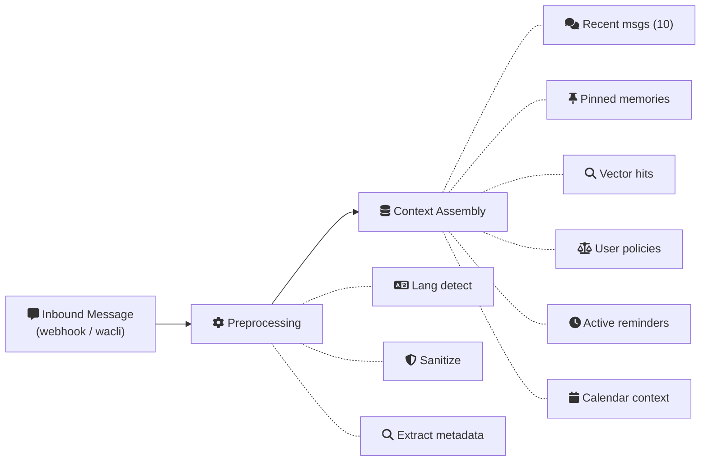

### Orchestrator

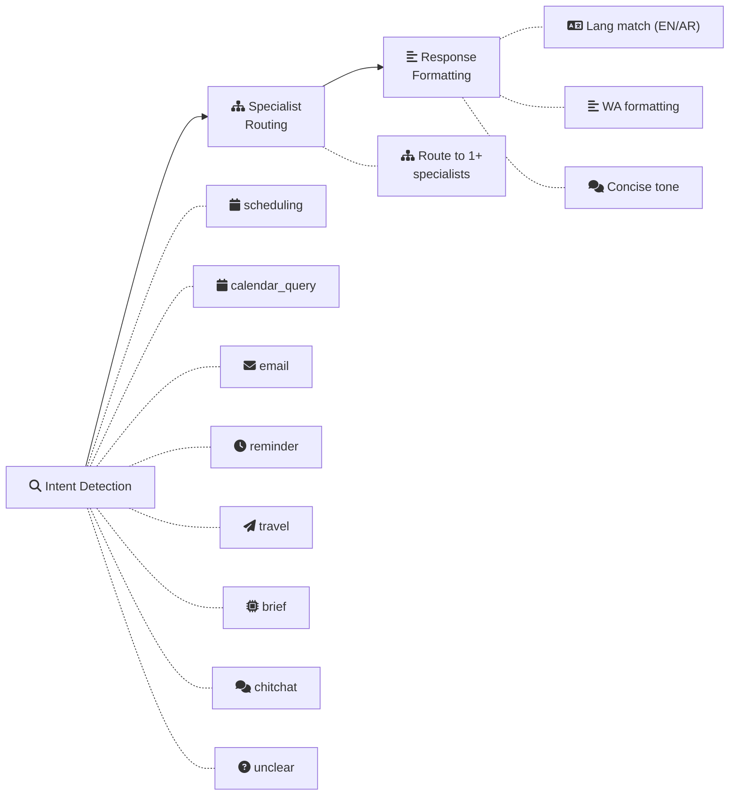

Orchestrator model: Claude Sonnet / GPT-4o (runs as Convex Actions).

### Specialist Agents

<ArchDiagram :config="agentsConfig" />

### Tools

<ArchDiagram :config="toolsConfig" />

### Approval Workflow

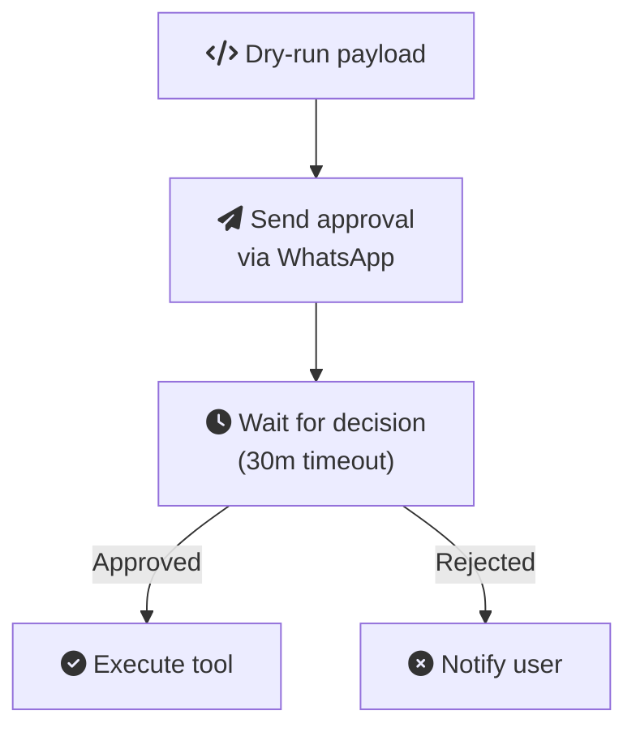

### Memory System

<ArchDiagram :config="memoryConfig" />

### Response Delivery

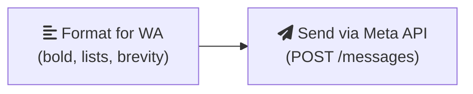

## Orchestrator Responsibilities

The orchestrator is the central coordinator for every agent run. It receives the preprocessed message and assembled context, then manages the entire execution lifecycle.

### 1. Intent Detection

The orchestrator classifies the inbound message into one of these intents:

| Intent | Description | Example |
|---|---|---|
| `scheduling` | Create, move, or cancel meetings | "Set up a call with Ahmed at 3pm tomorrow" |
| `calendar_query` | Check availability or daily agenda | "What do I have on Thursday?" |
| `email` | Read, summarize, or draft email | "Any important emails today?" |
| `reminder` | Set, check, or cancel reminders | "Remind me to call the bank at 2pm" |
| `travel` | Travel-related scheduling | "I'm flying to London on March 15th" |
| `brief` | Pre-meeting briefing | "Brief me on my next meeting" |
| `chitchat` | Non-actionable conversation | "Thanks!" |
| `unclear` | Ambiguous or multi-intent | "Handle my stuff for tomorrow" |

For `unclear` intents, the orchestrator asks a clarifying question before routing.

### 2. Specialist Routing

Based on the detected intent, the orchestrator selects one or more specialist agents. Complex requests may involve multiple specialists in sequence:

Example: *"Set up a call with Ahmed tomorrow at 3pm and send me a brief about him 30 minutes before"*

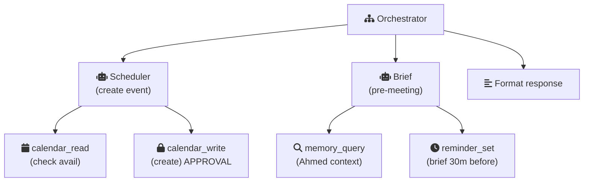

### 3. Context Assembly

Before calling any specialist, the orchestrator assembles a context window:

| Context Source | Content | Max Size |
|---|---|---|
| Recent messages | Last 10 messages in the conversation | ~2000 tokens |
| Pinned memories | All pinned facts for the principal | ~500 tokens |
| Vector search | Top-10 semantically relevant memories | ~1000 tokens |
| User policies | Approval rules, working hours, preferences | ~200 tokens |
| Active reminders | Upcoming reminders for the next 24 hours | ~300 tokens |
| Calendar context | Today's and tomorrow's events | ~500 tokens |

Total context budget: ~4500 tokens, leaving room for the system prompt and response.

### 4. Policy Check

Before executing any tool, the orchestrator checks the principal's policies:

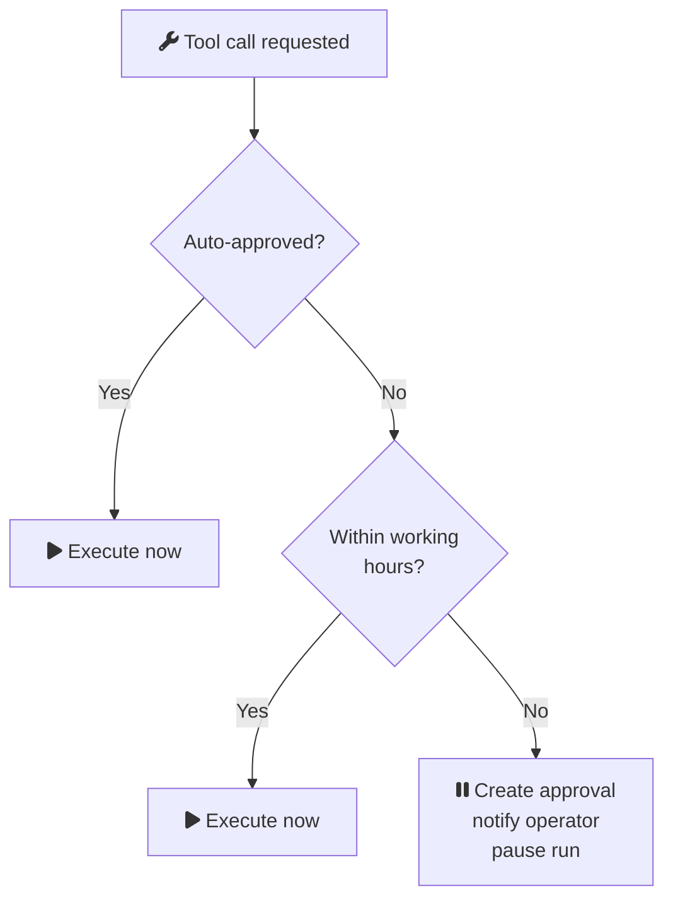

### 5. Approval Workflow

For approval-gated tools, the orchestrator:

1. Generates a dry-run payload (what the tool would do, in human-readable format)
2. Creates an `approvalRequest` record in Convex
3. Sends a WhatsApp message to the operator with the request details
4. Pauses the agent run (status = `"awaiting_approval"`)
5. On approval: resumes execution with the approved payload
6. On rejection: notifies the principal and marks the run complete

### 6. Result Formatting

The orchestrator formats the final response for WhatsApp delivery:

- Matches the language of the inbound message (EN or AR)
- Uses WhatsApp formatting (bold, italic, lists, line breaks)
- Keeps responses concise (under 500 characters for simple confirmations)
- Includes relevant details without being verbose
- Adds a follow-up prompt when appropriate ("Anything else?")

---

## Specialist Agents

### Scheduler Agent

**Purpose:** Handles all meeting and event creation, modification, and cancellation requests.

**Input Context:**
- Inbound message with scheduling intent
- Principal's calendar for the relevant day(s)
- Contact information for mentioned participants
- Principal's scheduling preferences from memory

**Tools:**
- `calendar_read` -- check availability, find events
- `calendar_write` -- create, update, or delete events (approval-gated)
- `memory_query` -- look up contact preferences, usual meeting patterns

**Output Format:**
- Confirmation message with event details (time, date, participants, location)
- Conflict notification if time slot is busy
- Alternative time suggestions if requested slot is unavailable

**Approval Required:** Yes, for `calendar_write` (unless auto-approved via policy).

---

### Calendar Agent

**Purpose:** Answers questions about the principal's calendar without making changes.

**Input Context:**
- Inbound message with calendar query intent
- Principal's calendar for the relevant timeframe

**Tools:**
- `calendar_read` -- fetch events for date range
- `memory_query` -- look up context about meetings or attendees

**Output Format:**
- Day summary with event list (time, title, participants)
- Availability windows for the requested date
- Meeting count and free time summary

**Approval Required:** No (read-only).

---

### Email Agent

**Purpose:** Reads, summarizes, and helps draft email responses.

**Input Context:**
- Inbound message with email intent
- Recent email subjects and senders (via Gmail API)

**Tools:**
- `email_read` -- fetch inbox, read specific emails
- `memory_query` -- look up sender context and past interactions

**Output Format:**
- Inbox digest: top N unread emails with sender, subject, and 1-line summary
- Full email summary when a specific email is referenced
- Flagged items: emails from VIP contacts or containing urgent keywords

**Approval Required:** No (read-only). Future: email sending will be approval-gated.

---

### Reminder Agent

**Purpose:** Creates, tracks, and delivers reminders via WhatsApp.

**Input Context:**
- Inbound message with reminder intent
- Active reminders for the principal
- Principal's timezone

**Tools:**
- `reminder_set` -- create a Convex scheduled function for delivery
- `reminder_deliver` -- send reminder message via Meta Cloud API (approval-gated for first delivery)
- `memory_query` -- check for related context

**Output Format:**
- Confirmation with reminder details (what, when)
- Active reminders list when requested
- Delivery confirmation when a reminder fires

**Approval Required:** `reminder_deliver` requires approval for the first reminder to a new contact. Subsequent deliveries to the same principal are auto-approved.

---

### Travel Agent

**Purpose:** Extracts travel details from messages and proposes calendar entries.

**Input Context:**
- Inbound message mentioning travel (flights, hotels, trips)
- Principal's calendar for the travel dates
- Timezone information

**Tools:**
- `calendar_read` -- check conflicts with travel dates
- `calendar_write` -- create travel blocks and related events (approval-gated)
- `memory_query` -- look up travel preferences (airline, hotel, seat)

**Output Format:**
- Extracted travel itinerary (flight times, hotel dates, destinations)
- Proposed calendar entries for the trip
- Conflict warnings if travel overlaps with existing events

**Approval Required:** Yes, for `calendar_write`.

---

### Brief Agent

**Purpose:** Assembles pre-meeting briefing documents with context from multiple sources.

**Input Context:**
- The upcoming meeting (participants, agenda, location)
- Memory about each participant
- Past meeting notes and outcomes
- Recent email threads with participants

**Tools:**
- `calendar_read` -- get meeting details
- `email_read` -- find recent correspondence with attendees
- `memory_query` -- retrieve relationship context, past interactions, notes

**Output Format:**
- Structured brief: meeting title, time, participants with context
- Key talking points from past interactions
- Open items or follow-ups from previous meetings
- Relevant facts from memory (preferences, sensitivities, recent events)

**Approval Required:** No (read-only assembly).

---

## Tool Registry

| Tool Name | Description | Side Effect | Approval Required | Provider |
|---|---|---|---|---|
| `calendar_read` | Read events, check availability | No | No | Google Calendar API |
| `calendar_write` | Create, update, delete calendar events | Yes | Yes (default) | Google Calendar API |
| `email_read` | Read inbox, fetch email content | No | No | Gmail API |
| `reminder_set` | Schedule a reminder delivery | Yes | No | Convex scheduled function |
| `reminder_deliver` | Send reminder via WhatsApp | Yes | Yes (first contact) | Meta Cloud API |
| `whatsapp_send` | Send message via WhatsApp | Yes | Yes (first contact) | Meta Cloud API |
| `memory_query` | Semantic search over memories | No | No | Convex vector search |
| `memory_pin` | Pin a fact as permanent memory | Yes | No | Convex mutation |

### Tool Execution Flow

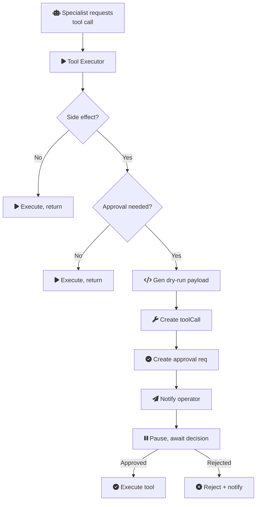

---

## Agent Prompt Architecture

### System Prompt Structure

Each agent (orchestrator and specialists) receives a structured system prompt composed of these sections:

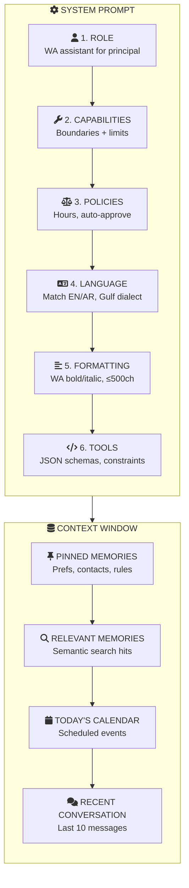

### Language Handling (EN/AR)

The agent detects the language of the inbound message and responds accordingly:

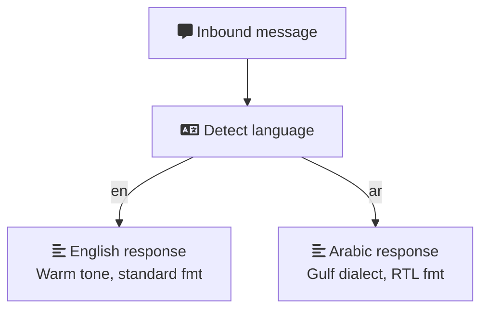

Language detection uses a lightweight classifier (no LLM call). The detected language is stored on the message record and passed to the agent as context. The agent's system prompt includes bilingual instructions.

### Prompt Composition Pipeline

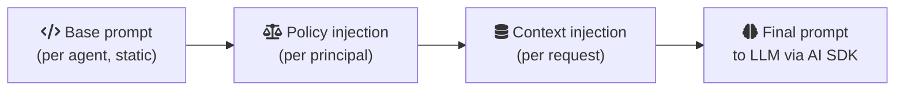

1. **Base prompt** is static per agent type (orchestrator, scheduler, calendar, etc.) and defines the role, capabilities, and formatting rules.
2. **Policy injection** adds the principal's specific preferences, approval rules, and working hours.
3. **Context injection** adds real-time data: memories, calendar events, recent conversation, and any active reminders.

The composed prompt is passed to `generateText()` or `streamText()` from the Vercel AI SDK. Tool definitions are provided as structured JSON schemas to enable native tool calling by the LLM.

---

## Observability (LangSmith)

Every agent run is traced via LangSmith for production observability. See [Security Posture > Agent Observability](/security/posture#agent-observability-langsmith) for the full integration architecture, PII redaction policy, and alerting thresholds.

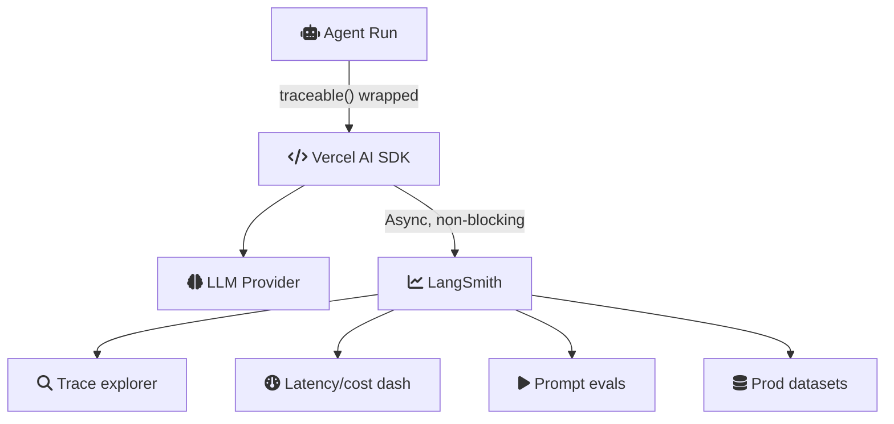

Key: tracing is async and non-blocking. LangSmith outage does not affect agent execution.
