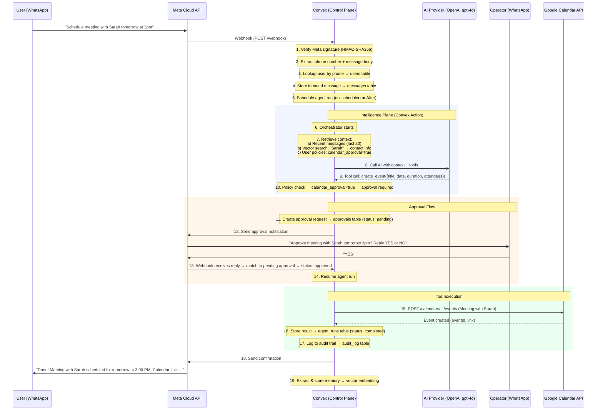
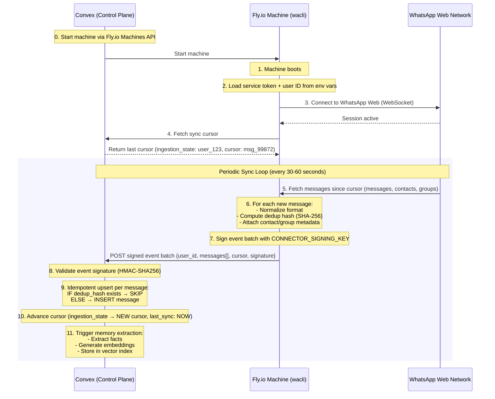
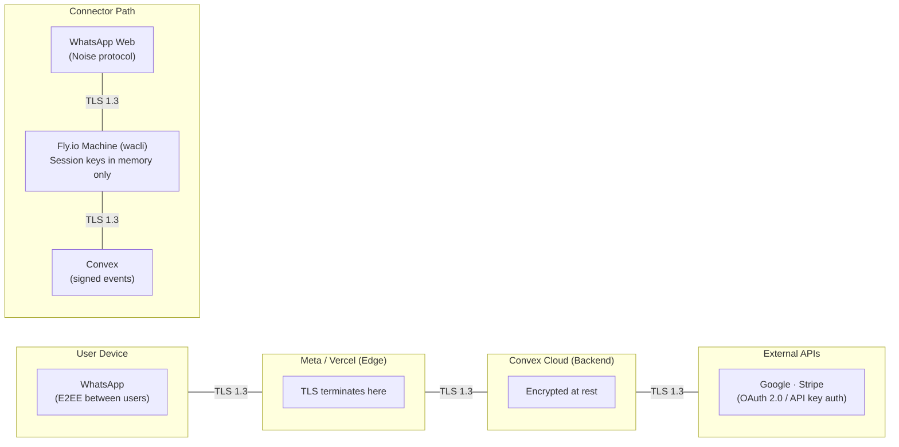

# End-to-End Data Flow

This document traces the complete path of data through the Ecqqo system for two critical flows: an agent-driven scheduling request and the background message sync/ingestion pipeline.

## Flow 1: Scheduling Request

A user sends "Schedule meeting with Sarah tomorrow at 3pm" to the Ecqqo WhatsApp number. Here is the complete end-to-end flow from message send to calendar confirmation.

### Timing Breakdown (Typical)

| Step | Time | Cumulative |
|------|------|------------|
| Meta webhook delivery | ~200ms | 200ms |
| Signature verify + user lookup | ~50ms | 250ms |
| Message store + schedule run | ~100ms | 350ms |
| Context assembly (vector search) | ~150ms | 500ms |
| AI provider call (gpt-4o) | ~2-4s | 3-4s |
| Approval request sent | ~300ms | 3.5-4.5s |
| *--- waiting for operator ---* | *variable* | |
| Operator approval received | ~200ms | +200ms |
| Google Calendar API call | ~500ms | +700ms |
| Confirmation sent to user | ~300ms | +1000ms |
| **Total (excluding approval wait)** | **~4-6 seconds** | |

## Flow 2: Message Sync / Ingestion (wacli)

The wacli connector worker on Fly.io syncs historical and ongoing messages from WhatsApp Web into Convex. This runs independently of the Cloud API webhook flow and provides richer context.

### Sync Guarantees

| Property | Mechanism |
|----------|-----------|
| Exactly-once delivery | Deduplication hash (SHA-256 of sender + timestamp + body) checked before insert. Duplicate messages from overlapping syncs are silently dropped. |
| Ordering | Messages stored with original WhatsApp timestamp. Cursor advances only after successful batch commit. If a batch fails, the cursor stays put and the next sync retries from the same point. |
| Crash recovery | Cursor is persisted in Convex after each successful batch. If the Fly.io machine crashes: (1) Convex detects missed health check, (2) Convex restarts the machine, (3) Machine fetches last cursor and resumes. No messages are lost; some may be re-fetched (handled by dedup). |
| Authentication | Every event batch is signed with CONNECTOR_SIGNING_KEY (HMAC-SHA256). Convex rejects unsigned or incorrectly signed payloads. |
| Isolation | Each machine's service token is scoped to a single user_id. A compromised worker cannot read or write another user's data. |

## Data Sensitivity Classification

| Data Category | Storage Location | Sensitivity | Encryption | Retention |
|---|---|---|---|---|
| **Phone numbers** | Convex `users` table | PII - High | Encrypted at rest (Convex managed) | Until account deletion |
| **Message content** | Convex `messages` table | PII - High | Encrypted at rest; in transit via TLS | Configurable per user (default: 1 year) |
| **Contact metadata** | Convex `contacts` table | PII - Medium | Encrypted at rest | Until account deletion |
| **Memory embeddings** | Convex vector index | Derived PII - Medium | Encrypted at rest | Pruned after 90 days of irrelevance |
| **Extracted facts** | Convex `memory` table | PII - High | Encrypted at rest | Pruned after 90 days of irrelevance |
| **OAuth tokens** | Convex (encrypted field) | Secret - Critical | AES-256 encrypted field + at rest | Revoked on disconnect; refreshed automatically |
| **API keys** | Convex env vars, Fly.io secrets | Secret - Critical | Platform-managed secret storage | Rotated quarterly |
| **Agent run logs** | Convex `agent_runs` table | Internal - Medium | Encrypted at rest | 6 months |
| **Audit log** | Convex `audit_log` table | Compliance - High | Encrypted at rest; append-only | 2 years minimum |
| **Billing data** | Stripe (primary), Convex (mirror) | Financial - High | Stripe PCI compliance; Convex encrypted at rest | Per Stripe retention policy |
| **wacli session keys** | Fly.io machine memory only | Secret - Critical | In-memory only; never persisted to disk | Destroyed on machine stop |
| **Media files** | Convex file storage | PII - High | Encrypted at rest; signed URLs for access | Configurable per user |

### Data Flow Security Summary

::: info Note on encryption
Messages between a user and the Ecqo WhatsApp Business number are encrypted in transit but readable by the Ecqo system. This is by design -- the agent must read messages to process them. Users are informed of this during onboarding. E2EE applies only between WhatsApp users, not between a user and Ecqo.
:::
