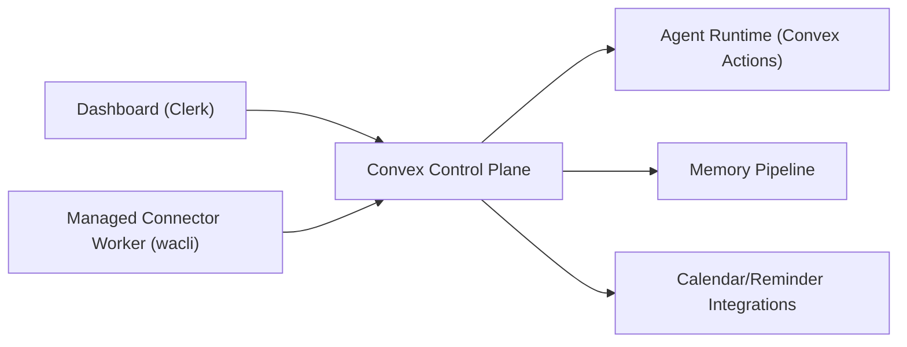
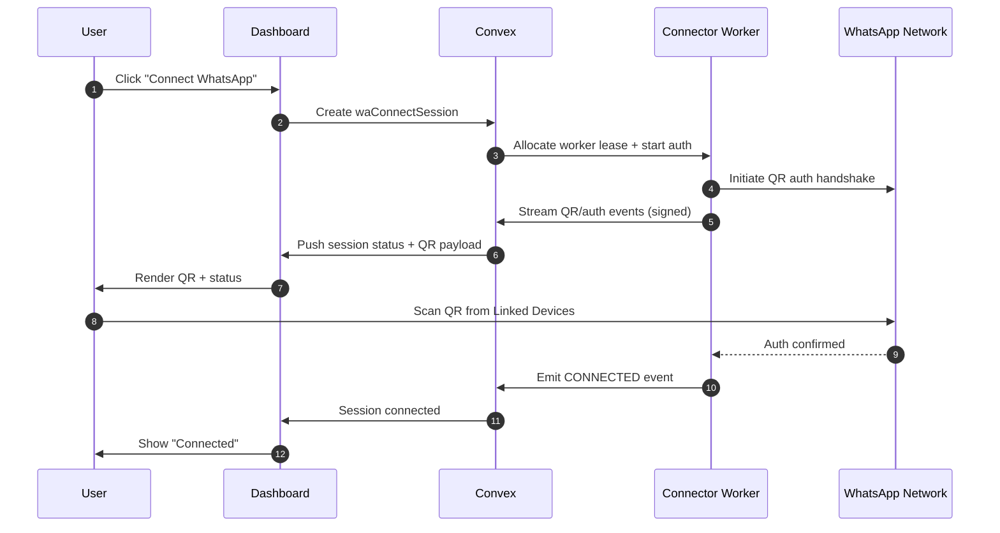
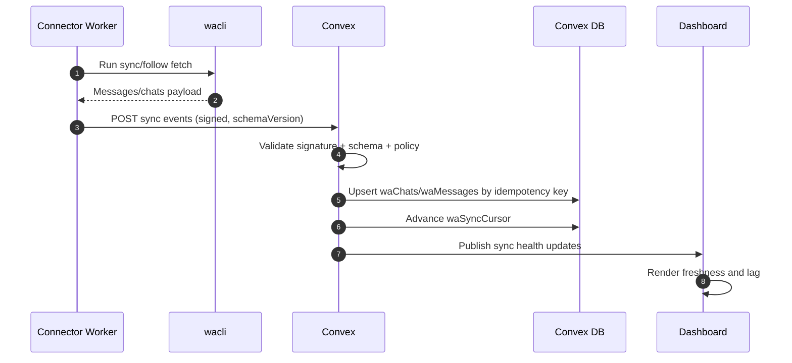
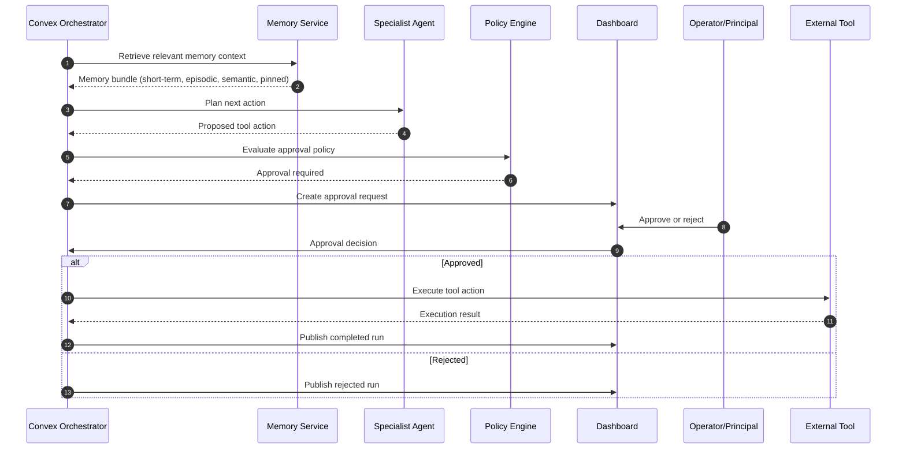
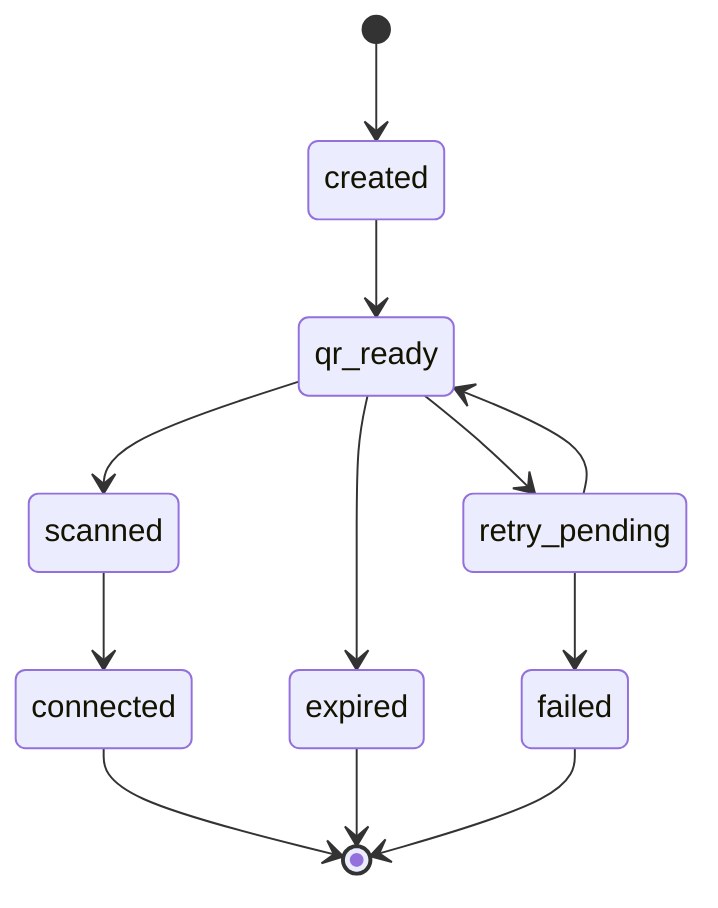
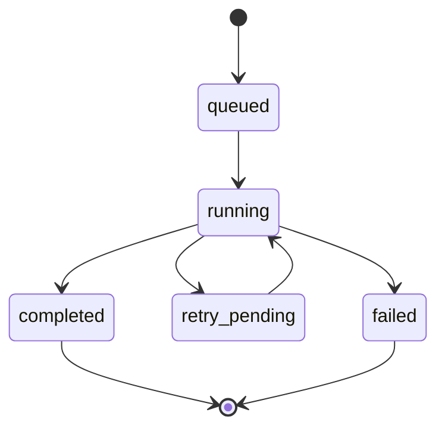
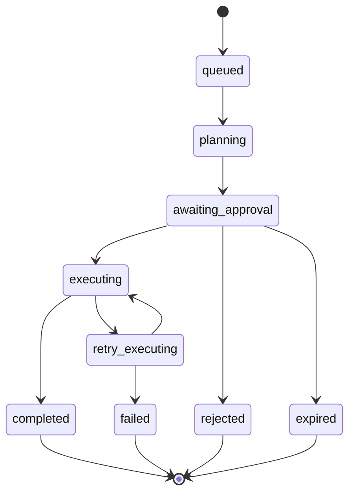

# Managed WhatsApp Agent Architecture (Server-Managed `wacli`)

Date: March 7, 2026  
Status: Architecture approved for implementation handoff

## 1. Title and Decision Snapshot
Ecqqo operates a server-managed WhatsApp ingestion and agent platform for non-technical users. Users authenticate in the Ecqqo dashboard, link WhatsApp by scanning a QR code, and receive AI assistance based on periodically synced conversation context.

Locked architectural decisions:
- Managed server-side `wacli` sessions per user account.
- Pilot-only rollout with explicit risk controls and instant kill-switch.
- V1 WhatsApp path is read-only (ingestion/context only, no outbound via unofficial client).
- Metadata-first sync by default; full message body sync only for explicitly allowlisted chats.
- Clerk authentication with workspace RBAC (`owner`, `principal`, `operator`).
- Convex-native orchestrator and workflow state management.
- English and Arabic support in runtime, memory extraction, and dashboard views.
- Approval-required execution for all external side-effect tools.

## 2. Goals and Non-Goals
### Goals
- Deliver non-technical onboarding for connecting a personal WhatsApp account.
- Maintain reliable, idempotent, and observable periodic sync.
- Provide memory-backed agent reasoning over approved chat data.
- Provide a dual-role operations dashboard for approvals, traceability, and health monitoring.
- Enforce strict approval gating for side-effectful actions.

### Non-Goals
- Broad public launch in the first release wave.
- Unmanaged local connector requirements for end users.
- Outbound WhatsApp sending through unofficial client path in V1.
- Multi-workspace SaaS tenancy in V1.

## 3. System Architecture
### Architectural Planes
- Experience Plane: TanStack Start dashboard with Clerk session handling and role-based page access.
- Control Plane: Convex as source of truth for identity mapping, ingestion state, policies, runs, memory, and audit.
- Connector Plane: managed worker fleet that hosts isolated `wacli` sessions and emits signed events.
- Intelligence Plane: Convex action-driven orchestration, specialist agents, memory retrieval/extraction, and approval workflow.

### Component responsibilities and trust boundaries
- Dashboard components are untrusted for privileged writes and operate only through authenticated backend contracts.
- Connector workers are trusted workload identities with scoped credentials; no direct human access to worker stores.
- Convex enforces all policy, idempotency, and RBAC decisions.
- External integrations execute only after approval state transitions.

### Deployment model
- Dashboard and Convex deploy as primary control stack.
- Connector workers run in isolated runtime units (one active lease per WhatsApp account).
- Session artifacts are encrypted at rest and scoped to account identity.
- Worker-to-backend communication uses signed service requests and replay protection.

### Component diagram

## 4. End-to-End Flows
### Flow 1: Connect WhatsApp with QR
Trigger:
- User selects `Connect WhatsApp` in dashboard.

Sequence:

State changes:
- `waConnectSessions.status`: `created -> qr_ready -> scanned -> connected` or `failed`.
- `waAccounts.status`: `pending -> connected`.

Failure handling:
- QR timeout transitions session to `expired`.
- Worker crash transitions to `retry_pending`.
- Re-auth required transitions account to `reconnect_required`.

User-visible status:
- `pending`, `qr_ready`, `scanned`, `connected`, `expired`, `reconnect_required`.

### Flow 2: Periodic sync and idempotent ingestion
Trigger:
- Scheduled cadence (every 5 minutes) and continuous follow stream when worker online.

Sequence:

State changes:
- `waSyncJobs.status`: `queued -> running -> completed` or `failed`.
- `waAccounts.syncState`: `syncing -> healthy` or `degraded`.

Failure handling:
- Validation failures produce dead-letter records and `failed` job state.
- Transient ingest faults transition to retry queue with bounded exponential backoff.
- Missing heartbeat marks worker `stale`.

User-visible status:
- `syncing`, `healthy`, `degraded`, `stale`.

### Flow 3: Agent run lifecycle with approval gate
Trigger:
- New inbound synced message or user dashboard action requiring agent reasoning.

Sequence:

State changes:
- `agentRuns.status`: `queued -> planning -> awaiting_approval -> executing -> completed|failed|rejected`.
- `approvalRequests.status`: `pending -> approved|rejected|expired`.

Failure handling:
- Tool transient failure transitions run to `retry_executing`.
- Policy evaluation failure transitions run to `failed_safe`.
- Timeout at approval transitions to `expired`.

User-visible status:
- `awaiting_approval`, `executing`, `completed`, `failed`, `rejected`, `expired`.

### Flow 4: Memory extract/retrieve loop
Trigger:
- Run completion event or periodic memory maintenance pass.

Flow behavior:
- Completed runs trigger episodic summarization and semantic fact extraction.
- Facts receive confidence, language marker (`en|ar`), and TTL policy.
- Pinned memories remain until explicit removal.
- Retrieval stage composes final context in priority order: pinned -> short-term -> high-confidence semantic -> episodic.

Failure handling:
- Extraction errors move run to `memory_partial` and enqueue retry.
- Retrieval fallback returns minimal short-term context when semantic store unavailable.

User-visible status:
- Dashboard marks memory sync as `up_to_date`, `partial`, or `lagging`.

### State machines
#### Connect Session State Machine

Terminal states:
- `connected`, `expired`, `failed`.
Retry states:
- `retry_pending`.

#### Sync Job State Machine

Terminal states:
- `completed`, `failed`.
Retry states:
- `retry_pending`.

#### Agent Run State Machine

Terminal states:
- `completed`, `failed`, `rejected`, `expired`.
Retry states:
- `retry_executing`.

## 5. Data Model and Contracts
### Primary entities
- `waAccounts`: account binding, connection status, sync health, reconnect reason.
- `waConnectSessions`: QR lifecycle and auth attempt history.
- `waChats`: chat metadata, allowlist mode, sync policy flags.
- `waMessages`: normalized message records, ingestion hash, language markers.
- `waSyncCursors`: per-account/per-chat cursor and last successful watermark.
- `waConnectorWorkers`: lease owner, heartbeat, runtime status.
- `agentRuns`: run-level orchestration state and policy context.
- `runSteps`: plan/decision/execution steps for traceability.
- `toolCalls`: dry-run payload, approved action, execution result metadata.
- `approvalRequests`: actor, decision, expiration, rationale.
- `memories`: tier, confidence, TTL, language, source linkage.
- `integrationConnections`: Google Calendar/Gmail/Reminder connection status and scope.
- `auditEvents`: immutable security and operations timeline.

### Required indexes and idempotency rules
- `waAccounts`: unique by `(workspaceId, principalId)` for V1 single-account binding.
- `waConnectSessions`: index by `(workspaceId, status, createdAt)` for recovery and dashboards.
- `waChats`: unique by `(waAccountId, chatExternalId)`.
- `waMessages`: unique idempotency index by `(waAccountId, chatExternalId, messageExternalId)`.
- `waSyncCursors`: unique by `(waAccountId, chatExternalId)`.
- `waConnectorWorkers`: index by `(waAccountId, leaseStatus)`.
- `agentRuns`: index by `(workspaceId, status, createdAt)`.
- `approvalRequests`: index by `(workspaceId, status, expiresAt)`.
- `memories`: index by `(principalId, tier, expiresAt)` and `(principalId, language)`.
- `auditEvents`: index by `(workspaceId, occurredAt)` and `(entityType, entityId)`.

### External interfaces
#### `POST /internal/wa/connect/session`
- Purpose: create a new WhatsApp connection session.
- Auth semantics: Clerk user JWT validated by dashboard backend, RBAC `owner|principal`.
- Idempotency semantics: optional idempotency key; repeated key returns same active session if present.
- Error semantics:
  - `401` unauthenticated
  - `403` role not permitted
  - `409` active connect session already exists
  - `422` workspace/principal mismatch

#### `POST /internal/wa/connect/{sessionId}/events`
- Purpose: ingest QR/auth lifecycle events from connector worker.
- Auth semantics: service HMAC signature with worker identity and timestamp window.
- Idempotency semantics: dedupe by `(sessionId, eventId)`.
- Error semantics:
  - `401` invalid signature
  - `404` unknown session
  - `409` stale or out-of-order state transition
  - `422` invalid schemaVersion/payload

#### `POST /internal/wa/sync/events`
- Purpose: ingest normalized sync events (chat metadata/messages).
- Auth semantics: service HMAC signature + worker lease token.
- Idempotency semantics: dedupe per message key `(waAccountId, chatExternalId, messageExternalId)`.
- Error semantics:
  - `401` signature invalid
  - `403` lease token not active
  - `409` cursor regression
  - `422` schema validation failure

#### `POST /internal/wa/sync/heartbeat`
- Purpose: mark worker liveness and runtime health.
- Auth semantics: service HMAC signature + worker identity.
- Idempotency semantics: last-write-wins by `(workerId, observedAt)`.
- Error semantics:
  - `401` invalid signature
  - `404` unknown worker
  - `409` worker not lease owner

### Event schema versioning policy
- All connector payloads include `schemaVersion`.
- Minor additive changes keep backward compatibility for two active versions.
- Breaking changes require new major version and dual-read window during migration.
- Unsupported versions return `422` with a version mismatch reason.

## 6. Security, Privacy, and Compliance Posture
- Per-user session isolation: each `waAccount` maps to one leased worker context and isolated encrypted store.
- Token and session artifact encryption at rest with environment-managed key hierarchy.
- Signed connector-to-backend requests with anti-replay timestamp checks.
- Chat-level allowlist policy enforced before full-content persistence and before memory extraction.
- RBAC gates across all dashboard views and mutation paths.
- Immutable audit timeline for connect/sync/policy/approval actions.
- Trace redaction for sensitive message fragments and tokens.
- Pilot consent disclosure: unofficial connector behavior and account risk posture.

## 7. Dashboard Information Architecture
### Pages
- Connect: start/retry/disconnect WhatsApp, QR status, reconnect requirements.
- Inbox: approval queue with context, dry-run previews, approve/reject actions.
- Conversations: synced thread timeline with allowlist controls.
- Runs: orchestration trace, agent decisions, execution outcomes, retry markers.
- Memory: memory tiers, confidence, TTL visibility, pin/unpin controls.
- Integrations: status and health for calendar/reminder/email connectors.
- Policy: approval policy, quiet windows, guardrails, workspace defaults.

### Role behavior
- Principal:
  - configures policy defaults
  - approves high-impact decisions
  - views memory and run history for owned context
- Operator:
  - manages daily approval queue
  - triages degraded sync and reconnect events
  - monitors run failures and retry outcomes

### Status semantics
- `connected`: active lease and recent heartbeat.
- `degraded`: ingestion or orchestration SLO breached, partial service available.
- `reconnect_required`: session invalid and user action needed.
- `syncing`: active sync job in progress.
- `stale`: heartbeat missing beyond threshold.

## 8. Sub-Agent Execution Workstreams
### Workstream A: Auth/RBAC
- Scope: Clerk identity model, workspace membership, role enforcement boundary.
- Dependencies: none.
- Handoff artifacts: access matrix, role-to-action mapping, identity schema.
- Definition of done: all privileged operations have deterministic role checks.

### Workstream B: Connector lifecycle
- Scope: worker lease model, QR auth lifecycle, reconnect semantics, heartbeat.
- Dependencies: A.
- Handoff artifacts: session lifecycle spec, worker lease contract, runbook.
- Definition of done: exactly one active worker lease per account with recoverable reconnect path.

### Workstream C: Sync/ingestion
- Scope: event normalization, idempotent writes, cursor progression, dead-letter policy.
- Dependencies: B.
- Handoff artifacts: ingest schema catalog, idempotency contract, retry policy.
- Definition of done: duplicate and out-of-order events are safely handled.

### Workstream D: Orchestration/runtime
- Scope: run state machine, specialist routing, policy checks, approval transition logic.
- Dependencies: A, C.
- Handoff artifacts: orchestration state spec, policy decision table, run trace schema.
- Definition of done: no side-effect transition bypasses approval state.

### Workstream E: Memory system
- Scope: extraction, retrieval ordering, TTL policy, EN/AR memory tagging.
- Dependencies: C, D.
- Handoff artifacts: memory tier contract, retrieval precedence spec, retention policy.
- Definition of done: context assembly is deterministic and policy-compliant.

### Workstream F: Dashboard UX
- Scope: role-aware IA, status semantics, operator workflows, principal controls.
- Dependencies: A, B, C, D, E.
- Handoff artifacts: navigation map, screen-state matrix, copy/status taxonomy.
- Definition of done: principal and operator can operate without backend intervention.

### Workstream G: Security/observability
- Scope: encryption posture, signature verification, audit trails, SLO metrics, kill-switch.
- Dependencies: all prior workstreams.
- Handoff artifacts: security controls matrix, SLO dashboard spec, incident runbooks.
- Definition of done: pilot safety controls are measurable and enforceable.

## 9. Milestones and Rollout
### M0: Architecture + contracts approved
- Architecture document ratified.
- Interface and state contracts frozen for implementation.

### M1: Connection + sync foundation
- Managed connect sessions, worker lease, heartbeat, metadata sync, allowlist policy baseline.

### M2: Runtime + memory + dashboard ops
- Agent orchestration, approval queue, run traces, memory loop, operator controls.

### M3: Pilot hardening + SLOs + runbooks
- Security hardening, reliability guardrails, incident runbooks, pilot operations dashboard.

### Pilot gates
- Connect success rate above threshold in pilot cohort.
- Sync freshness SLO met for allowlisted chats.
- Zero critical cross-user access violations.
- Approval gate invariants proven by audit checks.

### Kill-switch criteria
- Elevated account restriction events from provider ecosystem.
- Repeated signature/auth anomalies from connector fleet.
- Sustained data integrity violations (duplicate/cursor corruption).
- Manual emergency disable by owner role.

## 10. Test and Acceptance Matrix
### Unit tests
- State transition legality for connect/sync/run state machines.
- Policy engine approval requirements.
- Memory retrieval precedence and TTL expiration behavior.

### Integration tests
- QR/auth event ingestion path with signature validation.
- Sync ingestion with dedupe, cursor advancement, and retry behavior.
- Approval workflow from proposal to execution outcome.

### End-to-end tests
- Non-technical connect flow and reconnect flow.
- Operator queue handling and principal oversight paths.
- EN/AR memory-backed response relevance in dashboard traces.

### Chaos/recovery tests
- Worker crash during auth and during sync.
- Out-of-order event replay and duplicate delivery storms.
- Backend partial outage with eventual recovery and cursor continuity.

### Mandatory acceptance checks
- No cross-user data leakage.
- No duplicate message ingestion after retries/replays.
- No side-effect execution without explicit approval.
- Sync freshness SLO is met under pilot load.
- EN/AR memory retrieval quality remains within agreed QA threshold.

## 11. Risks and Mitigations
### Risk: unofficial client/account restrictions
- Mitigation: pilot-only rollout, consent disclosure, account-level kill switch, rapid disconnect controls.
- Rollback: disable connector ingress and preserve readonly historical data.

### Risk: backfill inconsistency when phone offline
- Mitigation: incremental cursor sync first, reconciliation windows, user-visible freshness status.
- Rollback: freeze full-content extraction and continue metadata-only sync.

### Risk: worker churn/session invalidation
- Mitigation: lease ownership checks, heartbeat watchdogs, controlled reconnect state.
- Rollback: quarantine affected account to `reconnect_required` with no data writes until stable.

## 12. Open Decisions Log
No unresolved architecture decisions at this stage.  
If new decisions emerge during implementation, each entry must include: decision statement, owner, due date, and impact surface.

