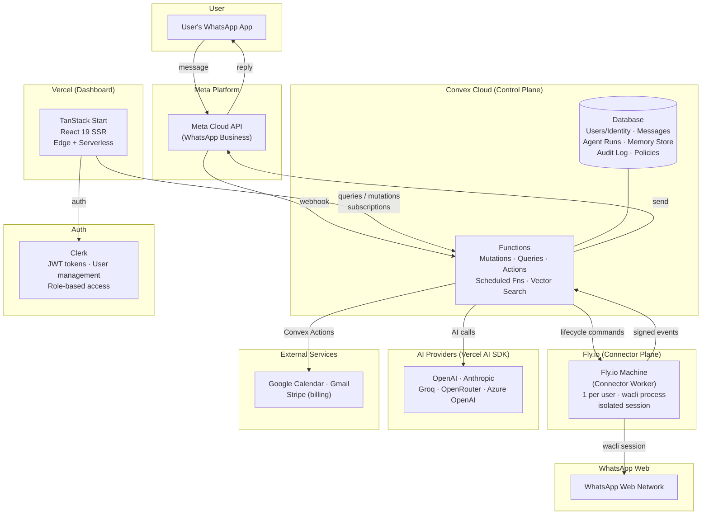
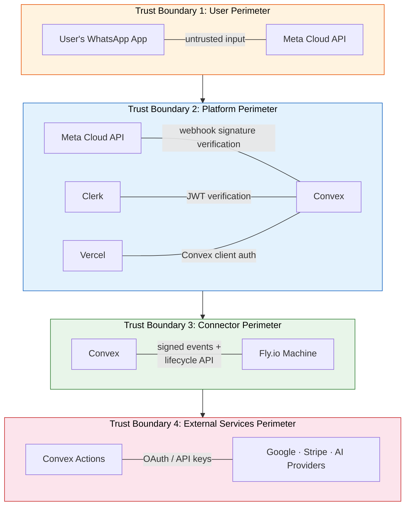

# System Overview

Ecqqo is a WhatsApp-native executive assistant that lets high-net-worth operators delegate scheduling, communications, and administrative tasks through natural WhatsApp conversations. The system identifies users by phone number, processes requests through an AI orchestration layer, and executes actions across integrated services with human-in-the-loop approval.

## Component Diagram

## Tech Stack

| Component | Technology | Rationale |
|---|---|---|
| **Frontend** | TanStack Start + React 19 | SSR-first framework with file-based routing. React 19 provides server components and improved streaming. |
| **Backend / Control Plane** | Convex | Reactive database with built-in real-time subscriptions, scheduled functions, and vector search. Zero-ops backend eliminates infrastructure management for a solo dev. |
| **Auth** | Clerk | Drop-in auth with JWT integration for Convex. Supports role-based access (Principal vs Operator) out of the box. |
| **Deployment (Dashboard)** | Vercel | Native TanStack Start support. Edge + serverless functions for SSR with zero-config deployments. |
| **Connector Workers** | Fly.io Machines | Per-user isolated machines that can be started/stopped on demand. Pay-nothing when stopped. Simple deployment model for solo dev. |
| **WhatsApp Integration** | Meta Cloud API + wacli | Cloud API for official business messaging (send/receive). wacli for extended WhatsApp Web capabilities (history sync, richer context). |
| **AI Orchestration** | Vercel AI SDK | Provider-agnostic interface to swap between OpenAI, Anthropic, Groq, and others without code changes. Streaming support built in. |
| **Billing** | Stripe | Industry-standard subscription billing with webhooks for lifecycle events. |
| **Email** | Resend (@convex-dev/resend) | Transactional email for waitlist and notifications. Native Convex component. |

## Key Architectural Decisions

1. **WhatsApp as primary interface, dashboard as secondary.** The target users (executives, operators) already live in WhatsApp. Forcing them into a web dashboard creates friction. The dashboard exists for configuration, analytics, and approval workflows that benefit from a richer UI.

2. **Convex as the single source of truth.** All state lives in Convex: user identity, message history, agent runs, memory, policies, and audit logs. Fly.io workers and the Vercel dashboard are stateless consumers. This simplifies consistency guarantees and eliminates state synchronization bugs.

3. **One Fly.io Machine per user for connector isolation.** Each user's wacli session runs in its own machine. This provides process isolation (one user's crash cannot affect another), independent lifecycle management (start/stop per user), and clear cost attribution.

4. **Vercel AI SDK for provider agnosticism.** Wrapping AI calls through the Vercel AI SDK means switching from OpenAI to Anthropic (or using both for different tasks) requires changing a single provider parameter, not rewriting prompt handling, streaming, or tool-calling code.

5. **Human-in-the-loop approval for sensitive actions.** The agent never executes calendar changes, email sends, or financial operations without explicit approval from the designated operator. Approval requests flow through WhatsApp for speed and are logged in Convex for audit.

6. **Monorepo with clear service boundaries.** Frontend (`app/`), backend (`convex/`), and connector worker (`services/connector/`) live in one repo for atomic changes and shared types, but deploy independently to different platforms.

## Trust Boundaries

The system has four distinct trust boundaries that govern how components authenticate and authorize communication:

Each boundary enforces the principle of least privilege: components only receive the credentials and data they need to perform their specific function. Cross-boundary communication always flows through authenticated, validated channels.
