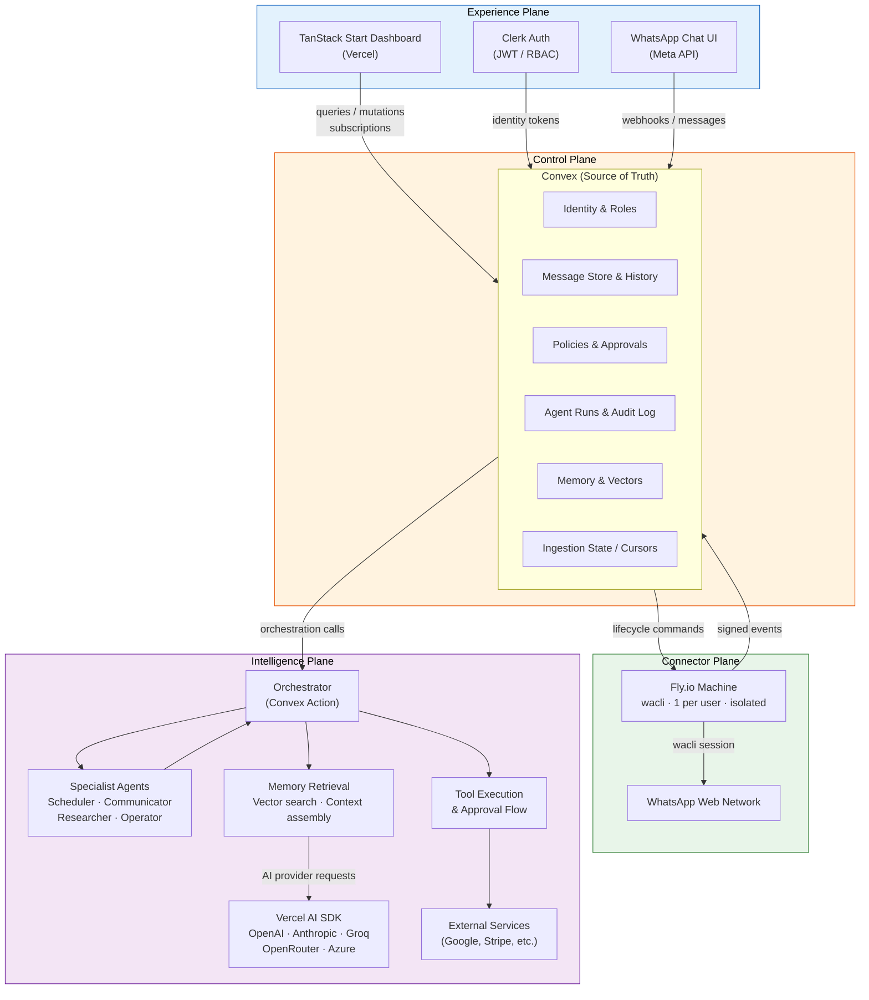
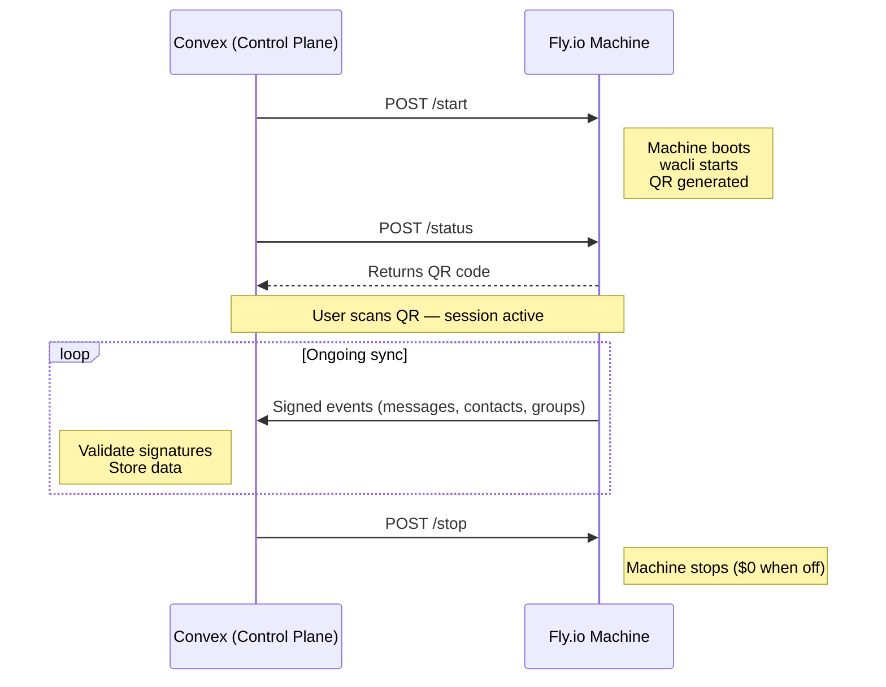
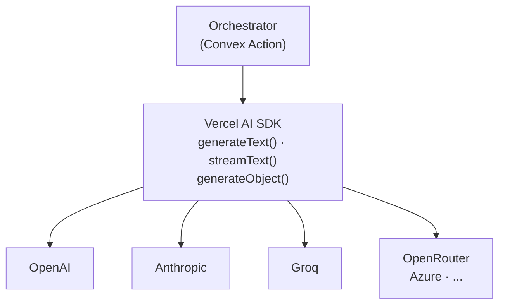

# Architectural Planes

Ecqqo's architecture is organized into four distinct planes, each with a clear responsibility boundary. This separation ensures that concerns like user interaction, data management, connectivity, and intelligence remain decoupled, allowing independent evolution and failure isolation.

## Plane Interaction Diagram

## 1. Experience Plane

The Experience Plane handles all user-facing interactions across two surfaces: the WhatsApp chat interface (primary) and the web dashboard (secondary).

### WhatsApp Interface
- Users interact with a single Ecqqo WhatsApp Business number
- Messages arrive via Meta Cloud API webhooks into Convex
- Responses are sent back through the Meta Cloud API send endpoint
- The phone number serves as the identity anchor -- no login required for WhatsApp interactions

### Web Dashboard (TanStack Start on Vercel)
- Server-side rendered React 19 application
- Clerk provides authentication with JWT tokens validated by Convex
- Two role-based views:
  - **Principal view**: The executive sees their conversation history, pending approvals, preferences, and analytics
  - **Operator view**: The assistant/operator sees all principals they manage, can configure agent behavior, review audit logs, and handle approvals that escalate beyond WhatsApp

### Key Responsibilities
- Rendering UI (chat history, approval cards, settings)
- Capturing user input and routing it to the Control Plane
- Real-time updates via Convex subscriptions (new messages, approval status changes)
- Zero business logic -- the Experience Plane is a pure presentation layer

## 2. Control Plane

The Control Plane is the authoritative source of truth for the entire system. It runs entirely on Convex Cloud.

### Data Domains

| Domain | Description |
|---|---|
| **Identity** | User records keyed by phone number, linked Clerk IDs, role assignments (Principal/Operator), onboarding state |
| **Messages** | All WhatsApp messages (inbound and outbound), normalized and stored with metadata (timestamps, delivery status, media references) |
| **Ingestion State** | Per-user sync cursors for wacli workers, deduplication checksums, last-sync timestamps |
| **Policies** | Per-user agent configuration: what actions require approval, spending limits, allowed calendar operations, contact preferences |
| **Agent Runs** | Execution records for every agent invocation: input, plan, tool calls, results, approval decisions, final output |
| **Memory** | Extracted facts, preferences, and relationship context stored as vector embeddings for semantic retrieval |
| **Audit Log** | Immutable append-only log of every state change, approval decision, and external action for compliance |

### Key Responsibilities
- Webhook reception and validation (Meta Cloud API signatures)
- User identification and session resolution by phone number
- Triggering agent runs via scheduled functions
- Managing Fly.io machine lifecycle (start, stop, restart commands)
- Enforcing policies and approval requirements
- Storing and indexing all data with real-time subscriptions

## 3. Connector Plane

The Connector Plane manages the fleet of isolated wacli worker processes that connect to WhatsApp Web for extended capabilities beyond the official Cloud API.

### Architecture
- Each user gets a dedicated Fly.io Machine running a wacli process
- The machine connects to WhatsApp Web and maintains a persistent session
- Synced data (message history, contacts, group info) is posted to Convex as signed events
- Convex validates event signatures before processing

### Why a Separate Plane
The official Meta Cloud API only provides messages sent after the business number is set up. The wacli connector enables:
- Historical message sync (past conversations for context)
- Richer contact and group metadata
- Read receipts and presence information
- Media download and processing

### Lifecycle Management

### Isolation Guarantees
- Each machine runs in its own VM -- no shared memory or filesystem
- Service tokens are scoped to a single user's data partition in Convex
- A crashed worker cannot affect other users' sessions
- Machines are ephemeral and can be rebuilt from Convex state

## 4. Intelligence Plane

The Intelligence Plane contains all AI reasoning, tool execution, and approval workflow logic. It runs as Convex actions (serverless functions with external network access).

### Orchestration Flow
1. **Trigger**: A new message arrives and the Control Plane schedules an agent run
2. **Context Assembly**: The orchestrator retrieves relevant memory (vector search), recent conversation history, user policies, and contact context
3. **Planning**: The orchestrator calls an AI provider (via Vercel AI SDK) with the assembled context and available tools
4. **Specialist Dispatch**: Based on the plan, specialist agents handle specific domains:
   - **Scheduler**: Calendar operations (create, move, cancel events)
   - **Communicator**: Draft and send messages on behalf of the principal
   - **Researcher**: Look up information, summarize documents
   - **Operator**: Handle meta-tasks (update preferences, explain capabilities)
5. **Approval Gate**: If the planned action requires approval (per user policies), an approval request is created and the operator is notified via WhatsApp
6. **Execution**: Upon approval, the specialist executes the action against external services
7. **Response**: The result is composed into a natural WhatsApp message and sent to the user
8. **Memory Extraction**: Key facts from the interaction are extracted and stored as vector embeddings

### Provider Agnosticism
The Vercel AI SDK provides a unified interface across providers:

Switching providers is a configuration change, not a code change. Different specialists can use different providers optimized for their task (e.g., fast models for classification, powerful models for planning).

### Memory System
- Facts extracted from conversations are stored with vector embeddings
- Convex vector search enables semantic retrieval at query time
- Memory is scoped per principal (never leaks across users)
- The orchestrator assembles a context window from: recent messages + relevant memories + user policies
