# Dashboard Information Architecture

The Ecqqo dashboard is a role-gated, real-time control surface built with TanStack Start + React 19. It gives principals (the high-net-worth operators who use the assistant) and their support staff visibility into every action the agent takes, with approval controls at every exit point.

## Navigation Structure

```mermaid
flowchart TD
    Dashboard["fa:fa-gauge Dashboard<br/>(Clerk auth, RBAC)"]

    Dashboard --> Home
    Dashboard --> Connect
    Dashboard --> Inbox
    Dashboard --> Conversations
    Dashboard --> Runs
    Dashboard --> Memory
    Dashboard --> Integrations
    Dashboard --> Policy
    Dashboard --> Settings

    subgraph Home["fa:fa-house Home / Overview"]
        direction LR
        H1["fa:fa-chart-line Status cards<br/>WA, sync, approvals"]
        H2["fa:fa-bolt Quick actions"]
        H3["fa:fa-list-check Activity feed (24h)"]
    end

    subgraph Connect["fa:fa-link Connect"]
        direction LR
        C1["fa:fa-comments QR code display"]
        C2["fa:fa-circle-check Connection status"]
        C3["fa:fa-link Reconnect / disconnect"]
        C4["fa:fa-clock Uptime + heartbeat"]
    end

    subgraph Inbox["fa:fa-inbox Inbox (Approvals)"]
        direction LR
        I1["fa:fa-inbox Approval queue<br/>+ dry-run previews"]
        I2["fa:fa-circle-check Approve / reject"]
        I3["fa:fa-magnifying-glass Filters: pending,<br/>approved, rejected"]
        I4["fa:fa-list-check Batch approve<br/>(owner only)"]
        I5["fa:fa-comments WA deep-link"]
    end

    subgraph Conversations["fa:fa-comments Conversations"]
        direction LR
        CV1["fa:fa-comments Chat list<br/>+ allowlist toggles"]
        CV2["fa:fa-message Thread viewer"]
        CV3["fa:fa-user Contact + sync status"]
        CV4["fa:fa-magnifying-glass Search metadata"]
    end

    subgraph Runs["fa:fa-list-check Runs"]
        direction LR
        R1["fa:fa-magnifying-glass Run explorer"]
        R2["fa:fa-clock State timeline"]
        R3["fa:fa-gear Step details<br/>tools, reasoning"]
        R4["fa:fa-arrow-right Retry info"]
        R5["fa:fa-chart-line Duration + cost"]
    end

    subgraph Memory["fa:fa-microchip Memory"]
        direction LR
        M1["fa:fa-microchip Memory browser<br/>core/active/episodic"]
        M2["fa:fa-magnifying-glass Semantic + keyword"]
        M3["fa:fa-gear Pin/unpin controls"]
        M4["fa:fa-chart-line Confidence scores"]
        M5["fa:fa-clock TTL + expiry"]
    end

    subgraph Integrations["fa:fa-plug Integrations"]
        direction LR
        IG1["fa:fa-link Google Calendar"]
        IG2["fa:fa-message Gmail"]
        IG3["fa:fa-comments WhatsApp connector"]
        IG4["fa:fa-credit-card Stripe billing"]
        IG5["fa:fa-plug Connect / disconnect"]
    end

    subgraph Policy["fa:fa-scale-balanced Policy"]
        direction LR
        P1["fa:fa-scale-balanced Approval rules"]
        P2["fa:fa-clock Quiet hours"]
        P3["fa:fa-shield-halved Guardrails"]
        P4["fa:fa-gear Defaults (lang, tz)"]
    end

    subgraph Settings["fa:fa-gear Settings"]
        direction LR
        S1["fa:fa-gear Workspace config"]
        S2["fa:fa-users Members + roles"]
        S3["fa:fa-credit-card Billing portal"]
        S4["fa:fa-globe Language (EN/AR)"]
        S5["fa:fa-gear Theme (light/dark)"]
        S6["fa:fa-triangle-exclamation Danger zone"]
    end
```



## Role-Page Access Matrix

Three roles govern dashboard access. Every Convex query and mutation checks the caller's Clerk JWT and workspace membership before returning data.

| Page           | Owner              | Principal          | Operator           |
|----------------|--------------------|--------------------|---------------------|
| Home           | Full               | Full               | Limited (no billing stats) |
| Connect        | Full               | View only          | No access           |
| Inbox          | Full + batch       | Approve/reject own | Full (triage + escalate) |
| Conversations  | Full               | Own context only   | Full (monitor all)  |
| Runs           | Full               | Own context only   | Full (monitor all)  |
| Memory         | Full (CRUD)        | Own context only   | View only           |
| Integrations   | Full (connect/disconnect) | View status  | View status         |
| Policy         | Full (CRUD)        | Edit own defaults  | View only           |
| Settings       | Full               | Profile + language | No access           |

**Role definitions:**

- **Owner** -- Workspace creator. Full administrative control. Can invite/remove members, manage billing, activate kill switches, modify all policies. One per workspace.
- **Principal** -- The person the assistant serves. Can approve/reject actions, view their own conversation context and runs, adjust their own default preferences. Multiple allowed per workspace.
- **Operator** -- Support staff or delegated admin. Can triage the approval queue, monitor all conversations and runs, escalate issues. Cannot modify policies or billing.

## Page Wireframes

### Home / Overview

```
+------------------------------------------------------------------+
|  [logo] Ecqqo          Home  Inbox(3)  Runs  Memory    [AR] [??]  |
+------------------------------------------------------------------+
|                                                                    |
|  +-------------------+  +-------------------+                      |
|  | WhatsApp          |  | Sync Health       |                      |
|  | [*] Connected     |  | [*] Healthy       |                      |
|  | Uptime: 4d 12h    |  | Last sync: 2m ago |                      |
|  +-------------------+  +-------------------+                      |
|                                                                    |
|  +-------------------+  +-------------------+                      |
|  | Pending Approvals |  | Today's Runs      |                      |
|  | [!] 3 waiting     |  | 12 completed      |                      |
|  | Oldest: 14m ago   |  | 1 failed, 0 retry |                      |
|  +-------------------+  +-------------------+                      |
|                                                                    |
|  Recent Activity                                        [View all] |
|  +--------------------------------------------------------------+ |
|  | 10:42  Agent scheduled meeting with Dr. Khalid    [approved]  | |
|  | 10:38  Approval requested: send follow-up email   [pending]   | |
|  | 10:21  Memory updated: "prefers morning meetings" [auto]      | |
|  | 09:55  Run completed: daily briefing generation   [completed] | |
|  | 09:30  WhatsApp sync: 4 new messages ingested     [synced]    | |
|  +--------------------------------------------------------------+ |
|                                                                    |
+------------------------------------------------------------------+
```

### Inbox / Approvals

```
+------------------------------------------------------------------+
|  [logo] Ecqqo          Home  Inbox(3)  Runs  Memory    [AR] [??]  |
+------------------------------------------------------------------+
|                                                                    |
|  Approvals                    [Pending v]  [All types v]  [Search] |
|                                                                    |
|  +--------------------------------------------------------------+ |
|  | [!] Send follow-up email to Ahmed Al-Mansour                  | |
|  |     Type: gmail.send | Requested: 14m ago                     | |
|  |                                                                | |
|  |  Dry-run preview:                                              | |
|  |  +----------------------------------------------------------+ | |
|  |  | To: ahmed@example.com                                     | | |
|  |  | Subject: Re: Q2 Investment Summary                        | | |
|  |  | Body: "Dear Ahmed, Following up on our discussion..."     | | |
|  |  +----------------------------------------------------------+ | |
|  |                                                                | |
|  |  [Approve]  [Reject]  [View full context]                     | |
|  +--------------------------------------------------------------+ |
|                                                                    |
|  +--------------------------------------------------------------+ |
|  | [!] Create calendar event: Board dinner                       | |
|  |     Type: calendar.create | Requested: 22m ago                | |
|  |     Mar 15, 7:00 PM - 10:00 PM | La Petite Maison             | |
|  |                                                                | |
|  |  [Approve]  [Reject]  [View full context]                     | |
|  +--------------------------------------------------------------+ |
|                                                                    |
|  +--------------------------------------------------------------+ |
|  | [!] Reply to WhatsApp message from Fatima                     | |
|  |     Type: whatsapp.send | Requested: 31m ago                  | |
|  |     "Will confirm the venue by Thursday evening."              | |
|  |                                                                | |
|  |  [Approve]  [Reject]  [View full context]                     | |
|  +--------------------------------------------------------------+ |
|                                                                    |
+------------------------------------------------------------------+
```

### Connect WhatsApp

```
+------------------------------------------------------------------+
|  [logo] Ecqqo          Home  Inbox(3)  Runs  Memory    [AR] [??]  |
+------------------------------------------------------------------+
|                                                                    |
|  Connect WhatsApp                                                  |
|                                                                    |
|  +-------------------------------+  +---------------------------+  |
|  |                               |  |                           |  |
|  |    +-------------------+      |  |  Status: Disconnected     |  |
|  |    |                   |      |  |                           |  |
|  |    |    [QR CODE]      |      |  |  1. Open WhatsApp on      |  |
|  |    |                   |      |  |     your phone            |  |
|  |    |   +-----------+   |      |  |  2. Tap Menu > Linked     |  |
|  |    |   |           |   |      |  |     Devices               |  |
|  |    |   |  QR CODE  |   |      |  |  3. Point your phone at   |  |
|  |    |   |   HERE    |   |      |  |     this QR code          |  |
|  |    |   |           |   |      |  |                           |  |
|  |    |   +-----------+   |      |  |  Session will persist     |  |
|  |    |                   |      |  |  across browser sessions. |  |
|  |    +-------------------+      |  |                           |  |
|  |                               |  |  [Refresh QR]             |  |
|  |  QR expires in 42s [|||||||]  |  |                           |  |
|  |                               |  +---------------------------+  |
|  +-------------------------------+                                 |
|                                                                    |
|  After connecting:                                                 |
|  +--------------------------------------------------------------+ |
|  |  Status: [*] Connected                                        | |
|  |  Phone: +971 50 *** **42                                      | |
|  |  Session uptime: 4d 12h 33m                                   | |
|  |  Last heartbeat: 12s ago                                       | |
|  |  Worker region: Dubai (fly-dxb)                                | |
|  |                                                                | |
|  |  [Reconnect]  [Disconnect]                                     | |
|  +--------------------------------------------------------------+ |
|                                                                    |
+------------------------------------------------------------------+
```

## Status Indicators and Color Coding

The dashboard uses a consistent set of status indicators across all pages. Colors map to the design token system defined in `app/styles.css`.

| Status | Color | CSS Variable | Behavior |
|--------|-------|-------------|----------|
| Connected | Green / teal | `--accent` (#0d7a6a) | Solid dot |
| Healthy | Green / teal | `--accent` (#0d7a6a) | Solid dot |
| Degraded | Amber | `--warning` (#d4a017) | Pulsing dot |
| Disconnected | Red | `--signal` (#e04b2c) | Solid dot |
| Failed | Red | `--signal` (#e04b2c) | Solid dot |
| Syncing | Blue | `--info` (#2563eb) | Animated spinner |
| Pending | Amber | `--warning` (#d4a017) | Pulsing dot |
| Approved | Green / teal | `--accent` (#0d7a6a) | Checkmark icon |
| Rejected | Red | `--signal` (#e04b2c) | X icon |
| Expired | Gray | `--muted` (#9ca3af) | Dimmed, strikethrough |

### Dark Mode Adaptations

In dark mode (`[data-theme="dark"]`), status colors maintain their hue but shift luminosity for contrast against the dark background (`--bg-dark: #1a1a1a`). The accent teal becomes slightly lighter, and the signal red gains brightness to meet WCAG AA contrast requirements.

## Real-Time Subscriptions

The dashboard uses Convex real-time subscriptions to keep data live without polling. The following elements update automatically when backend state changes:

| Page | Element | Convex Subscription |
|------|---------|-------------------|
| Home | Status cards | `workspace.status` |
| Home | Activity feed | `auditEvents.recent` |
| Home | Pending approval count | `approvals.pendingCount` |
| Connect | Connection status | `connector.status` |
| Connect | Heartbeat timestamp | `connector.heartbeat` |
| Connect | QR code (during pairing) | `connector.qrCode` |
| Inbox | Approval queue | `approvals.list` (filtered) |
| Inbox | Approval count badge (nav) | `approvals.pendingCount` |
| Conversations | Chat list | `conversations.list` |
| Conversations | Thread messages | `conversations.messages` |
| Runs | Run list | `runs.list` |
| Runs | Active run state | `runs.byId` (per-run) |
| Runs | Step progress | `runs.steps` |
| Memory | Memory entries | `memory.list` |
| Memory | Confidence scores | `memory.byId` |
| Integrations | Connection statuses | `integrations.status` |
| Settings | Member list | `workspace.members` |

All subscriptions are scoped to the user's workspace ID and filtered by their role. Convex handles connection multiplexing, so opening multiple tabs does not create redundant WebSocket connections.

## Mobile Responsiveness

The dashboard uses the same breakpoint system as the landing page, defined in `app/styles.css`.

| Breakpoint | Width | Layout Changes |
|-----------|-------|---------------|
| Desktop | > 1024px | Sidebar navigation, multi-column cards, full data tables, side-by-side panels |
| Tablet | 641-1024px | Collapsible sidebar (hamburger toggle), two-column card grid, scrollable tables, stacked panels |
| Mobile | <= 640px | Bottom tab navigation (5 primary pages), single-column layout, cards stack vertically, approval actions become full-width buttons, QR code centered, simplified data tables (key columns only) |

### Navigation Adaptation

```
Desktop (> 1024px):
+----------+---------------------------------------------------+
|          |                                                     |
| Sidebar  |  Main content area                                  |
| nav      |                                                     |
| (fixed)  |                                                     |
|          |                                                     |
+----------+---------------------------------------------------+

Tablet (641-1024px):
[=] +-------------------------------------------------------+
    |                                                         |
    |  Main content area (full width)                         |
    |                                                         |
    |  Sidebar slides in as overlay on hamburger tap           |
    |                                                         |
    +-------------------------------------------------------+

Mobile (<= 640px):
+-------------------------------------------------------+
|                                                         |
|  Main content area (full width, more padding)           |
|                                                         |
|                                                         |
+-------------------------------------------------------+
| Home | Inbox | Runs | Memory | More... |   <-- bottom tabs
+-------------------------------------------------------+
```

### RTL Layout (Arabic)

When the language is set to Arabic, the entire layout mirrors horizontally:

- Sidebar moves to the right side on desktop
- Text alignment flips to right-to-left
- Navigation order reverses
- Icons with directional meaning (arrows, chevrons) flip
- Numbers and Latin text remain LTR within the RTL flow (handled by `dir="auto"` on mixed-content elements)
- Font switches from DM Sans to a system Arabic font stack with comparable metrics
