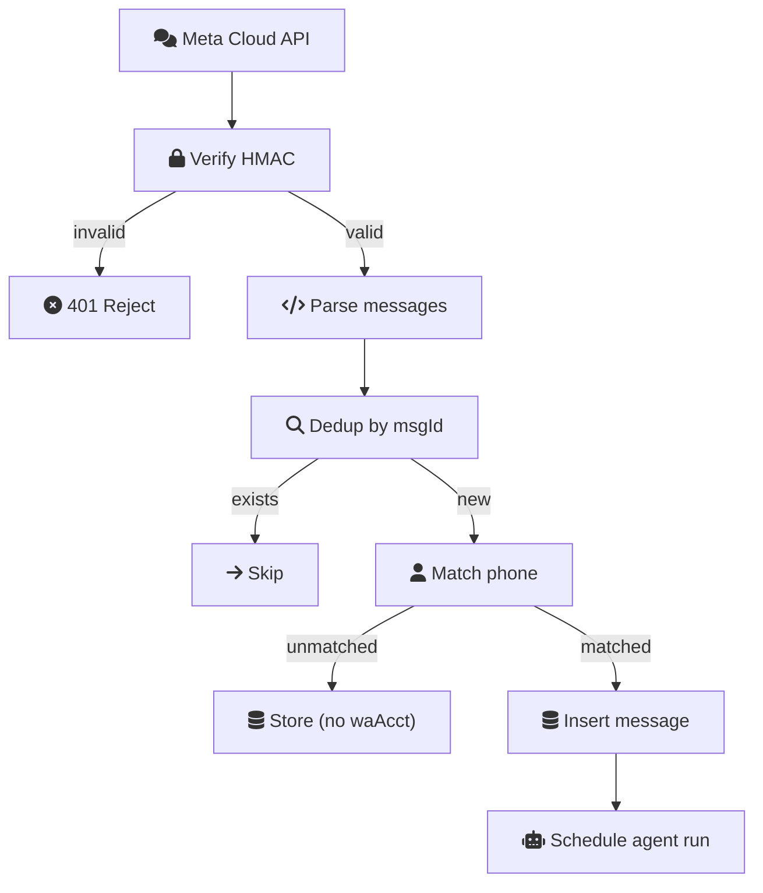
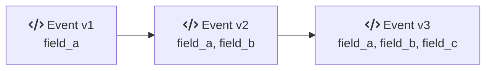

# API Contracts

This document specifies every internal and external API surface in Ecqqo: HTTP endpoints, Convex queries/mutations/actions, webhook handlers, and their request/response schemas. All endpoints follow consistent patterns for authentication, idempotency, and error handling.

## API Surface Overview

<script setup>
const apiSurfaceConfig = {
  layers: [
    {
      id: "api-external",
      title: "External Callers",
      subtitle: "Inbound Traffic",
      icon: "fa-globe",
      color: "red",
      nodes: [
        { id: "api-fly", icon: "si:flydotio", title: "Fly.io Workers", subtitle: "Sync Events" },
        { id: "api-meta", icon: "si:meta", title: "Meta Cloud API", subtitle: "WA Webhooks" },
        { id: "api-stripe", icon: "si:stripe", title: "Stripe", subtitle: "Billing Webhooks" },
        { id: "api-dash", icon: "fa-gauge", title: "Dashboard", subtitle: "User Queries" },
      ],
    },
    {
      id: "api-convex",
      title: "Convex Cloud",
      subtitle: "API Layer",
      icon: "si:convex",
      color: "teal",
      nodes: [
        { id: "api-http", icon: "fa-bolt", title: "HTTP Actions", subtitle: "/internal/wa · /webhooks" },
        { id: "api-qm", icon: "fa-code", title: "Queries & Mutations", subtitle: "Convex SDK" },
        { id: "api-actions", icon: "fa-code", title: "Actions", subtitle: "External Calls" },
      ],
    },
    {
      id: "api-downstream",
      title: "Downstream Services",
      subtitle: "External APIs",
      icon: "fa-plug",
      color: "dark",
      nodes: [
        { id: "api-ai", icon: "fa-brain", title: "AI Providers", subtitle: "LLM Calls" },
        { id: "api-google", icon: "si:google", title: "Google APIs", subtitle: "Calendar · Gmail" },
        { id: "api-meta-out", icon: "si:meta", title: "Meta API", subtitle: "Outbound WA" },
      ],
    },
  ],
  connections: [
    { from: "api-fly", to: "api-http", label: "HTTP POST" },
    { from: "api-meta", to: "api-http", label: "HTTP POST" },
    { from: "api-stripe", to: "api-http", label: "HTTP POST" },
    { from: "api-dash", to: "api-qm", label: "Convex SDK" },
    { from: "api-http", to: "api-actions" },
    { from: "api-qm", to: "api-actions" },
    { from: "api-actions", to: "api-ai" },
    { from: "api-actions", to: "api-google" },
    { from: "api-actions", to: "api-meta-out" },
  ],
}

const dashAuthSeqConfig = {
  type: "sequence",
  actors: [
    { id: "da-browser", icon: "fa-gauge", title: "Dashboard", color: "teal" },
    { id: "da-clerk", icon: "si:clerk", title: "Clerk", color: "warm" },
    { id: "da-convex", icon: "si:convex", title: "Convex", color: "teal" },
  ],
  steps: [
    { from: "da-browser", to: "da-clerk", label: "1. Login" },
    { from: "da-clerk", to: "da-browser", label: "2. JWT issued", dashed: true },
    { from: "da-browser", to: "da-convex", label: "3. Query/mutation + JWT" },
    { from: "da-convex", to: "da-clerk", label: "4. Verify JWT" },
    { from: "da-clerk", to: "da-convex", label: "5. Valid", dashed: true },
    { over: "da-convex", note: "6. Resolve user, check role" },
    { from: "da-convex", to: "da-browser", label: "7. Result (real-time)", dashed: true },
  ],
}

const hmacSeqConfig = {
  type: "sequence",
  actors: [
    { id: "hm-worker", icon: "si:flydotio", title: "Fly.io Worker", color: "red" },
    { id: "hm-convex", icon: "si:convex", title: "Convex", subtitle: "HTTP Action", color: "teal" },
  ],
  steps: [
    { over: "hm-worker", note: "1. Serialize to JSON\n2. HMAC-SHA256(body, secret)\n3. Attach signature" },
    { from: "hm-worker", to: "hm-convex", label: "4. POST event" },
    { over: "hm-convex", note: "5. Lookup secret\n6. Recompute HMAC\n7. Constant-time compare\n8. Reject if mismatch" },
  ],
}
</script>

<ArchDiagram :config="apiSurfaceConfig" />

---

## 1. Connector Worker APIs (Fly.io -> Convex)

These HTTP actions receive signed events from wacli connector workers running on Fly.io. All requests are authenticated with a scoped service token in the `Authorization` header.

### Authentication

All connector worker endpoints use bearer token authentication:

```
Authorization: Bearer <service_token>
```

The service token is scoped to a single `waAccountId` and is issued by Convex when the worker is started. Tokens are short-lived (24 hours) and rotated on worker restart.

---

### POST /internal/wa/connect/session

Creates a new WhatsApp connect session for QR-based authentication.

**Purpose:** Called by the connector worker when it starts in auth mode and is ready to generate a QR code.

**Auth:** Service token scoped to the target `waAccountId`.

**Request:**

```json
{
  "waAccountId": "j572a8b9c0d1e2f3",
  "workerId": "k683b9c0d1e2f3a4"
}
```

**Response (201 Created):**

```json
{
  "sessionId": "m794c0d1e2f3a4b5",
  "expiresAt": 1711843200000
}
```

**Error Codes:**

| Code | Condition |
|---|---|
| 401 | Invalid or expired service token |
| 403 | Token not scoped to the provided `waAccountId` |
| 409 | Active connect session already exists for this account |
| 422 | Invalid request body |

**Idempotency:** If an active (non-terminal) session already exists for the `waAccountId`, returns 409 with the existing session ID. The worker should use the existing session.

---

### POST /internal/wa/connect/{sessionId}/events

Receives lifecycle events during the QR connection flow.

**Purpose:** Called by the connector worker to relay QR code data, scan confirmation, and final connection status.

**Auth:** Service token scoped to the `waAccountId` associated with the session.

**Request:**

```json
{
  "eventType": "QR_READY | SCANNED | CONNECTED | FAILED",
  "timestamp": 1711843200000,
  "payload": {
    "qrData": "<base64 string>",
    "phone": "+971501234567",
    "error": "optional error message"
  },
  "signature": "<HMAC-SHA256 of event body>"
}
```

| eventType | Required payload fields | Session state transition |
|---|---|---|
| `QR_READY` | `qrData` | `created` -> `qr_ready` |
| `SCANNED` | (none) | `qr_ready` -> `scanned` |
| `CONNECTED` | `phone` | `scanned` -> `connected` |
| `FAILED` | `error` | any -> `failed` |

**Response (200 OK):**

```json
{
  "ack": true,
  "sessionStatus": "qr_ready"
}
```

**Error Codes:**

| Code | Condition |
|---|---|
| 401 | Invalid service token |
| 404 | Session not found |
| 409 | Invalid state transition (e.g., `CONNECTED` before `SCANNED`) |
| 422 | Missing required payload fields |

**Idempotency:** Events are idempotent on `(sessionId, eventType)`. Replaying the same event type returns 200 with the current session status and no state change.

---

### POST /internal/wa/sync/events

Receives batches of synced messages and chat metadata from the connector worker.

**Purpose:** Primary data ingestion endpoint. Called periodically by the worker as it syncs message history.

**Auth:** Service token scoped to the source `waAccountId`.

**Request:**

```json
{
  "waAccountId": "j572a8b9c0d1e2f3",
  "syncJobId": "n805d1e2f3a4b5c6",
  "batch": [
    {
      "type": "message",
      "chatExternalId": "1234567890@s.whatsapp.net",
      "messageExternalId": "3EB0A1B2C3D4E5F6",
      "sender": "1234567890@s.whatsapp.net",
      "body": "Can you move tomorrow's meeting to 3pm?",
      "timestamp": 1711843200000
    },
    {
      "type": "chat_meta",
      "chatExternalId": "1234567890@s.whatsapp.net",
      "name": "John Smith",
      "isGroup": false
    }
  ],
  "cursor": {
    "chatExternalId": "1234567890@s.whatsapp.net",
    "lastMessageTimestamp": 1711843200000
  },
  "signature": "<HMAC-SHA256 of request body>"
}
```

**Response (200 OK):**

```json
{
  "ack": true,
  "accepted": 12,
  "duplicates": 3,
  "errors": []
}
```

**Error Codes:**

| Code | Condition |
|---|---|
| 401 | Invalid service token |
| 403 | Token not scoped to the provided `waAccountId` |
| 404 | `syncJobId` not found or not in `"running"` state |
| 413 | Batch size exceeds 500 items |
| 422 | Invalid message format |

**Idempotency:** Each message is deduplicated by `ingestionHash` (SHA-256 of `waAccountId + messageExternalId`). Duplicate messages are counted in `duplicates` but not re-inserted. The cursor update is idempotent (only advances forward).

---

### POST /internal/wa/sync/heartbeat

Worker liveness signal.

**Purpose:** Called every 30 seconds by the connector worker to indicate it is alive and healthy.

**Auth:** Service token scoped to the `waAccountId`.

**Request:**

```json
{
  "waAccountId": "j572a8b9c0d1e2f3",
  "workerId": "k683b9c0d1e2f3a4",
  "status": "healthy | degraded",
  "metrics": {
    "memoryMb": 128,
    "messagesPerMinute": 45,
    "uptime": 3600
  }
}
```

**Response (200 OK):**

```json
{
  "ack": true,
  "command": "continue | pause | shutdown"
}
```

The `command` field allows Convex to issue lifecycle instructions to the worker:

| Command | Meaning |
|---|---|
| `continue` | Keep running normally |
| `pause` | Stop syncing but maintain session |
| `shutdown` | Gracefully terminate (user disconnected, plan expired, etc.) |

**Error Codes:**

| Code | Condition |
|---|---|
| 401 | Invalid service token |
| 404 | Worker not found in Convex |

**Idempotency:** Heartbeats are upserts on `(waAccountId, workerId)`. Always updates `lastHeartbeat` timestamp.

---

## 2. Meta Cloud API Webhooks (WhatsApp -> Convex)

### GET /webhooks/whatsapp

Webhook verification endpoint (required by Meta during setup).

**Purpose:** Meta sends a verification request when registering the webhook. Ecqqo must echo back the challenge token.

**Auth:** Verified via `hub.verify_token` matching the configured token in Convex environment variables.

**Query Parameters:**

| Parameter | Description |
|---|---|
| `hub.mode` | Must be `"subscribe"` |
| `hub.verify_token` | Must match `META_VERIFY_TOKEN` env var |
| `hub.challenge` | Challenge string to echo back |

**Response (200 OK):** Returns `hub.challenge` as plain text.

**Error Codes:**

| Code | Condition |
|---|---|
| 403 | `hub.verify_token` does not match |

---

### POST /webhooks/whatsapp

Receives inbound messages from users via Meta Cloud API.

**Purpose:** Primary inbound channel. Users send WhatsApp messages to the Ecqqo Business Number, and Meta delivers them here.

**Auth:** HMAC-SHA256 signature verification using `META_APP_SECRET`.

**Signature Verification:**

```
X-Hub-Signature-256: sha256=<HMAC-SHA256(request_body, META_APP_SECRET)>
```

The handler:
1. Reads the raw request body
2. Computes HMAC-SHA256 using `META_APP_SECRET`
3. Compares with the `X-Hub-Signature-256` header using constant-time comparison
4. Rejects with 401 if mismatch

**Request (Meta webhook payload):**

```json
{
  "object": "whatsapp_business_account",
  "entry": [
    {
      "id": "WHATSAPP_BUSINESS_ACCOUNT_ID",
      "changes": [
        {
          "value": {
            "messaging_product": "whatsapp",
            "metadata": {
              "display_phone_number": "971501234567",
              "phone_number_id": "PHONE_NUMBER_ID"
            },
            "messages": [
              {
                "from": "971509876543",
                "id": "wamid.ABCdef123456",
                "timestamp": "1711843200",
                "type": "text",
                "text": {
                  "body": "Move my 3pm meeting to tomorrow"
                }
              }
            ]
          },
          "field": "messages"
        }
      ]
    }
  ]
}
```

**Processing Flow:**



**Response:** Always returns 200 OK immediately (Meta requires fast acknowledgment). Processing happens asynchronously via scheduled Convex functions.

**Error Codes:**

| Code | Condition |
|---|---|
| 401 | Invalid HMAC signature |
| 200 | Always returned for valid signatures (even if processing fails internally) |

**Idempotency:** Deduplicated by `messageId` from the Meta payload. Meta may retry delivery; duplicate messages are silently ignored.

---

## 3. Stripe Webhooks

### POST /webhooks/stripe

Receives subscription lifecycle events from Stripe.

**Purpose:** Keeps Convex subscription state in sync with Stripe. Handles plan changes, payment failures, and cancellations.

**Auth:** Stripe signature verification using `STRIPE_WEBHOOK_SECRET`.

**Signature Verification:**

```
Stripe-Signature: t=<timestamp>,v1=<HMAC-SHA256(timestamp.payload, STRIPE_WEBHOOK_SECRET)>
```

Uses the `stripe.webhooks.constructEvent()` method for verification.

**Handled Events:**

| Stripe Event | Action |
|---|---|
| `customer.subscription.created` | Create/update `subscriptions` record, update workspace `plan` |
| `customer.subscription.updated` | Update `subscriptions` status and `currentPeriodEnd` |
| `customer.subscription.deleted` | Mark subscription `"canceled"`, downgrade workspace to `"free"` |
| `invoice.payment_failed` | Mark subscription `"past_due"`, notify operator |
| `invoice.payment_succeeded` | Clear `"past_due"` status if applicable |
| `checkout.session.completed` | Link `stripeCustomerId` to workspace |

**Request:** Standard Stripe webhook payload (JSON).

**Response (200 OK):**

```json
{
  "received": true
}
```

**Error Codes:**

| Code | Condition |
|---|---|
| 400 | Malformed request body |
| 401 | Invalid Stripe signature |
| 200 | Always returned for valid signatures |

**Idempotency:** Stripe events include an `id` field. The handler checks if the event has already been processed by looking up the event ID in recent `auditEvents`. Duplicate events are acknowledged but not reprocessed.

---

## 4. Dashboard APIs (Convex Queries/Mutations/Actions)

All dashboard APIs use the Convex client SDK with Clerk JWT authentication. The Convex auth middleware validates the JWT, extracts the `clerkId`, resolves the user and workspace, and checks role-based permissions.

### Auth Flow

<ArchDiagram :config="dashAuthSeqConfig" />

### Role-Based Access Control

| Role | Allowed Operations |
|---|---|
| `owner` | All operations. Manage workspace settings, billing, members. |
| `principal` | View own conversations, approvals, memories. Cannot manage other users. |
| `operator` | View all principals in workspace. Approve/reject requests. Configure agent policies. Cannot manage billing. |

---

### Queries (Real-time, Read-only)

#### getWorkspace

Returns the current user's workspace details including plan and member count.

```typescript
// Input: authenticated user context (from JWT)
// Output:
{
  _id: Id<"workspaces">,
  name: string,
  plan: string,
  memberCount: number,
  connectedAccounts: number
}
```

**Roles:** owner, principal, operator

---

#### getWaAccount

Returns the WhatsApp account status for a principal.

```typescript
// Input:
{ principalId?: Id<"users"> }  // defaults to current user

// Output:
{
  _id: Id<"waAccounts">,
  phone: string,
  status: string,
  syncState: string,
  lastSyncedAt: number | null,
  workerStatus: string | null
}
```

**Roles:** owner, operator (any principal), principal (own account only)

---

#### getApprovalQueue

Returns pending approval requests for the workspace.

```typescript
// Input:
{ limit?: number, cursor?: string }

// Output:
{
  items: Array<{
    _id: Id<"approvalRequests">,
    agentRunId: Id<"agentRuns">,
    toolCallId: Id<"toolCalls">,
    toolName: string,
    dryRunPayload: object,
    principalName: string,
    requestedAt: number,
    status: string
  }>,
  nextCursor: string | null
}
```

**Roles:** owner, operator

---

#### getRuns

Returns agent run history with filtering.

```typescript
// Input:
{
  principalId?: Id<"users">,
  status?: string,
  limit?: number,
  cursor?: string
}

// Output:
{
  items: Array<{
    _id: Id<"agentRuns">,
    principalName: string,
    specialistType: string,
    status: string,
    startedAt: number,
    completedAt: number | null,
    stepCount: number,
    toolCallCount: number
  }>,
  nextCursor: string | null
}
```

**Roles:** owner, operator (all principals), principal (own runs only)

---

#### getMemories

Returns memories for a principal with optional semantic search.

```typescript
// Input:
{
  principalId: Id<"users">,
  tier?: string,
  searchQuery?: string,   // triggers vector search
  limit?: number
}

// Output:
{
  items: Array<{
    _id: Id<"memories">,
    tier: string,
    content: string,
    confidence: number,
    language: string,
    isPinned: boolean,
    expiresAt: number | null
  }>
}
```

**Roles:** owner, operator

---

#### getSyncHealth

Returns sync health metrics for a WhatsApp account.

```typescript
// Input:
{ waAccountId: Id<"waAccounts"> }

// Output:
{
  workerStatus: string,
  lastHeartbeat: number | null,
  currentSyncJob: {
    status: string,
    messagesProcessed: number,
    startedAt: number
  } | null,
  totalChats: number,
  totalMessages: number,
  oldestMessage: number | null,
  newestMessage: number | null
}
```

**Roles:** owner, operator

---

#### getConversations

Returns chat list with last message preview.

```typescript
// Input:
{
  waAccountId: Id<"waAccounts">,
  limit?: number,
  cursor?: string
}

// Output:
{
  items: Array<{
    _id: Id<"waChats">,
    name: string,
    isGroup: boolean,
    allowlistMode: string,
    lastMessage: {
      body: string,
      timestamp: number,
      sender: string
    } | null
  }>,
  nextCursor: string | null
}
```

**Roles:** owner, operator

---

### Mutations (Transactional Writes)

#### createConnectSession

Initiates a WhatsApp connection flow.

```typescript
// Input:
{ principalId: Id<"users"> }

// Output:
{ sessionId: Id<"waConnectSessions"> }

// Side effects:
// - Creates waAccount (if not exists)
// - Creates waConnectSession
// - Schedules Convex action to start Fly.io machine
```

**Roles:** owner, operator
**Idempotency:** Returns existing active session if one exists.

---

#### approveRequest

Approves a pending approval request.

```typescript
// Input:
{
  approvalRequestId: Id<"approvalRequests">,
  rationale?: string
}

// Output:
{ success: boolean }

// Side effects:
// - Updates approvalRequest status to "approved"
// - Updates toolCall status to "approved"
// - Schedules Convex action to execute the approved tool call
// - Emits audit event
```

**Roles:** owner, operator
**Idempotency:** No-op if already approved. Returns `{ success: true }` regardless.

---

#### rejectRequest

Rejects a pending approval request.

```typescript
// Input:
{
  approvalRequestId: Id<"approvalRequests">,
  rationale: string  // required for rejections
}

// Output:
{ success: boolean }

// Side effects:
// - Updates approvalRequest status to "rejected"
// - Updates toolCall status to "rejected"
// - Marks parent agentRun as "completed" with rejection note
// - Emits audit event
```

**Roles:** owner, operator
**Idempotency:** No-op if already rejected.

---

#### pinMemory / unpinMemory

Pins or unpins a memory fact.

```typescript
// Input:
{ memoryId: Id<"memories"> }

// Output:
{ success: boolean }

// Side effects:
// - Sets isPinned = true/false
// - Sets tier to "pinned" (or reverts to "semantic")
// - Sets expiresAt to null (pinned) or 365 days (unpinned)
// - Emits audit event
```

**Roles:** owner, operator

---

#### updateAllowlist

Updates chat visibility for the agent.

```typescript
// Input:
{
  chatId: Id<"waChats">,
  allowlistMode: "all" | "allowlist" | "denylist"
}

// Output:
{ success: boolean }
```

**Roles:** owner, operator

---

#### updatePolicy

Updates agent behavior policies for a principal.

```typescript
// Input:
{
  principalId: Id<"users">,
  policies: {
    autoApproveCalendarRead?: boolean,
    autoApproveReminderSet?: boolean,
    requireApprovalForSend?: boolean,
    workingHoursStart?: string,    // "09:00"
    workingHoursEnd?: string,      // "18:00"
    timezone?: string,             // "Asia/Dubai"
    preferredLanguage?: string     // "en" | "ar"
  }
}

// Output:
{ success: boolean }
```

**Roles:** owner, operator

---

### Actions (External Network Calls)

#### triggerSync

Manually triggers a message sync for a WhatsApp account.

```typescript
// Input:
{ waAccountId: Id<"waAccounts"> }

// Output:
{ syncJobId: Id<"waSyncJobs"> }

// External calls:
// - Sends command to Fly.io worker via heartbeat response
```

**Roles:** owner, operator
**Idempotency:** Returns existing running sync job if one exists.

---

#### disconnectWhatsApp

Disconnects a WhatsApp account and stops the connector worker.

```typescript
// Input:
{ waAccountId: Id<"waAccounts"> }

// Output:
{ success: boolean }

// External calls:
// - Sends shutdown command to Fly.io worker
// - Calls Fly.io Machines API to stop the machine
// Side effects:
// - Updates waAccount status to "disconnected"
// - Marks connector worker as "stopped"
// - Emits audit event
```

**Roles:** owner, operator

---

#### killSwitch

Emergency shutdown of all agent processing for a workspace.

```typescript
// Input:
{ workspaceId: Id<"workspaces"> }

// Output:
{ success: boolean, stoppedRuns: number, stoppedWorkers: number }

// External calls:
// - Stops all Fly.io workers for the workspace
// Side effects:
// - Fails all "running" and "pending" agent runs
// - Rejects all pending approvals
// - Sets all waAccounts to "disconnected"
// - Emits audit event with action "kill_switch"
```

**Roles:** owner only

---

## 5. Event Schema Versioning

All event payloads (connector events, webhook payloads) include a schema version field to allow backward-compatible evolution.

### Versioning Policy



**Rules:**
1. New fields are always optional (additive changes only).
2. Existing fields are never removed or renamed in the same major version.
3. The handler supports all versions back to `version - 2` (rolling 3-version window).
4. Unsupported versions return 422 with a descriptive error.
5. The version field is included in the HMAC signature calculation.

### Current Versions

| Event Source | Current Version | Min Supported |
|---|---|---|
| Connector worker events | 1 | 1 |
| Meta webhook payload | N/A (Meta-controlled) | N/A |
| Stripe webhook payload | N/A (Stripe-controlled) | N/A |

---

## 6. Signature Verification Details

### Connector Worker Events (HMAC-SHA256)

All events from Fly.io connector workers are signed using HMAC-SHA256.

**Key Management:**
- Each worker receives a unique signing secret when started
- The secret is generated by Convex and passed to the worker as an environment variable
- The secret is stored in the `waConnectorWorkers` record (encrypted at rest)

**Signing Process:**

<ArchDiagram :config="hmacSeqConfig" />

### Meta Cloud API Webhooks

Uses the `X-Hub-Signature-256` header as specified by the Meta webhook protocol.

```
Verification:
  expected = HMAC-SHA256(raw_body, META_APP_SECRET)
  actual   = X-Hub-Signature-256 header (strip "sha256=" prefix)
  compare  = crypto.timingSafeEqual(expected, actual)
```

### Stripe Webhooks

Uses the `Stripe-Signature` header with Stripe's built-in verification.

```
Verification:
  stripe.webhooks.constructEvent(raw_body, sig_header, STRIPE_WEBHOOK_SECRET)
  // Throws if signature is invalid or timestamp is too old (>300s tolerance)
```

---

## 7. Common Error Response Format

All HTTP endpoints return errors in a consistent format:

```json
{
  "error": {
    "code": "INVALID_SIGNATURE",
    "message": "HMAC signature verification failed",
    "details": {}
  }
}
```

### Standard Error Codes

| HTTP Status | Code | Meaning |
|---|---|---|
| 400 | `BAD_REQUEST` | Malformed request body or missing required fields |
| 401 | `UNAUTHORIZED` | Missing or invalid authentication credentials |
| 401 | `INVALID_SIGNATURE` | HMAC/JWT signature verification failed |
| 403 | `FORBIDDEN` | Authenticated but insufficient permissions |
| 404 | `NOT_FOUND` | Requested resource does not exist |
| 409 | `CONFLICT` | Operation conflicts with current state (e.g., duplicate session) |
| 413 | `PAYLOAD_TOO_LARGE` | Request body exceeds size limit |
| 422 | `UNPROCESSABLE` | Valid JSON but semantically invalid (wrong event version, invalid state transition) |
| 429 | `RATE_LIMITED` | Too many requests. Uses `@convex-dev/rate-limiter`. |
| 500 | `INTERNAL_ERROR` | Unexpected server error |

### Rate Limiting

All external-facing endpoints are rate-limited using `@convex-dev/rate-limiter`:

| Endpoint | Limit | Window |
|---|---|---|
| `/webhooks/whatsapp` | 1000 req | per minute |
| `/webhooks/stripe` | 100 req | per minute |
| `/internal/wa/sync/events` | 60 req | per minute per waAccountId |
| `/internal/wa/sync/heartbeat` | 10 req | per minute per waAccountId |
| `/internal/wa/connect/*` | 5 req | per minute per waAccountId |
| Convex mutations (dashboard) | 30 req | per minute per user |
| Convex queries (dashboard) | 120 req | per minute per user |

Rate-limited responses include:

```
HTTP 429 Too Many Requests
Retry-After: 12

{
  "error": {
    "code": "RATE_LIMITED",
    "message": "Rate limit exceeded. Try again in 12 seconds.",
    "details": {
      "retryAfter": 12,
      "limit": 60,
      "window": "1m"
    }
  }
}
```

---

## 8. Environment Variables

| Variable | Service | Description |
|---|---|---|
| `META_APP_SECRET` | Convex | Meta app secret for webhook HMAC verification |
| `META_VERIFY_TOKEN` | Convex | Token for Meta webhook verification handshake |
| `META_ACCESS_TOKEN` | Convex | Meta Cloud API access token for sending messages |
| `META_PHONE_NUMBER_ID` | Convex | WhatsApp Business phone number ID |
| `STRIPE_SECRET_KEY` | Convex | Stripe API key for subscription management |
| `STRIPE_WEBHOOK_SECRET` | Convex | Stripe webhook endpoint secret |
| `CLERK_SECRET_KEY` | Convex | Clerk backend API key |
| `OPENAI_API_KEY` | Convex | OpenAI API key (AI provider) |
| `ANTHROPIC_API_KEY` | Convex | Anthropic API key (AI provider) |
| `GROQ_API_KEY` | Convex | Groq API key (AI provider) |
| `FLY_API_TOKEN` | Convex | Fly.io API token for machine management |
| `CONNECTOR_SIGNING_SALT` | Convex | Salt used to derive per-worker HMAC secrets |
| `TOKEN_ENCRYPTION_KEY` | Convex | AES-256 key for encrypting OAuth tokens |
| `RESEND_API_KEY` | Convex | Resend API key for transactional email |

All environment variables are stored in the Convex dashboard, never in code or `.env` files committed to the repository.
