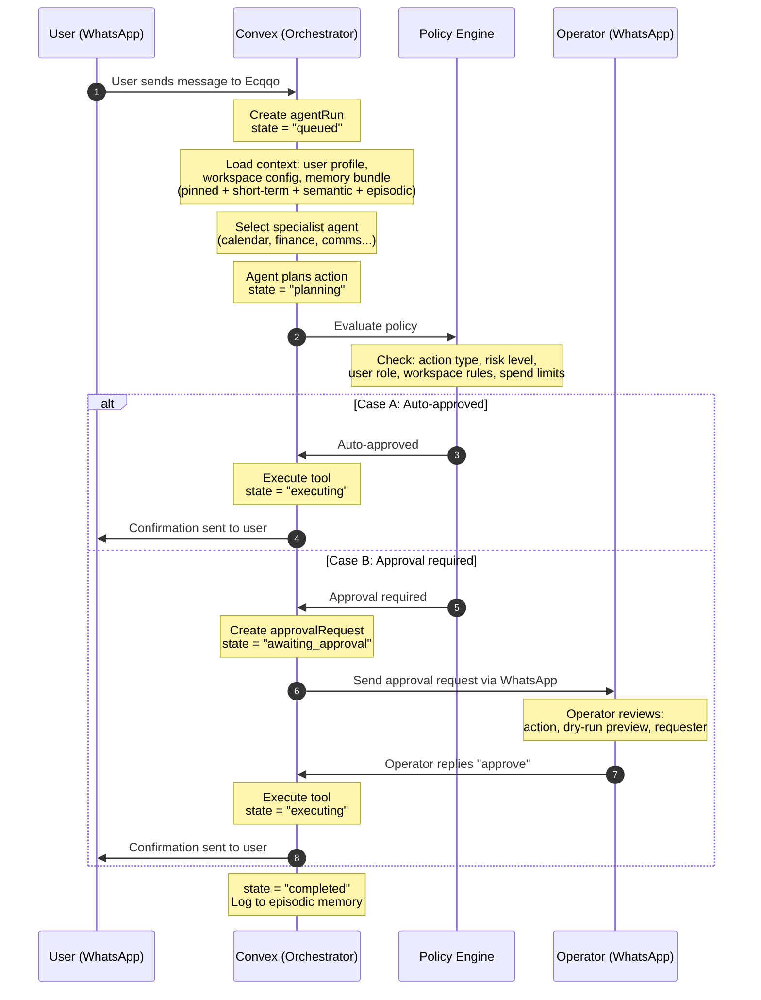
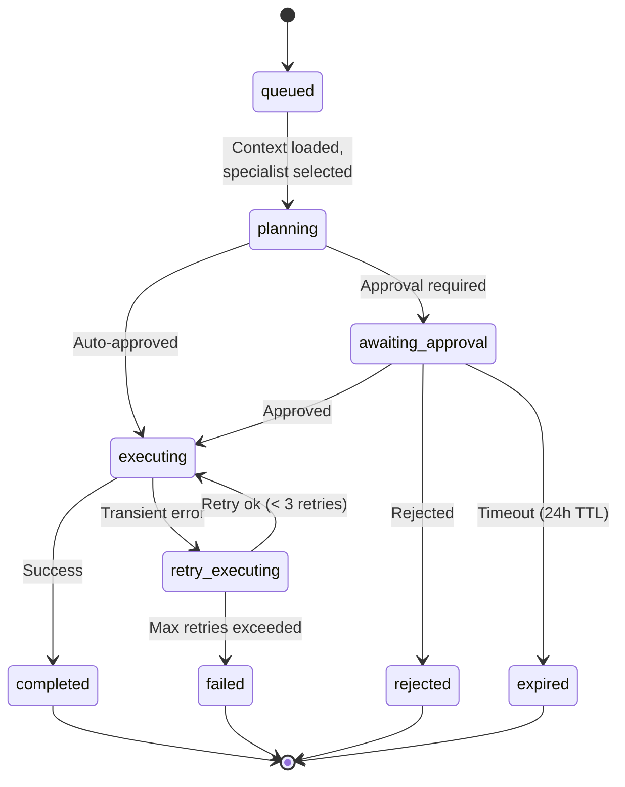
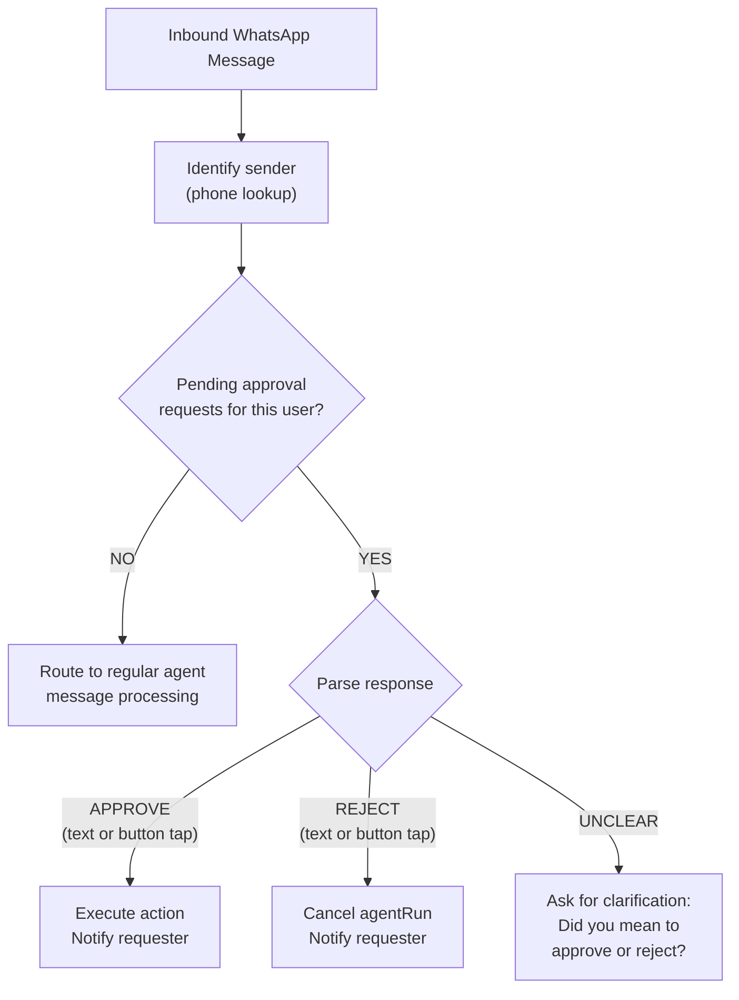
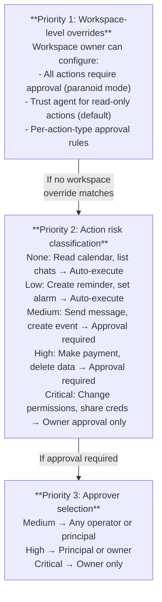

# Agent Runtime & Approval Gates

## Overview

The agent runtime is the core orchestration layer that processes user messages, plans actions, enforces approval policies, and executes tools. Every interaction flows through this pipeline, ensuring that no side-effecting action is taken without appropriate authorization.

The runtime operates on a **gated execution model**: the agent can freely read and reason, but any action that modifies external state (sending a message, creating a calendar event, making a payment) must pass through the policy engine. Depending on the action's risk level and the workspace's configuration, it may execute immediately or require explicit human approval via WhatsApp.

## Agent Run Sequence Diagram



## Agent Run State Machine



## Approval via WhatsApp

The approval flow is a core differentiator of Ecqqo: operators and principals can approve or reject agent actions directly from WhatsApp, without opening a dashboard.

### Approval Request Message

When the agent determines an action requires approval, a structured WhatsApp message is sent to the designated approver:

```
  ┌─────────────────────────────────────────────────┐
  │  Ecqqo Approval Request                         │
  │                                                 │
  │  Action:  Create calendar event                 │
  │  For:     Ahmed Al-Rashid (Principal)           │
  │  Details:                                       │
  │    Title: Board meeting with Investor Group     │
  │    Date:  Sunday, March 15 at 2:00 PM GST      │
  │    Location: DIFC Office, Meeting Room 3        │
  │    Duration: 90 minutes                         │
  │    Attendees: 4 (invites will be sent)          │
  │                                                 │
  │  Reply "approve" or "reject"                    │
  │                                                 │
  │  [Approve]  [Reject]                            │
  │  (Quick reply buttons)                          │
  └─────────────────────────────────────────────────┘
```

### Approval Response Routing

When the approver replies, the response flows back through the same Meta Cloud API webhook. The system must distinguish approval responses from regular messages:



### Context-Aware Routing

If an approver has multiple pending approval requests, the system uses context to determine which one the reply refers to:

1. **Recency** -- If only one pending request, the reply applies to it.
2. **Quick-reply metadata** -- WhatsApp interactive button replies include a payload ID that maps to a specific `approvalRequest`.
3. **Explicit reference** -- The approver can reply with "approve the calendar event" to disambiguate.
4. **Disambiguation prompt** -- If ambiguous, Ecqqo lists pending requests and asks the approver to specify.

## Policy Engine Rules

The policy engine determines whether an action can auto-execute or needs approval. Rules are evaluated in priority order:



### Spend Limits

For financial actions, additional spend-based rules apply:

| Condition                         | Policy                              |
|-----------------------------------|-------------------------------------|
| Amount < daily auto-approve limit | Auto-execute (if action type allows)|
| Amount >= daily limit             | Approval required                   |
| Cumulative daily spend > cap      | Approval required (even if individual amount is small) |
| No spend limit configured         | All financial actions need approval |

## Retry Behavior

When tool execution fails (e.g., Google Calendar API is down, payment gateway timeout):

| Attempt | Delay  | Action                                                     |
|---------|--------|------------------------------------------------------------|
| 1       | 0s     | Initial execution attempt                                  |
| 2       | 10s    | First retry, same parameters                               |
| 3       | 60s    | Second retry, same parameters                              |
| --      | --     | Max retries exceeded: state = "failed", user notified      |

Retries do **not** re-trigger the approval flow. Once an action is approved, retries execute under the same approval grant. The approval has a 24-hour TTL; if retries are still failing after 24 hours, the approval expires and the run fails permanently.

### Non-Retryable Failures

Some failures are terminal and skip the retry queue:

- **Validation errors** -- Invalid tool parameters (e.g., malformed email address).
- **Permission denied** -- The connected account lacks access to the target resource.
- **Resource not found** -- The target entity no longer exists (e.g., deleted calendar).
- **Approval rejected** -- The operator explicitly rejected the action.
- **Approval expired** -- No response within the 24-hour TTL.
