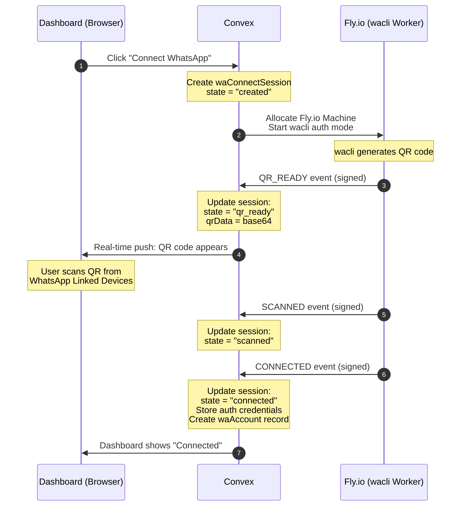
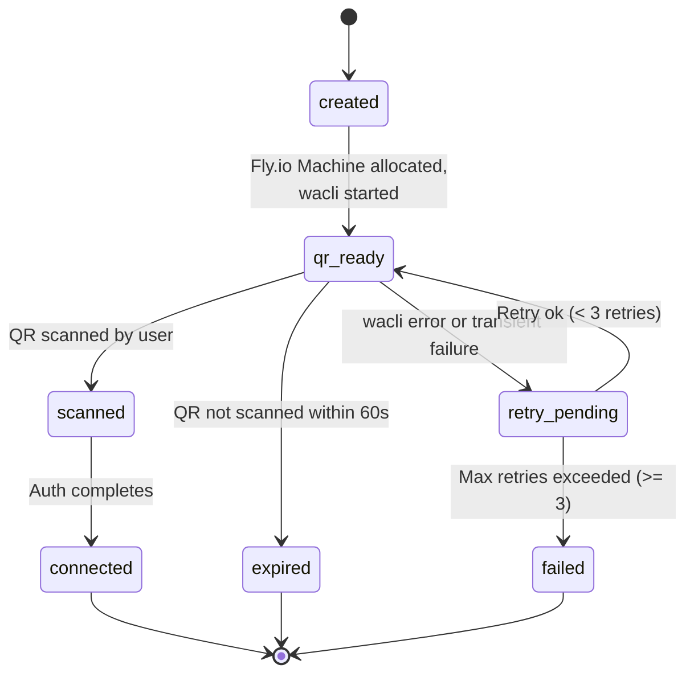

# Connect WhatsApp

## Overview

The WhatsApp connection flow links a user's personal WhatsApp account to Ecqqo so the agent can read and act on their conversations. This uses the **wacli** library (an unofficial WhatsApp Web client) running on a dedicated Fly.io Machine per user. The flow mirrors how WhatsApp Web works: the user scans a QR code from the Linked Devices screen on their phone, and the wacli instance authenticates as a linked device.

The entire flow is orchestrated through Convex, which manages session state, relays QR codes to the dashboard in real time, and records the connection outcome.

## Sequence Diagram

## Session State Machine

## State Transition Table

| From State        | To State         | Trigger                          | Side Effects                                               |
|-------------------|------------------|----------------------------------|------------------------------------------------------------|
| `created`         | `qr_ready`       | Worker emits `QR_READY` event    | QR data stored on session; dashboard subscription fires    |
| `qr_ready`        | `scanned`        | Worker emits `SCANNED` event     | Dashboard updates to "Confirming..."                       |
| `qr_ready`        | `expired`        | 60s timeout, no scan             | Worker stopped; user prompted to retry                     |
| `qr_ready`        | `retry_pending`  | Worker error during QR display   | Error logged; retry counter incremented                    |
| `scanned`         | `connected`      | Worker emits `CONNECTED` event   | Auth credentials stored; `waAccount` record created/updated; Fly.io Machine kept alive |
| `retry_pending`   | `qr_ready`       | Retry attempt (< 3 retries)     | New QR generated by worker; retry counter incremented      |
| `retry_pending`   | `failed`         | Max retries exceeded (>= 3)     | Worker terminated; Fly.io Machine released                 |

## Failure Handling

### QR Timeout

The QR code is valid for approximately 60 seconds (WhatsApp's native timeout). If the user does not scan within this window:

- The session transitions to `expired`.
- The Fly.io Machine is stopped to avoid resource waste.
- The dashboard shows "QR expired" with a "Try Again" button.
- Clicking "Try Again" creates a new `waConnectSession` and restarts the flow.

### Worker Crash

If the wacli worker process crashes or the Fly.io Machine becomes unreachable:

- Convex detects the failure via a missed heartbeat (15s interval) or a signed `ERROR` event.
- The session moves to `retry_pending`.
- Up to 3 automatic retries are attempted, each allocating a fresh Fly.io Machine.
- If all retries fail, the session transitions to `failed` and the user is notified.

### Re-auth Required

WhatsApp may revoke a linked device session at any time (e.g., user removes linked device from phone, WhatsApp server-side revocation). When this happens:

- The wacli worker detects the disconnection and emits a `DISCONNECTED` event.
- The `waAccount` status is set to `disconnected`.
- The dashboard shows a "Reconnect WhatsApp" prompt.
- The user must repeat the full QR scanning flow.

## User-Visible Status Values

| Status           | Dashboard Display               | Meaning                                                     |
|------------------|---------------------------------|-------------------------------------------------------------|
| `not_connected`  | "Connect WhatsApp" button       | No WhatsApp account linked yet                              |
| `connecting`     | Spinner + "Connecting..."       | Session created, waiting for QR                             |
| `scan_qr`       | QR code displayed               | QR ready, waiting for user to scan                          |
| `confirming`     | "Confirming..." with spinner    | QR scanned, completing auth handshake                       |
| `connected`      | Green checkmark + phone number  | WhatsApp linked and active                                  |
| `disconnected`   | Yellow warning + "Reconnect"    | Previously connected but session revoked                    |
| `failed`         | Red error + "Try Again"         | Connection failed after retries                             |
