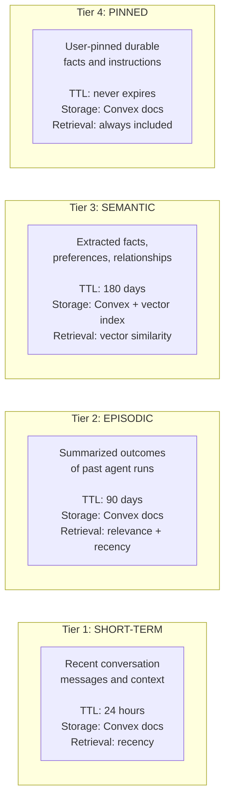
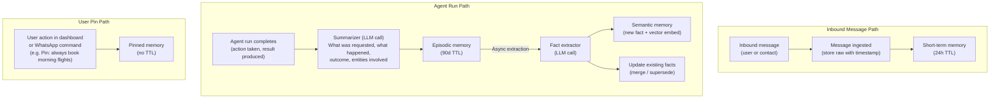
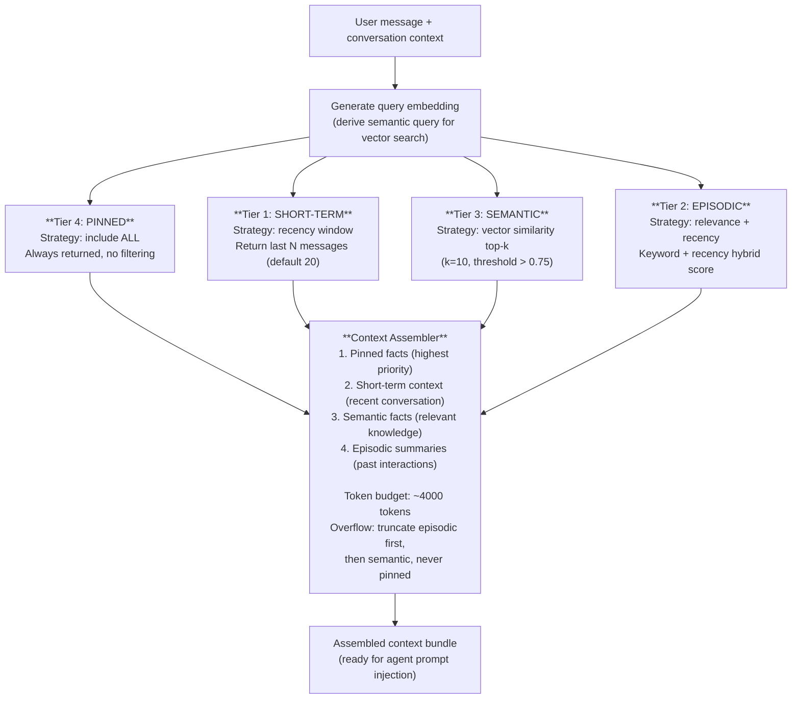
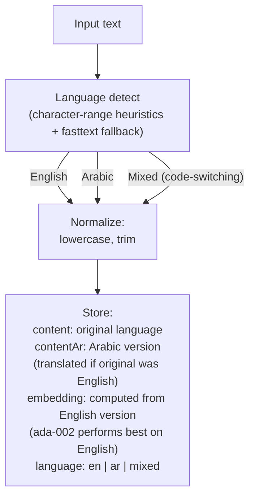
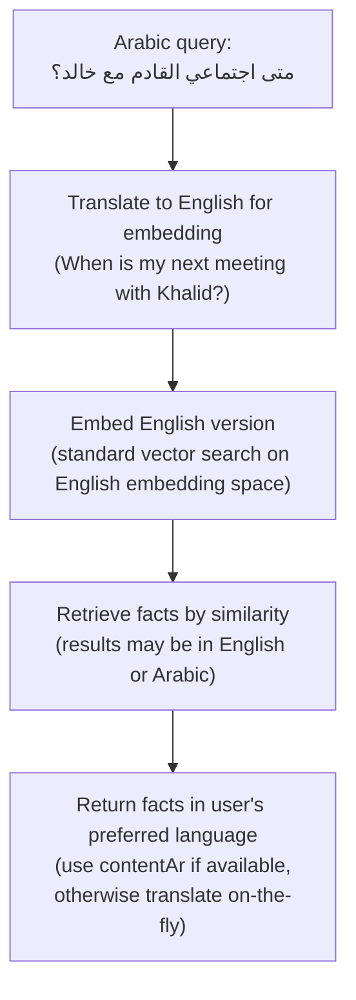

# Memory Pipeline

## Overview

Ecqqo's memory system gives the agent persistent, contextual awareness across conversations. It is organized into four tiers, each serving a distinct role in how the agent remembers, retrieves, and reasons about user context.



## Memory Lifecycle

Memory flows through the system in a pipeline, with each tier fed by specific triggers:



## Retrieval Composition

When the agent needs context for a new run, it assembles a memory bundle from all four tiers:



## Convex Vector Search Setup

Semantic memory uses Convex's built-in vector search for similarity-based retrieval.

### Schema

```
  memoryFacts table
  ─────────────────

  ┌────────────────────────────────────────────────────────────┐
  │ Field              Type           Description              │
  │ ─────              ────           ───────────              │
  │ _id                Id             Convex document ID       │
  │ userId             Id<users>      Owner of the fact        │
  │ workspaceId        Id<workspaces> Workspace scope          │
  │ content            string         Fact text (normalized)   │
  │ contentAr          string?        Arabic translation       │
  │ embedding          float64[1536]  OpenAI ada-002 vector    │
  │ source             string         "episodic" | "message"   │
  │                                   | "user_input"           │
  │ confidence         float64        0.0 - 1.0                │
  │ language           string         "en" | "ar" | "mixed"    │
  │ entityRefs         string[]       Referenced entity IDs    │
  │ createdAt          number         Timestamp                │
  │ expiresAt          number         TTL expiry timestamp     │
  │ supersededBy       Id?            Newer fact that replaces │
  │                                   this one                 │
  └────────────────────────────────────────────────────────────┘

  Indexes:
    - by_user_workspace: [userId, workspaceId]
    - by_expiry: [expiresAt]
    - vector_index: embedding (dimensions: 1536, filter: userId)
```

### Query Flow

```
  User message: "When is my next meeting with Khalid?"
       │
       v
  ┌──────────────┐
  │ Embed query  │     "next meeting with Khalid"
  │ (ada-002)    │──>  [0.023, -0.187, 0.445, ...]  (1536 dims)
  └──────┬───────┘
         │
         v
  ┌──────────────────────────────────────────────────────┐
  │ db.query("memoryFacts")                              │
  │   .withIndex("by_user_workspace",                    │
  │     q => q.eq("userId", userId)                      │
  │            .eq("workspaceId", workspaceId))           │
  │   .vectorSearch("embedding", queryVector, { top: 10 })│
  │   .filter(q => q.gt(q.field("confidence"), 0.5))     │
  │   .filter(q => q.eq(q.field("supersededBy"), null))   │
  └──────────────────────────────────────────────────────┘
         │
         v
  Results (ranked by cosine similarity):
  ┌──────────────────────────────────────────────────────┐
  │ 1. "Khalid Al-Fahad prefers morning meetings"  0.92 │
  │ 2. "Weekly sync with Khalid is on Sundays"     0.89 │
  │ 3. "Khalid's office is in DIFC Gate Village"   0.81 │
  │ 4. "Last meeting with Khalid discussed Q2..."  0.78 │
  └──────────────────────────────────────────────────────┘
```

## EN/AR Bilingual Handling

Ecqqo serves a bilingual user base (English and Arabic). The memory system handles this through language detection, dual storage, and cross-language retrieval.

### Language Pipeline



### Cross-Language Retrieval

When a user queries in Arabic but relevant facts were stored in English (or vice versa):



## TTL Policies Per Tier

```
  ┌──────────────────────────────────────────────────────────────────────┐
  │                       TTL Policy Summary                            │
  └──────────────────────────────────────────────────────────────────────┘

  Tier           TTL          Cleanup Strategy          Can Extend?
  ────           ───          ────────────────          ───────────

  Short-term     24 hours     Convex scheduled job      No
                              runs hourly, deletes      (auto-expire
                              expired entries           only)

  Episodic       90 days      Convex scheduled job      Yes
                              runs daily; entries       (if re-referenced
                              with low relevance        in a new run,
                              score may expire          TTL resets)
                              sooner (30 days if
                              relevance < 0.3)

  Semantic       180 days     Convex scheduled job      Yes
                              runs daily; only          (if re-confirmed
                              deletes if                by new evidence,
                              supersededBy != null      TTL resets)
                              OR confidence < 0.3
                              AND expired

  Pinned         Never        Only removed by           N/A
                              explicit user action      (permanent
                              (unpin from dashboard     until unpinned)
                              or WhatsApp command)
```

### TTL Extension Logic

```
  Episodic or Semantic fact referenced in a new agent run?
       │
       ├──── YES ──> Reset TTL to full duration
       │             Bump relevance score += 0.1 (capped at 1.0)
       │
       └──── NO  ──> TTL continues counting down
                     No change to relevance score
```

## Memory Quality and Confidence Scoring

Every fact in semantic memory carries a **confidence score** (0.0 to 1.0) that reflects the system's certainty about the fact's accuracy and relevance.

### Confidence Assignment

```
  ┌─────────────────────────────────────────────────────────────────────┐
  │                    Confidence Score Assignment                      │
  └─────────────────────────────────────────────────────────────────────┘

  Source                          Initial Confidence    Rationale
  ──────                          ──────────────────    ─────────

  User-pinned fact                1.0                   Explicit user
                                                        intent, highest
                                                        trust

  Extracted from user's own       0.9                   Direct user
  message ("I prefer morning                            statement
  meetings")

  Extracted from contact's        0.7                   Second-hand
  message ("Khalid said he's                            information
  available Sundays")

  Inferred from pattern           0.5                   Statistical
  ("User typically responds                             inference, may
  within 5 minutes")                                    not hold

  Extracted from group chat       0.4                   Noisy source,
  context                                               lower signal
```

### Confidence Decay and Reinforcement

```
  Confidence over time:

  1.0 |  *
      |  * *           * (re-confirmed by new evidence)
  0.9 |    *         * *
      |      *     *     *
  0.7 |        * *         *
      |                      *
  0.5 |  - - - - - - - - - - -*- - - threshold - - - - -
      |                        *
  0.3 |                          *
      |                            * (decay below threshold)
  0.0 |________________________________*__________________
      0    30    60    90   120   150   180  days

  Facts below threshold (0.5):
  - Excluded from retrieval results
  - Eligible for early TTL expiry
  - May be superseded by higher-confidence facts
```

### Fact Supersession

When a new fact contradicts an existing one, the older fact is superseded:

```
  Existing fact:
  ┌───────────────────────────────────────────┐
  │ "Ahmed's assistant is Sara"               │
  │ confidence: 0.7   created: 2025-12-01     │
  └────────────────────┬──────────────────────┘
                       │
  New fact extracted:  │
  ┌────────────────────┴──────────────────────┐
  │ "Ahmed's new assistant is Noor"           │
  │ confidence: 0.9   created: 2026-02-15     │
  └───────────────────────────────────────────┘
                       │
                       v
  Result:
  ┌───────────────────────────────────────────┐
  │ Old: supersededBy = <new_fact_id>         │
  │      (excluded from retrieval)            │
  │                                           │
  │ New: active, confidence 0.9               │
  │      (returned in search results)         │
  └───────────────────────────────────────────┘
```
