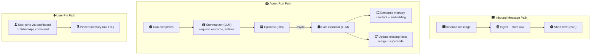
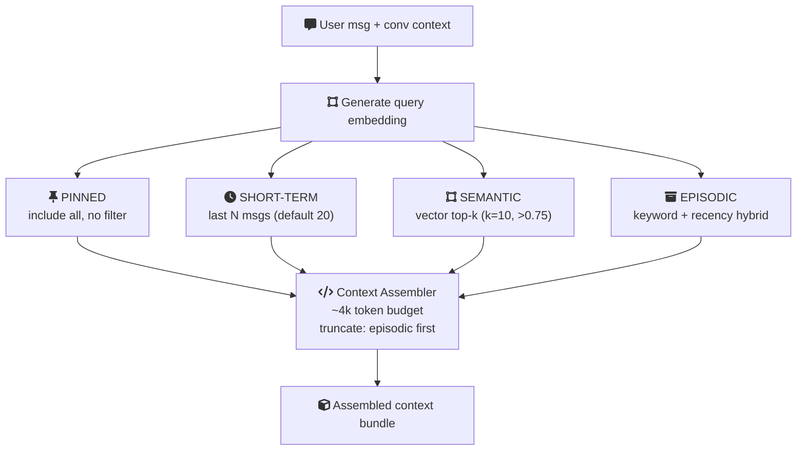
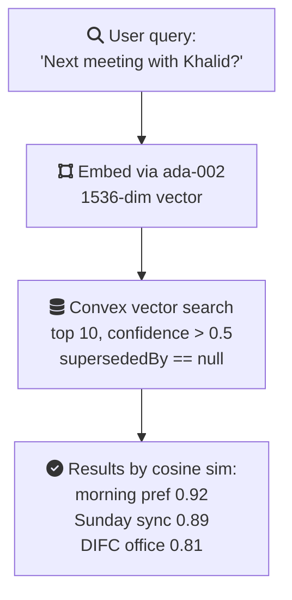
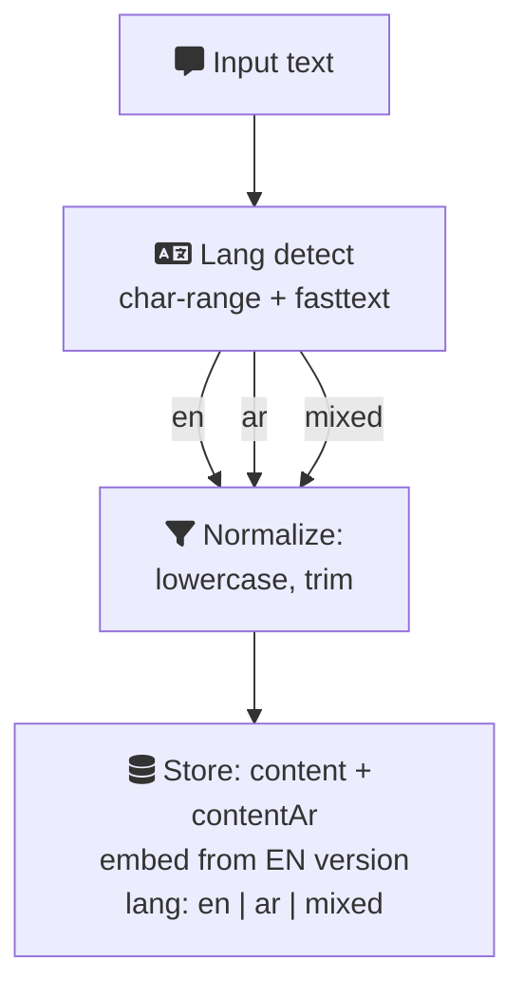
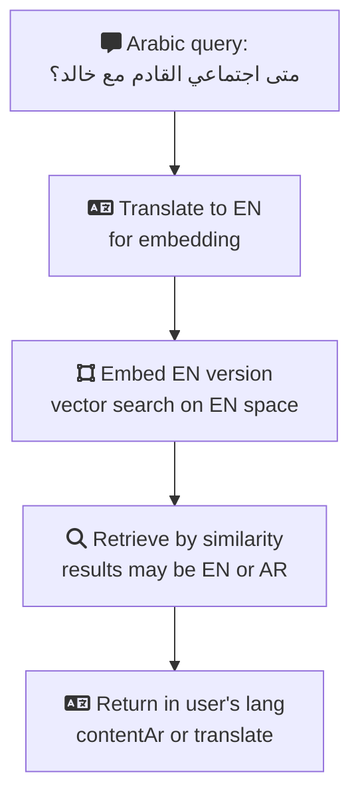
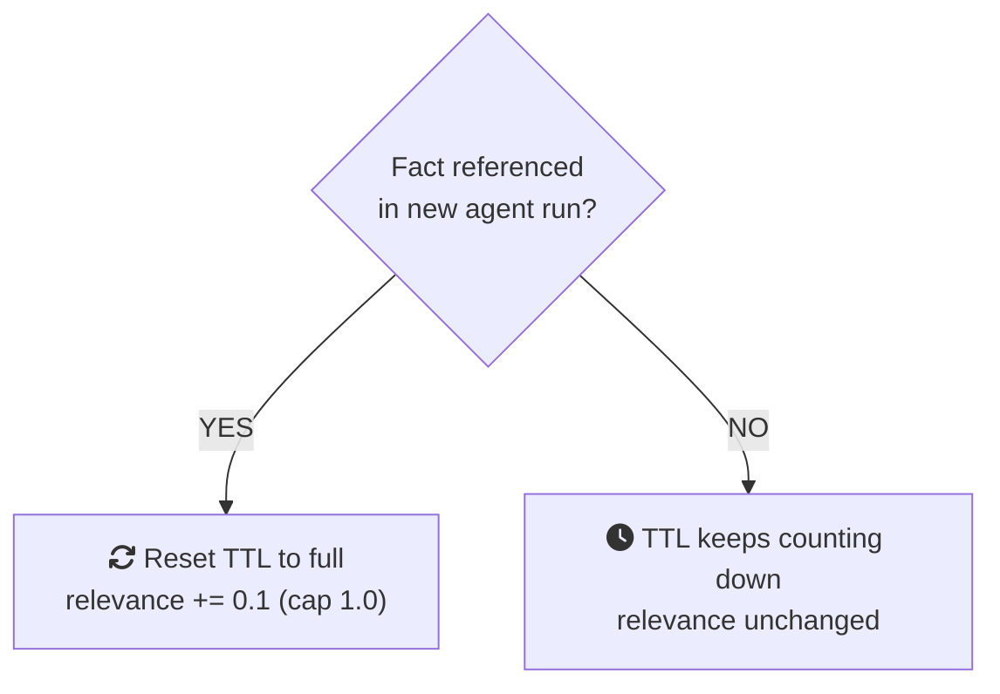
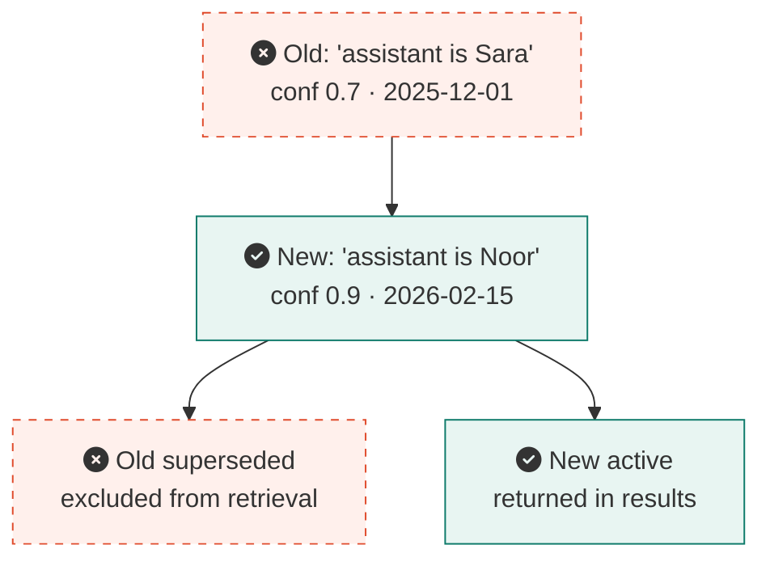

# Memory Pipeline

## Overview

Ecqqo's memory system gives the agent persistent, contextual awareness across conversations. It is organized into four tiers, each serving a distinct role in how the agent remembers, retrieves, and reasons about user context.

<script setup>
const memoryTiersConfig = {
  layers: [
    {
      id: "tier1",
      title: "Tier 1: Short-term",
      subtitle: "TTL 24h · Recency-based Retrieval",
      icon: "fa-clock",
      color: "teal",
      nodes: [
        { id: "mt-t1", icon: "fa-clock", title: "Recent Context", subtitle: "Messages · In-flight Data" },
      ],
    },
    {
      id: "tier2",
      title: "Tier 2: Episodic",
      subtitle: "TTL 90d · Relevance + Recency",
      icon: "fa-box-archive",
      color: "warm",
      nodes: [
        { id: "mt-t2", icon: "fa-box-archive", title: "Run Outcomes", subtitle: "Summarized Decisions" },
      ],
    },
    {
      id: "tier3",
      title: "Tier 3: Semantic",
      subtitle: "TTL 180d · Vector Similarity",
      icon: "fa-brain",
      color: "dark",
      nodes: [
        { id: "mt-t3", icon: "fa-magnifying-glass", title: "Facts & Relations", subtitle: "Embeddings · Preferences" },
      ],
    },
    {
      id: "tier4",
      title: "Tier 4: Pinned",
      subtitle: "No TTL · Always Included",
      icon: "fa-thumbtack",
      color: "blue",
      nodes: [
        { id: "mt-t4", icon: "fa-thumbtack", title: "Pinned Facts", subtitle: "User-managed · Permanent" },
      ],
    },
  ],
  connections: [
    { from: "mt-t1", to: "mt-t2", label: "promote" },
    { from: "mt-t2", to: "mt-t3", label: "extract" },
  ],
}
</script>

<ArchDiagram :config="memoryTiersConfig" />

## Memory Lifecycle

Memory flows through the system in a pipeline, with each tier fed by specific triggers:



## Retrieval Composition

When the agent needs context for a new run, it assembles a memory bundle from all four tiers:



## Convex Vector Search Setup

Semantic memory uses Convex's built-in vector search for similarity-based retrieval.

### Schema

**`memoryFacts` table:**

| Field | Type | Description |
|---|---|---|
| `_id` | `Id` | Convex document ID |
| `userId` | `Id<"users">` | Owner of the fact |
| `workspaceId` | `Id<"workspaces">` | Workspace scope |
| `content` | `string` | Fact text (normalized) |
| `contentAr` | `string?` | Arabic translation |
| `embedding` | `float64[1536]` | OpenAI ada-002 vector |
| `source` | `string` | `"episodic"` \| `"message"` \| `"user_input"` |
| `confidence` | `float64` | 0.0 - 1.0 |
| `language` | `string` | `"en"` \| `"ar"` \| `"mixed"` |
| `entityRefs` | `string[]` | Referenced entity IDs |
| `createdAt` | `number` | Timestamp |
| `expiresAt` | `number` | TTL expiry timestamp |
| `supersededBy` | `Id?` | Newer fact that replaces this one |

**Indexes:**
- `by_user_workspace`: `[userId, workspaceId]`
- `by_expiry`: `[expiresAt]`
- `vector_index`: `embedding` (dimensions: 1536, filter: `userId`)

### Query Flow



## EN/AR Bilingual Handling

Ecqqo serves a bilingual user base (English and Arabic). The memory system handles this through language detection, dual storage, and cross-language retrieval.

### Language Pipeline



### Cross-Language Retrieval

When a user queries in Arabic but relevant facts were stored in English (or vice versa):



## TTL Policies Per Tier

| Tier | TTL | Cleanup Strategy | Can Extend? |
|---|---|---|---|
| **Short-term** | 24 hours | Convex scheduled job runs hourly, deletes expired entries | No (auto-expire only) |
| **Episodic** | 90 days | Convex scheduled job runs daily; entries with low relevance score may expire sooner (30 days if relevance < 0.3) | Yes (if re-referenced in a new run, TTL resets) |
| **Semantic** | 180 days | Convex scheduled job runs daily; only deletes if `supersededBy != null` OR `confidence < 0.3` AND expired | Yes (if re-confirmed by new evidence, TTL resets) |
| **Pinned** | Never | Only removed by explicit user action (unpin from dashboard or WhatsApp command) | N/A (permanent until unpinned) |

### TTL Extension Logic



## Memory Quality and Confidence Scoring

Every fact in semantic memory carries a **confidence score** (0.0 to 1.0) that reflects the system's certainty about the fact's accuracy and relevance.

### Confidence Assignment

| Source | Initial Confidence | Rationale |
|---|---|---|
| User-pinned fact | **1.0** | Explicit user intent, highest trust |
| Extracted from user's own message (e.g., "I prefer morning meetings") | **0.9** | Direct user statement |
| Extracted from contact's message (e.g., "Khalid said he's available Sundays") | **0.7** | Second-hand information |
| Inferred from pattern (e.g., "User typically responds within 5 minutes") | **0.5** | Statistical inference, may not hold |
| Extracted from group chat context | **0.4** | Noisy source, lower signal |

### Confidence Decay and Reinforcement

```
Confidence over time:

1.0 |  *
    |  * *           * (re-confirmed by new evidence)
0.9 |    *         * *
    |      *     *     *
0.7 |        * *         *
    |                      *
0.5 |  - - - - - - - - - - -*- - - threshold - - - - -
    |                        *
0.3 |                          *
    |                            * (decay below threshold)
0.0 |________________________________*__________________
    0    30    60    90   120   150   180  days
```

Facts below the threshold (0.5):
- Excluded from retrieval results
- Eligible for early TTL expiry
- May be superseded by higher-confidence facts

### Fact Supersession

When a new fact contradicts an existing one, the older fact is superseded:


