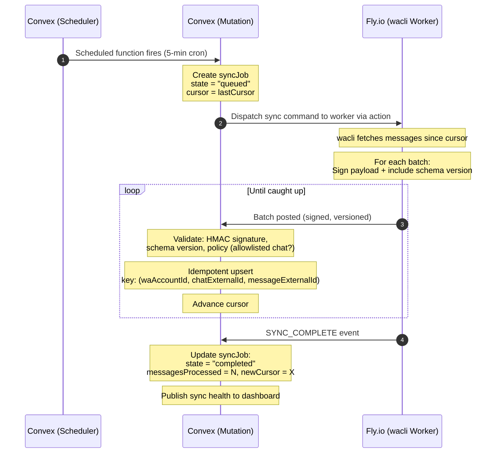
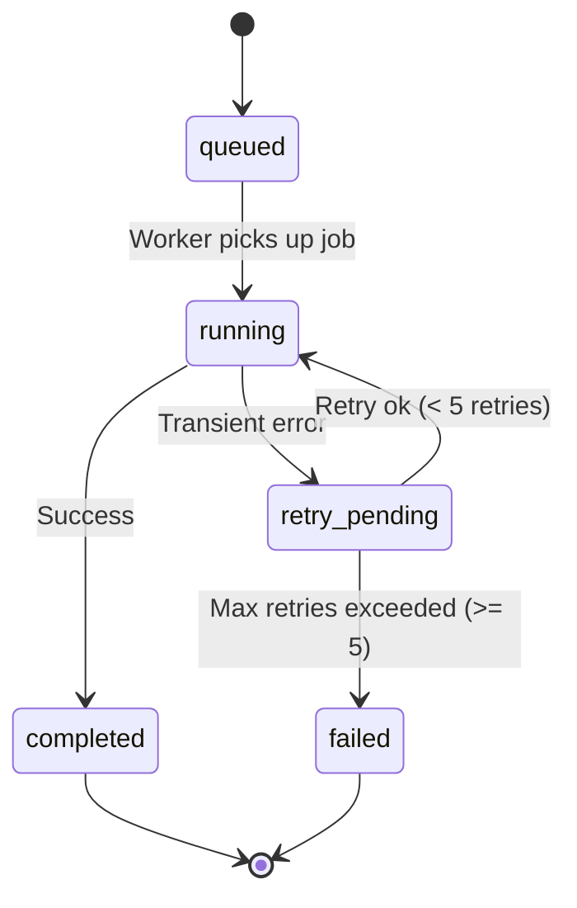
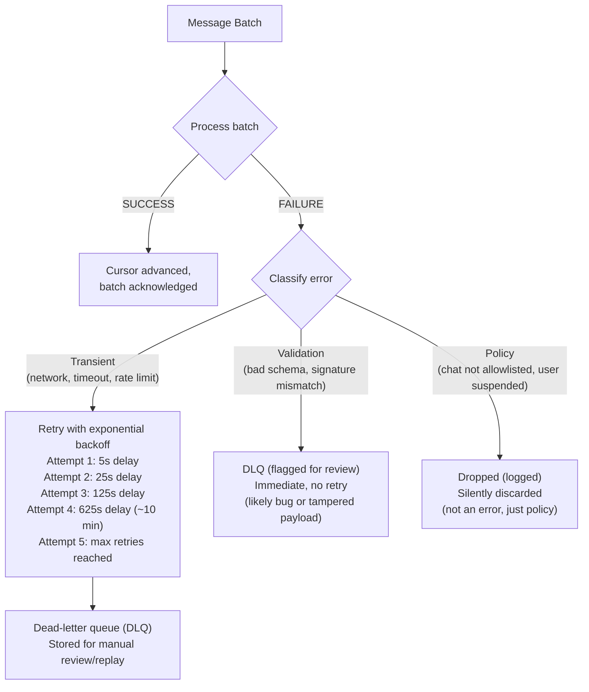

# Sync & Ingestion

## Overview

Ecqqo syncs messages from a user's personal WhatsApp account via the **wacli** worker running on a Fly.io Machine. Sync operates on a **dual-cadence model**:

- **Periodic sync** -- Every 5 minutes, a Convex scheduled function triggers a full sync cycle for each connected account. This catches any messages that may have been missed.
- **Continuous follow** -- While the wacli worker is connected, it streams new messages to Convex in near-real-time as they arrive.

By default, Ecqqo follows a **metadata-first policy**: only chat-level metadata (contact name, last message timestamp, unread count) is synced. Full message bodies are only fetched for chats the user has explicitly allowlisted. This minimizes data exposure and storage costs.

## Sync Sequence Diagram



## Sync Job State Machine



## Metadata-First Policy

By default, Ecqqo does **not** sync full message content. This is a deliberate privacy-by-design choice.

```
  ┌─────────────────────────────────────────────────────────────────┐
  │                    What Gets Synced By Default                  │
  └─────────────────────────────────────────────────────────────────┘

  ALL CHATS (automatic):
  ┌──────────────────────────────────────────┐
  │  Metadata only:                          │
  │  - Chat ID (external)                    │
  │  - Contact / group name                  │
  │  - Last message timestamp                │
  │  - Unread count                          │
  │  - Chat type (individual / group)        │
  │  - Muted status                          │
  │  - Pinned status                         │
  └──────────────────────────────────────────┘

  ALLOWLISTED CHATS (user opt-in):
  ┌──────────────────────────────────────────┐
  │  Metadata (above) PLUS:                  │
  │  - Full message body (text)              │
  │  - Message sender                        │
  │  - Timestamps (sent, delivered, read)    │
  │  - Reply-to references                   │
  │  - Media metadata (type, size, caption)  │
  │  - Media content (if enabled separately) │
  └──────────────────────────────────────────┘
```

Users manage their allowlist from the dashboard. Each chat can be individually toggled. When a chat is added to the allowlist, a backfill sync is triggered to fetch historical messages (up to 30 days or 500 messages, whichever limit is hit first).

## Dead-Letter Queue and Retry Strategy

When a message batch fails to process, it follows this retry path:



Retry strategy uses **exponential backoff** with base 5s and multiplier 5x. Jitter (+/- 20%) is added to prevent thundering herd when multiple accounts retry simultaneously.

## Cursor Progression and Reconciliation

Each `waAccount` maintains a **sync cursor** -- an opaque token representing the last successfully processed position in the message stream.

```
  Timeline of messages:
  ──────────────────────────────────────────────────────>

  │ msg1 │ msg2 │ msg3 │ msg4 │ msg5 │ msg6 │ msg7 │
                          ^                     ^
                          │                     │
                     lastCursor            currentHead
                     (stored in          (latest on device)
                      Convex)

  Sync fetches: msg4, msg5, msg6, msg7
  On success:   lastCursor = msg7
```

### Reconciliation

If the cursor becomes invalid (e.g., message history was cleared on the device, or the wacli session was reset), a reconciliation process runs:

1. Worker reports `CURSOR_INVALID` event.
2. Convex marks the sync as `needs_reconciliation`.
3. A full metadata scan is triggered to rebuild the chat list.
4. For allowlisted chats, a bounded backfill is performed.
5. New cursor is established from the current head position.

## Sync Health Statuses

The dashboard displays a real-time sync health indicator per connected WhatsApp account:

| Status       | Indicator    | Meaning                                                | Auto-recovery?  |
|--------------|--------------|--------------------------------------------------------|-----------------|
| `syncing`    | Blue spinner | Sync currently in progress                             | N/A             |
| `healthy`    | Green dot    | Last sync completed < 10 min ago, no errors            | N/A             |
| `degraded`   | Yellow dot   | Last sync had partial failures or retries are pending  | Yes, automatic  |
| `stale`      | Orange dot   | Last successful sync > 15 min ago                      | Yes, re-trigger |
| `error`      | Red dot      | Last sync failed, all retries exhausted                | No, manual      |

```
  Health Determination Logic
  ──────────────────────────

  lastSyncCompleted < 10 min ago
       AND failureCount == 0          ──>  healthy
       AND failureCount > 0           ──>  degraded

  lastSyncCompleted > 15 min ago
       AND worker is connected        ──>  stale (auto-retrigger)
       AND worker is disconnected     ──>  error (manual intervention)

  syncJob.state == "running"          ──>  syncing
```
