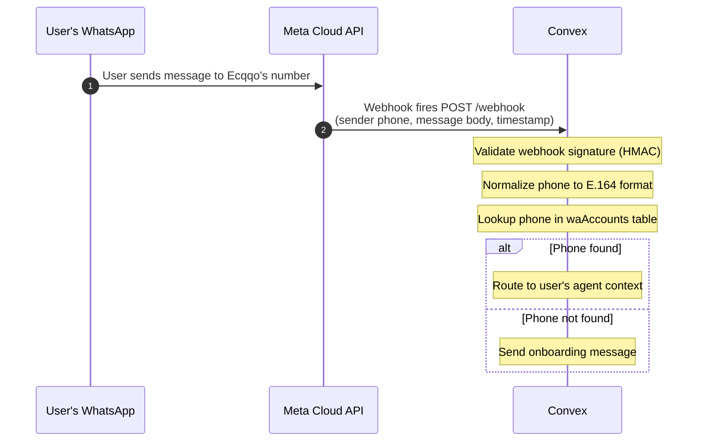
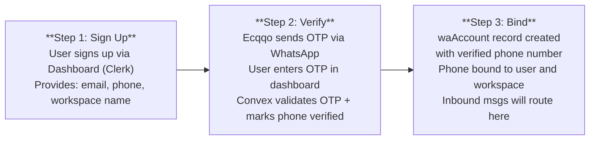
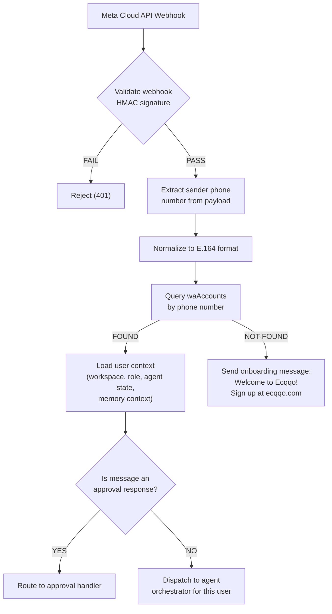
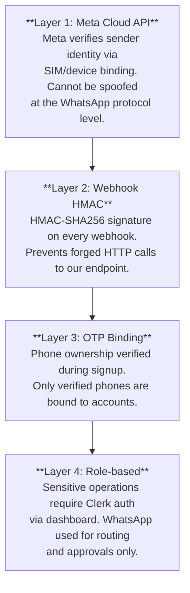

# User Identification (Single Number)

## Problem Statement

Ecqqo operates through a **single WhatsApp Business number** powered by the Meta Cloud API. Every user -- whether an owner, principal, or operator -- messages this same number. The system must reliably identify which user is sending each inbound message and route it to the correct agent context, workspace, and conversation state.

This is fundamentally different from the wacli-based connection (where Ecqqo reads a user's personal WhatsApp). Here, Ecqqo's own Business number **receives** messages from users. The identification challenge: given an inbound message from phone number `+971501234567`, determine which Ecqqo user account this belongs to, and which workspace/agent context to activate.

## Inbound Message Identification Flow



## Registration and Phone Binding Flow

Before a user can interact with Ecqqo via WhatsApp, their phone number must be bound to their account. This happens during onboarding:



### Why OTP via WhatsApp?

The OTP is sent via Ecqqo's WhatsApp Business number to the user's phone. This serves dual purpose:

1. **Verifies phone ownership** -- only the person with the phone can read the OTP.
2. **Establishes the conversation** -- the user now has a chat thread with Ecqqo, making future interactions seamless.

## Complete Identification Pipeline



## Edge Cases

### Multiple Users from Same Phone Number

Not supported. Phone number binding is strictly **1:1**: one phone number maps to exactly one user account. If a phone number is already bound to an existing account, the new signup will be rejected with a prompt to contact support.

Database constraint: `waAccounts` table has a unique index on `phone`.

### User Changes Phone Number

1. User initiates phone change from the dashboard.
2. New phone number goes through the same OTP verification flow.
3. On successful verification:
   - Old `waAccount` record is marked `inactive`.
   - New `waAccount` record is created with `verified: true`.
   - Any pending approval requests on the old number are migrated.
4. Messages from the old number will no longer route to this user.

### Unregistered User Messages Ecqqo

When someone who hasn't signed up sends a message to Ecqqo's WhatsApp number:

- The phone lookup returns no match.
- Ecqqo responds with a friendly onboarding message (templated, pre-approved by Meta).
- The message is logged for analytics but no agent context is created.
- Rate limiting applies: max 3 onboarding messages per phone per 24h to prevent abuse.

### Phone Number Format Normalization

All phone numbers are stored and compared in **E.164 format** (`+` prefix, country code, no separators):

```
  Input                    Normalized (E.164)
  ─────                    ──────────────────
  +971501234567            +971501234567       (already E.164)
  00971501234567           +971501234567       (international prefix)
  0501234567               +971501234567       (local, needs country code from context)
  971-50-123-4567          +971501234567       (strip separators, add +)
  +1 (415) 555-0123       +14155550123        (US number)
```

The normalization function runs at two points:
1. **Registration** -- when the user provides their phone number during signup.
2. **Webhook ingestion** -- when processing the sender phone from Meta's webhook payload. (Meta typically provides E.164 already, but normalization is applied defensively.)

## Security Considerations

### Phone Number Spoofing Mitigations

The Meta Cloud API provides strong guarantees against phone number spoofing:

1. **Meta-verified sender identity** -- The `from` field in webhook payloads is the verified phone number of the WhatsApp account. Meta authenticates users via SIM/device binding. This is not a caller-ID-style header that can be forged.

2. **Webhook signature validation** -- Every webhook from Meta includes an HMAC-SHA256 signature computed with the app secret. Convex validates this signature before processing any message. This prevents forged webhook calls.

3. **No phone-number-only auth** -- Phone number identification is used for **routing**, not for authentication of sensitive operations. Any high-risk action (e.g., changing payment details, removing team members) still requires dashboard authentication via Clerk.

4. **Binding verification** -- The OTP flow during registration proves the user controls the phone number at binding time. Combined with Meta's ongoing device verification, this provides continuous assurance.


