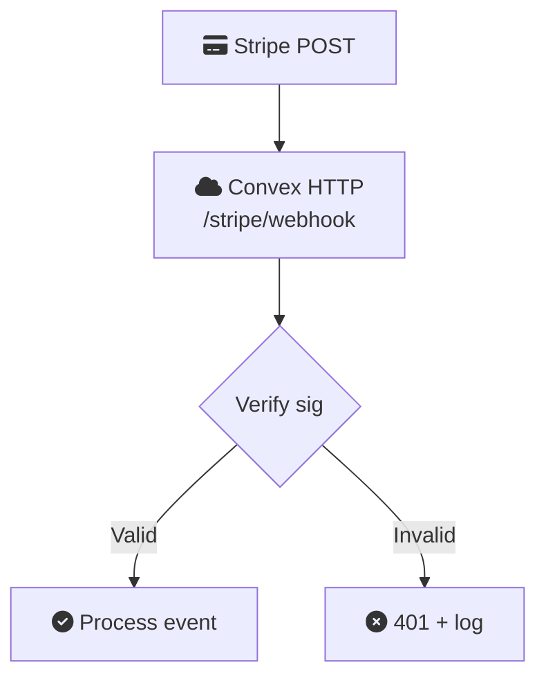
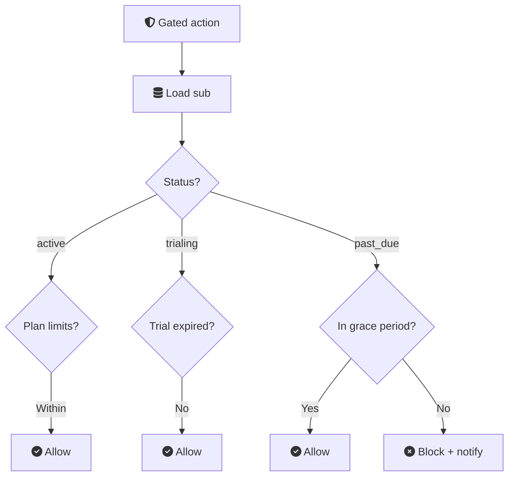
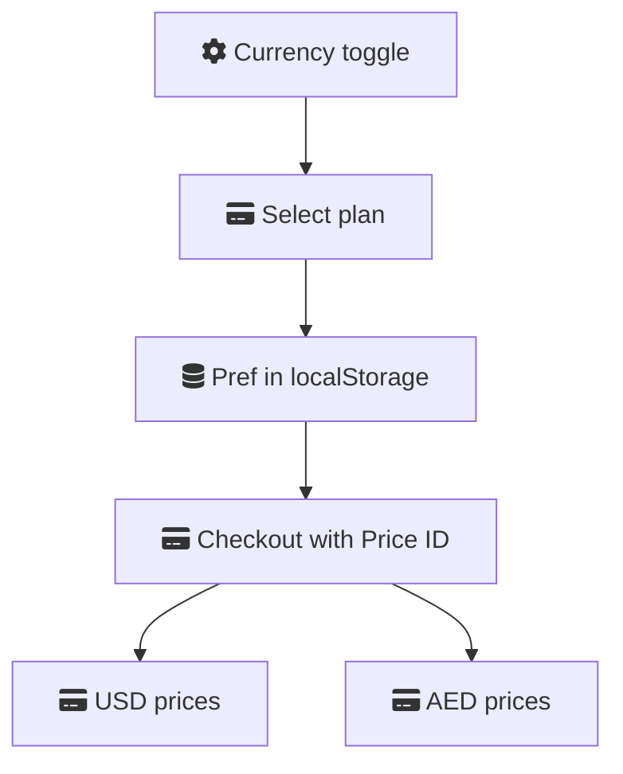

# Billing (Stripe)

Stripe integration architecture, plan definitions, webhook handling, and enforcement logic for Ecqqo subscriptions.

## Integration Architecture

<script setup>
const billingConfig = {
  layers: [
    {
      id: "bill-ui",
      title: "User Interface",
      subtitle: "Dashboard · Plan Selection",
      icon: "fa-gauge",
      color: "teal",
      nodes: [
        { id: "bill-dash", icon: "fa-gauge", title: "Dashboard", subtitle: "Select Plan" },
        { id: "bill-portal", icon: "fa-credit-card", title: "Billing Portal", subtitle: "Card · Cancel · Invoices" },
      ],
    },
    {
      id: "bill-stripe",
      title: "Payment Processing",
      subtitle: "Stripe · Checkout · Events",
      icon: "si:stripe",
      color: "warm",
      nodes: [
        { id: "bill-checkout", icon: "fa-credit-card", title: "Stripe Checkout", subtitle: "Payment Flow" },
        { id: "bill-stripe-core", icon: "si:stripe", title: "Stripe", subtitle: "Products · Prices · Subs" },
      ],
    },
    {
      id: "bill-backend",
      title: "Backend",
      subtitle: "Convex · Subscription State",
      icon: "si:convex",
      color: "teal",
      nodes: [
        { id: "bill-convex", icon: "si:convex", title: "Convex", subtitle: "Webhook Handler" },
        { id: "bill-subs", icon: "fa-database", title: "Subscriptions", subtitle: "Plan · Status · Limits" },
      ],
    },
    {
      id: "bill-enforce",
      title: "Enforcement",
      subtitle: "Plan Limits · Feature Gates",
      icon: "fa-shield-halved",
      color: "dark",
      nodes: [
        { id: "bill-enforcement", icon: "fa-scale-balanced", title: "Plan Enforcement", subtitle: "Usage · Limits" },
        { id: "bill-gates", icon: "fa-shield-halved", title: "Feature Gates", subtitle: "Per-plan Access" },
      ],
    },
  ],
  connections: [
    { from: "bill-dash", to: "bill-checkout", label: "select plan" },
    { from: "bill-checkout", to: "bill-stripe-core", label: "payment" },
    { from: "bill-stripe-core", to: "bill-convex", label: "webhook" },
    { from: "bill-dash", to: "bill-convex", label: "queries" },
    { from: "bill-convex", to: "bill-portal" },
    { from: "bill-convex", to: "bill-subs" },
    { from: "bill-subs", to: "bill-enforcement" },
    { from: "bill-enforcement", to: "bill-gates" },
  ],
}

const billingFlowConfig = {
  type: "sequence",
  actors: [
    { id: "bf-user", icon: "fa-user", title: "User", color: "teal" },
    { id: "bf-clerk", icon: "si:clerk", title: "Clerk", color: "warm" },
    { id: "bf-dash", icon: "fa-gauge", title: "Dashboard", color: "teal" },
    { id: "bf-convex", icon: "si:convex", title: "Convex", color: "teal" },
    { id: "bf-stripe", icon: "si:stripe", title: "Stripe", color: "warm" },
  ],
  steps: [
    { from: "bf-user", to: "bf-clerk", label: "Signs up" },
    { from: "bf-clerk", to: "bf-convex", label: "Create identity" },
    { from: "bf-convex", to: "bf-stripe", label: "Create workspace" },
    { from: "bf-stripe", to: "bf-convex", label: "Create customer", dashed: true },
    { over: "bf-convex", note: "Store stripeId" },
    { from: "bf-user", to: "bf-dash", label: "Pick plan" },
    { from: "bf-dash", to: "bf-convex", label: "Call mutation" },
    { from: "bf-convex", to: "bf-stripe", label: "Create checkout" },
    { from: "bf-stripe", to: "bf-user", label: "Checkout page" },
    { from: "bf-user", to: "bf-stripe", label: "Pay" },
    { from: "bf-stripe", to: "bf-convex", label: "Send event" },
    { over: "bf-convex", note: "Update subscriptions table" },
  ],
  groups: [
    { label: "Signup Flow", color: "warm", from: 0, to: 4 },
    { label: "Checkout Flow", color: "teal", from: 5, to: 11 },
  ],
}
</script>

<ArchDiagram :config="billingConfig" />

### Data Flow Detail

<ArchDiagram :config="billingFlowConfig" />

## Plan Definitions

| Plan | USD/mo | AED/mo | Principals | Features |
|------|--------|--------|-----------|----------|
| Founder | $199 | 749 AED | 1 | Unlimited scheduling, Approval workflow, Calendar + Reminders, WhatsApp sync, Memory system, Email support |
| Dreamer | $399 | 1,499 AED | Up to 5 | Everything in Founder, plus: Priority rules, Shared operator view, Email digest, Meeting briefs, Priority support |
| Custom | TBD | TBD | Custom | Everything in Dreamer, plus: Dedicated onboarding, Custom agent configuration, SLA guarantee, Direct Slack/WhatsApp support |

## Stripe Objects Mapping

| Stripe Object | Ecqqo Mapping | Notes |
|--------------|-------------|-------|
| Product | Ecqqo plan (Founder, Dreamer, Custom) | One product per plan tier |
| Price | Monthly price variant | Two prices per product: USD and AED |
| Customer | Workspace | 1:1 mapping. stripeId stored in workspaces table |
| Subscription | Active plan | One active sub per workspace |
| Checkout Session | Plan selection flow | Created by Convex action, hosted by Stripe |
| Billing Portal Session | Self-service management | Update card, cancel, view invoices |

### Convex Schema: `subscriptions` Table

```
subscriptions {
  workspaceId:       Id<"workspaces">      // foreign key
  stripeCustomerId:  string                 // cus_xxxxx
  stripeSubId:       string                 // sub_xxxxx
  stripePriceId:     string                 // price_xxxxx
  plan:              "founder" | "dreamer" | "custom"
  status:            "trialing" | "active" | "past_due" | "canceled" | "unpaid"
  currency:          "usd" | "aed"
  currentPeriodEnd:  number                 // Unix timestamp
  trialEnd:          number | null          // Unix timestamp
  cancelAtPeriodEnd: boolean
  createdAt:         number
  updatedAt:         number
}

indexes:
  by_workspace:    [workspaceId]
  by_stripe_sub:   [stripeSubId]
  by_stripe_cust:  [stripeCustomerId]
  by_status:       [status, currentPeriodEnd]
```

## Webhook Events to Handle

| Stripe Event | Convex Handler Action |
|-------------|----------------------|
| `checkout.session.completed` | 1. Look up workspace by client_reference. 2. Create/update subscription record. 3. Set status = "active" or "trialing". 4. Emit audit event. |
| `invoice.paid` | 1. Look up subscription by stripeSubId. 2. Extend currentPeriodEnd. 3. Clear any past_due flags. 4. Emit audit event. |
| `invoice.payment_failed` | 1. Set status = "past_due". 2. Start 7-day grace period. 3. Send notification via WhatsApp. 4. Send email via Resend. 5. Emit audit event. |
| `customer.subscription.updated` | 1. Update plan, price, status fields. 2. If plan changed: re-evaluate limits. 3. Emit audit event. |
| `customer.subscription.deleted` | 1. Set status = "canceled". 2. Disable agent runs (keep data). 3. Disable connector workers. 4. Emit audit event. |

### Webhook Verification



## Plan Enforcement Logic

### Enforcement Points

| Action | Enforcement Check |
|--------|-------------------|
| Create waAccount (connect WhatsApp) | `subscription.status` in `["active", "trialing"]` |
| Add principal to workspace | Count principals < `plan.maxPrincipals` (Founder: 1, Dreamer: 5, Custom: N) |
| Trigger agent run | `status == "active"` OR (`status == "trialing"` AND `now < trialEnd`) OR (`status == "past_due"` AND `now < graceDeadline`) |
| Access dashboard | Always allowed (read-only view of billing status even when inactive) |

### Enforcement Flow



### Grace Period and Trial Handling

| Scenario | Behavior |
|----------|----------|
| New workspace signup | 14-day free trial starts immediately. No payment method required. All Founder features available during trial. |
| Trial expiring (3 reminders) | Notify at day 10, day 13, and day 14. Via WhatsApp and email. |
| Trial expired | Status -> "unpaid". Agent runs disabled. Dashboard remains accessible (read-only). Data retained for 30 days. |
| Payment failed (active subscription) | Status -> "past_due". 7-day grace period starts. Agent runs continue during grace period. Notify at day 1, day 5, and day 7. |
| Grace period expired | Status -> "unpaid". Agent runs disabled. Connector workers stopped. Data retained; reactivation restores full access. |
| Plan upgrade | Immediate. Prorated credit applied. New limits take effect instantly. |
| Plan downgrade | Takes effect at end of current billing period. If over new plan limits, block new principals but do not remove existing ones. |

## Multi-Currency Handling

Ecqqo supports USD and AED billing. The user's currency preference persists through the subscription lifecycle.



| Plan | USD Price ID | AED Price ID |
|------|-------------|-------------|
| Founder | price_xxxxx_usd | price_xxxxx_aed |
| Dreamer | price_yyyyy_usd | price_yyyyy_aed |
| Custom | Manual invoice | Manual invoice |

### Currency Rules

1. **Selection at checkout.** Currency is locked when the user completes checkout. Stripe does not allow mid-subscription currency changes.
2. **Display currency.** Dashboard always shows the subscription's billing currency, regardless of the display toggle on the landing page.
3. **Custom plan.** Custom plans are invoiced manually. Currency agreed during onboarding.
4. **AED/USD exchange.** Prices are set independently (not calculated from exchange rate). The AED price includes a small premium to account for currency risk: `$199 x 3.67 = 731 AED`, rounded up to `749 AED`.
