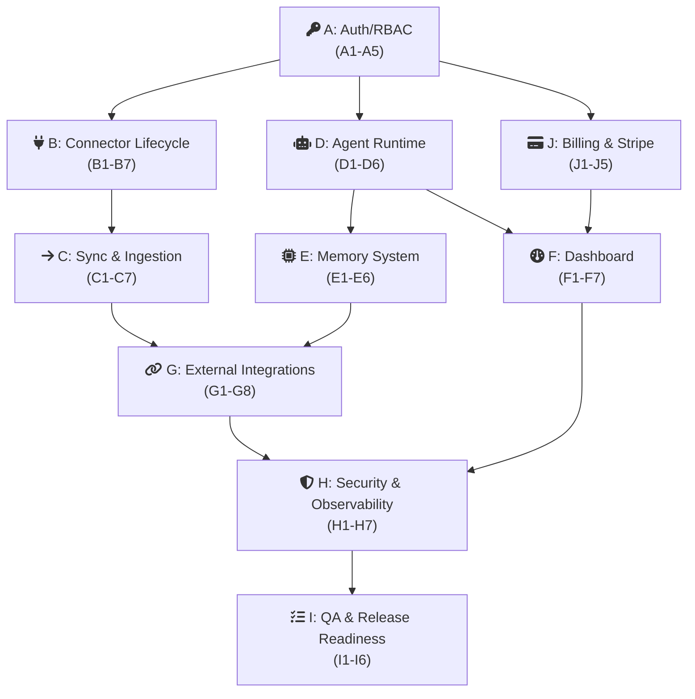
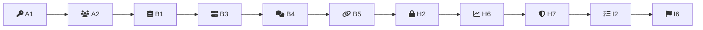

# Dependency Graph

This document maps the dependency relationships across all 10 epics and 64 issues, identifies the critical path, and highlights parallelization opportunities for a solo developer.

## Epic-Level Dependency DAG



## Detailed Issue-Level Dependency Graph

```mermaid
flowchart TD
    subgraph A["fa:fa-key Epic A: Auth/RBAC"]
        direction LR
        A1["fa:fa-key A1: Clerk auth"]
        A2["fa:fa-users A2: Workspace roles"]
        A3["fa:fa-shield-halved A3: RBAC enforcement"]
        A4["fa:fa-shield-halved A4: Route guards"]
        A5["fa:fa-list-check A5: Audit events"]
    end

    subgraph B["fa:fa-plug Epic B: Connector Lifecycle"]
        direction LR
        B1["fa:fa-database B1: waAccounts schema"]
        B2["fa:fa-plug B2: Connect API"]
        B3["fa:fa-server B3: Worker lease"]
        B4["fa:fa-comments B4: QR ingest"]
        B5["fa:fa-link B5: Reconnect"]
        B6["fa:fa-clock B6: Heartbeat"]
        B7["fa:fa-gauge B7: Dashboard QR UX"]
    end

    subgraph C["fa:fa-arrow-right Epic C: Sync & Ingestion"]
        direction LR
        C1["fa:fa-database C1: Sync schemas"]
        C2["fa:fa-plug C2: Sync ingest API"]
        C3["fa:fa-circle-check C3: Idempotency"]
        C4["fa:fa-clock C4: Scheduler"]
        C5["fa:fa-scale-balanced C5: Metadata policy"]
        C6["fa:fa-inbox C6: DLQ"]
        C7["fa:fa-chart-line C7: Health"]
    end

    subgraph D["fa:fa-robot Epic D: Agent Runtime"]
        direction LR
        D1["fa:fa-database D1: Agent schemas"]
        D2["fa:fa-gear D2: State machine"]
        D3["fa:fa-scale-balanced D3: Policy engine"]
        D4["fa:fa-inbox D4: Approval queue"]
        D5["fa:fa-arrow-right D5: Retry"]
        D6["fa:fa-chart-line D6: Traces"]
    end

    subgraph E["fa:fa-microchip Epic E: Memory System"]
        direction LR
        E1["fa:fa-database E1: Memory schema"]
        E2["fa:fa-clock E2: Episodic"]
        E3["fa:fa-brain E3: Semantic"]
        E4["fa:fa-magnifying-glass E4: Retrieval"]
        E5["fa:fa-gauge E5: Pinned UI"]
        E6["fa:fa-globe E6: EN/AR"]
    end

    subgraph F["fa:fa-gauge Epic F: Dashboard"]
        direction LR
        F1["fa:fa-gauge F1: Dashboard shell"]
        F2["fa:fa-gauge F2: Dashboard page"]
        F3["fa:fa-gauge F3: Dashboard page"]
        F4["fa:fa-gauge F4: Dashboard page"]
        F5["fa:fa-microchip F5: Memory UI"]
        F6["fa:fa-link F6: Integrations"]
        F7["fa:fa-scale-balanced F7: Policy page"]
    end

    subgraph G["fa:fa-link Epic G: External Integrations"]
        direction LR
        G1["fa:fa-link G1: Calendar connect"]
        G2["fa:fa-magnifying-glass G2: Cal read"]
        G3["fa:fa-code G3: Cal write"]
        G4["fa:fa-clock G4: Reminders"]
        G5["fa:fa-link G5: Gmail connect"]
        G6["fa:fa-arrow-right G6: Gmail sync"]
        G7["fa:fa-globe G7: Travel"]
        G8["fa:fa-message G8: Meeting briefs"]
    end

    subgraph H["fa:fa-shield-halved Epic H: Security & Observability"]
        direction LR
        H1["fa:fa-lock H1: Encryption"]
        H2["fa:fa-lock H2: Signed requests"]
        H3["fa:fa-list-check H3: Audit stream"]
        H4["fa:fa-chart-line H4: Observability"]
        H5["fa:fa-chart-line H5: Observability"]
    end

    subgraph J["fa:fa-credit-card Epic J: Billing & Stripe"]
        direction LR
        J1["fa:fa-credit-card J1: Stripe customer"]
        J2["fa:fa-credit-card J2: Plans"]
        J3["fa:fa-credit-card J3: Billing portal"]
        J4["fa:fa-scale-balanced J4: Plan limits"]
        J5["fa:fa-clock J5: Trial/grace"]
    end

    %% A dependencies
    A1 --> A2
    A2 --> A3
    A2 --> A4
    A2 --> B1
    A2 --> D1
    A3 --> A5
    A3 --> G5
    A5 --> H3

    %% A4 -> F
    A4 --> F1
    F1 --> F2
    F1 --> F3
    F1 --> F4
    F1 --> F5
    F1 --> J3

    %% B dependencies
    A3 --> B2
    B1 --> B3
    B3 --> B4
    B3 --> B6
    B4 --> B5
    B4 --> H2
    B4 --> B7
    B6 --> C7

    %% C dependencies
    B1 --> C1
    A3 --> C2
    C1 --> C5
    C5 --> F3
    C2 --> C3
    C2 --> C4
    C2 --> C6
    C4 --> C7

    %% D dependencies
    D1 --> D2
    D1 --> D3
    D2 --> D5
    D2 --> D6
    D3 --> D4
    D4 --> F2
    D4 --> H3
    D3 --> G4
    D3 --> F7
    D6 --> F4
    D6 --> H4
    D6 --> H5

    %% E dependencies
    D1 --> E1
    E1 --> E2
    E2 --> E3
    E3 --> E4
    E4 --> E6
    E4 --> F5
    E4 --> G8
    E1 --> E5
    F4 --> E5

    %% G dependencies
    A3 --> G1
    G1 --> G2
    G1 --> H1
    G2 --> G3
    G3 --> G7
    G2 --> F6
    G5 --> G6
    G6 --> G8

    %% J dependencies
    A1 --> J1
    J1 --> J2
    J2 --> J3
    J2 --> J4
    J2 --> J5
    A2 --> J4
```



## Critical Path

The longest dependency chain determines the minimum possible project duration. Two candidates:

**Critical Path Option 1 (Agent + Memory + Meeting Briefs):**
Total: 12 issues, ~62 SP (longest chain)


**Critical Path Option 2 (Connector + Security + QA):**
Total: 10 issues, ~46 SP (shorter but high-risk)



**Critical path is Option 1.** The chain from auth through agent runtime, memory, and advanced integrations (meeting briefs) is the longest. Any delay on D2, E3, or E4 pushes the entire project.

| Rank | ID | Why it is critical |
|------|----|--------------------|
| 1 | A1 | Everything depends on auth |
| 2 | A2 | Workspace roles unlock B1, D1, E1, J |
| 3 | D1 | Agent schemas unlock state machine |
| 4 | D2 | State machine unlocks memory + traces |
| 5 | E3 | Semantic extraction is hardest ML task |
| 6 | E4 | Retrieval composer gates G8 + F5 |

## Parallelization Opportunities

As a solo developer, true parallelism is impossible, but context-switching between loosely coupled workstreams is efficient when one stream is blocked or needs a mental break.

| Stream A | Stream B | Why they parallelize |
|----------|----------|---------------------|
| B (Connector) | D (Agent runtime) | Share only A as ancestor; no direct dependency until H1 |
| C (Sync) | E (Memory) | C produces data that E consumes, but E1-E3 can be stubbed with test data |
| J (Billing) | B/C (WA stack) | J depends only on A1; fully independent of connector work |
| F (Dashboard) | G (Integrations) | F consumes G outputs but F1 shell can be built before G delivers data |
| H (Security) | I (QA) | H must finish first, but H1-H2 can run alongside M1 connector work |

**Recommended context-switching pattern per week:**

```
Week 1 (M0):   A  ================>  (focus: auth + schemas)
                B1, D1  =====>       (schema stubs in parallel)

Week 2 (M1a):  B2-B4  ============> (AM: connector work)
                C1-C3  ============> (PM: sync pipeline)

Week 3 (M1b):  B5-B7  ============> (AM: connector polish)
                C4-C5, H1-H2  ====> (PM: sync + security)

Week 4 (M2a):  D2-D4  ============> (AM: orchestration)
                J1-J3  ============> (PM: billing)
                F1     ============> (evening: dashboard shell)

Week 5 (M2b):  E1-E4  ============> (AM: memory system)
                G1-G3  ============> (PM: calendar integration)
                F2-F4  ============> (evening: dashboard pages)

Week 6 (M3):   H3-H7  ============> (AM: security hardening)
                I1-I6  ============> (PM: testing + gate check)
                G5-G6  ============> (if time permits)
```

## Dependency Table

| Epic | Depends On | Blocks | Risk Level |
|---|---|---|---|
| **A** (Auth) | None | B, C, D, E, F, G, H, I, J | **Critical** -- delays cascade everywhere |
| **B** (Connector) | A | C, F, H, I | **High** -- external API risk (Meta/WhatsApp) |
| **C** (Sync) | A, B | E (indirectly), F, G, H, I | **High** -- data integrity is foundational |
| **D** (Runtime) | A | E, F, G, H, I | **High** -- core product value |
| **E** (Memory) | A, D | F, G (G8), I | **Medium** -- can degrade gracefully |
| **F** (Dashboard) | A, D, E, C, G | I | **Medium** -- UI can be iterative |
| **G** (Integrations) | A, D | F, H, I | **Medium** -- G5-G8 are deferrable |
| **H** (Security) | A, B, C, D | I | **High** -- pilot safety requirement |
| **I** (QA) | All | None (terminal) | **Medium** -- scoped by what ships |
| **J** (Billing) | A | F (J3) | **Low** -- Stripe is well-documented |
