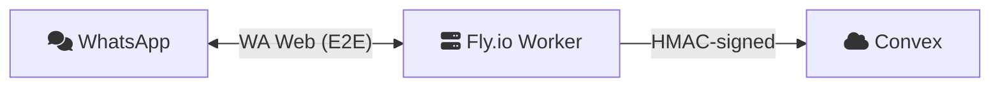
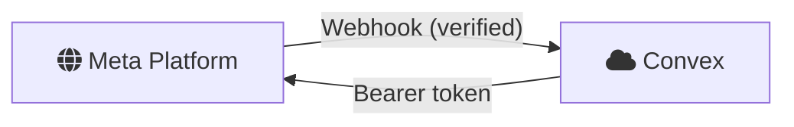
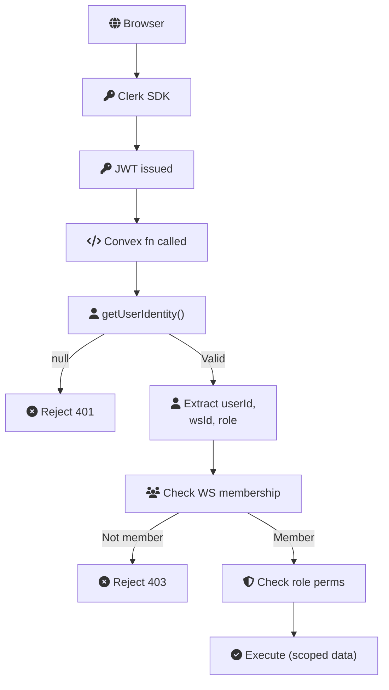
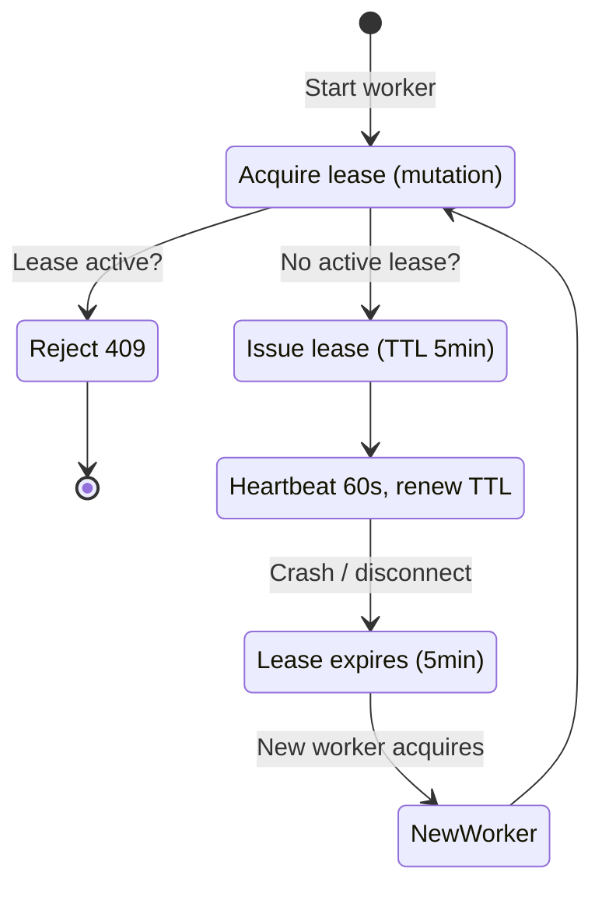
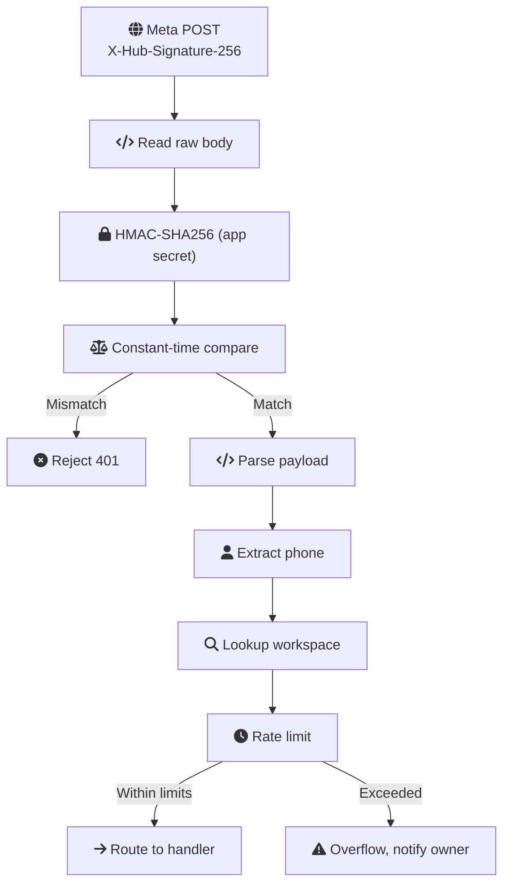
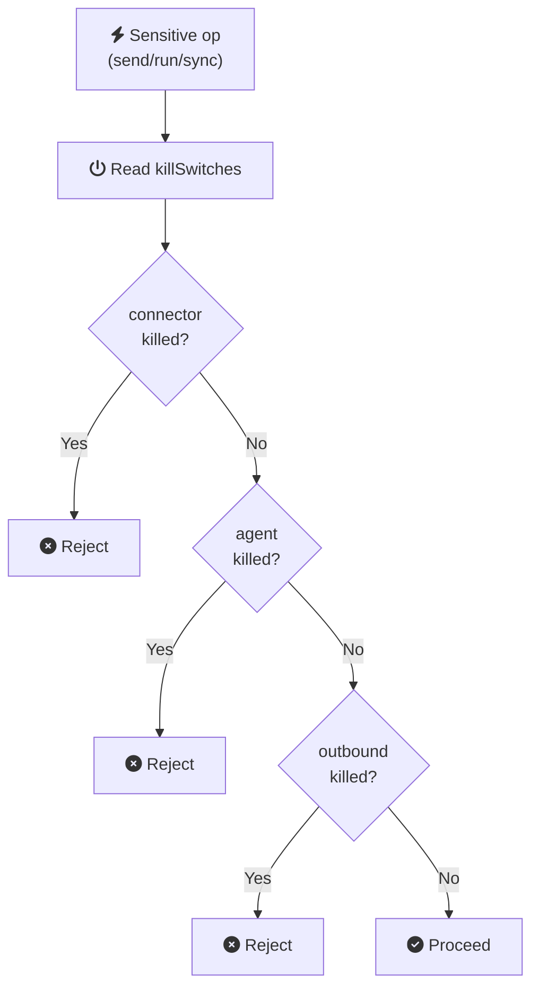
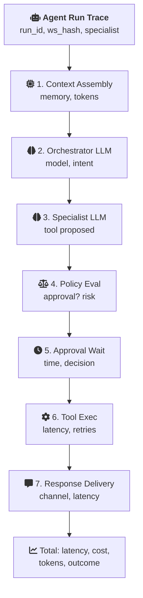

# Security Posture

This document describes Ecqqo's security architecture, threat model, and operational controls. Ecqqo handles sensitive personal and business data on behalf of high-net-worth individuals, so security is not an afterthought -- it is a core product requirement.

## Security Architecture

<script setup>
const secArchConfig = {
  layers: [
    {
      id: "sec-client",
      title: "Client",
      subtitle: "Browser · Dashboard",
      icon: "fa-globe",
      color: "teal",
      nodes: [
        { id: "sa-browser", icon: "fa-globe", title: "Browser", subtitle: "Dashboard (TLS 1.3 + JWT)" },
      ],
    },
    {
      id: "sec-edge",
      title: "Edge",
      subtitle: "Vercel · SSR + CDN",
      icon: "si:vercel",
      color: "warm",
      nodes: [
        { id: "sa-vercel", icon: "si:vercel", title: "Vercel Edge", subtitle: "SSR + CDN" },
      ],
    },
    {
      id: "sec-backend",
      title: "Backend",
      subtitle: "Convex Cloud",
      icon: "si:convex",
      color: "teal",
      nodes: [
        { id: "sa-rbac", icon: "fa-users", title: "RBAC", subtitle: "JWT + Roles + WS" },
        { id: "sa-db", icon: "fa-database", title: "Database", subtitle: "Encrypted at Rest" },
        { id: "sa-fns", icon: "fa-code", title: "Functions", subtitle: "Mutations · Queries · Actions" },
      ],
    },
    {
      id: "sec-workers",
      title: "Workers",
      subtitle: "Fly.io · Isolated Sessions",
      icon: "si:flydotio",
      color: "red",
      nodes: [
        { id: "sa-fly", icon: "si:flydotio", title: "Fly.io Workers", subtitle: "Encrypted Sessions" },
      ],
    },
    {
      id: "sec-wa",
      title: "WhatsApp",
      subtitle: "Meta Cloud API · User Chats",
      icon: "si:whatsapp",
      color: "dark",
      nodes: [
        { id: "sa-meta", icon: "si:meta", title: "Meta Cloud API", subtitle: "Outbound WA" },
        { id: "sa-wa", icon: "si:whatsapp", title: "WhatsApp", subtitle: "User Chats (E2E)" },
      ],
    },
  ],
  connections: [
    { from: "sa-browser", to: "sa-vercel", label: "TLS 1.3 + JWT" },
    { from: "sa-vercel", to: "sa-rbac", label: "authed reqs" },
    { from: "sa-fns", to: "sa-fly", label: "HMAC-SHA256" },
    { from: "sa-fns", to: "sa-meta", label: "HMAC-SHA256" },
    { from: "sa-meta", to: "sa-rbac", label: "webhook" },
    { from: "sa-fly", to: "sa-wa", label: "WA Web (E2E)" },
  ],
}

const rolesConfig = {
  layers: [
    {
      id: "role-owner",
      title: "Owner",
      subtitle: "Full Control",
      icon: "fa-user",
      color: "red",
      nodes: [
        { id: "rl-owner", icon: "fa-user", title: "Owner", subtitle: "Settings · Members · Billing" },
        { id: "rl-owner-perms", icon: "fa-gear", title: "Permissions", subtitle: "Kill switches · Batch approve" },
      ],
    },
    {
      id: "role-principal",
      title: "Principal",
      subtitle: "Approve + View Own",
      icon: "fa-user",
      color: "warm",
      nodes: [
        { id: "rl-principal", icon: "fa-user", title: "Principal", subtitle: "Inherits from Owner" },
        { id: "rl-principal-perms", icon: "fa-circle-check", title: "Permissions", subtitle: "Approve/reject · View own" },
      ],
    },
    {
      id: "role-operator",
      title: "Operator",
      subtitle: "Triage + Monitor",
      icon: "fa-user",
      color: "teal",
      nodes: [
        { id: "rl-operator", icon: "fa-user", title: "Operator", subtitle: "Inherits from Principal" },
        { id: "rl-operator-perms", icon: "fa-magnifying-glass", title: "Permissions", subtitle: "View all · Triage · Read-only" },
      ],
    },
  ],
  connections: [
    { from: "rl-owner", to: "rl-principal", label: "inherits +" },
    { from: "rl-principal", to: "rl-operator", label: "inherits +" },
  ],
}

const langsmithConfig = {
  layers: [
    {
      id: "ls-source",
      title: "Agent Runtime",
      subtitle: "Convex Actions",
      icon: "fa-code",
      color: "teal",
      nodes: [
        { id: "ls-action", icon: "fa-code", title: "Convex Action", subtitle: "Agent Run" },
      ],
    },
    {
      id: "ls-sdk",
      title: "AI SDK",
      subtitle: "Provider Interface + Tracing",
      icon: "fa-plug",
      color: "warm",
      nodes: [
        { id: "ls-sdk-node", icon: "fa-plug", title: "Vercel AI SDK", subtitle: "traceable()" },
        { id: "ls-llm", icon: "fa-brain", title: "LLM Provider", subtitle: "OpenAI · Anthropic" },
      ],
    },
    {
      id: "ls-observability",
      title: "Observability",
      subtitle: "LangSmith · Traces · Alerts",
      icon: "fa-chart-line",
      color: "dark",
      nodes: [
        { id: "ls-explorer", icon: "fa-magnifying-glass", title: "Trace Explorer", subtitle: "p50 / p95 / p99" },
        { id: "ls-evals", icon: "fa-list-check", title: "Prompt Regression", subtitle: "Eval Suites" },
        { id: "ls-alerts", icon: "fa-triangle-exclamation", title: "Alerts", subtitle: "Cost · Latency" },
      ],
    },
  ],
  connections: [
    { from: "ls-action", to: "ls-sdk-node", label: "traceable()" },
    { from: "ls-sdk-node", to: "ls-llm" },
    { from: "ls-sdk-node", to: "ls-explorer", label: "async trace" },
    { from: "ls-llm", to: "ls-explorer" },
  ],
}

const hmacReqSeqConfig = {
  type: "sequence",
  actors: [
    { id: "hr-worker", icon: "si:flydotio", title: "Fly.io Worker", color: "red" },
    { id: "hr-convex", icon: "si:convex", title: "Convex Cloud", color: "teal" },
  ],
  steps: [
    { over: "hr-worker", note: "1. Build payload\n(wsId, event, data, ts)" },
    { over: "hr-worker", note: "2. HMAC-SHA256\n(secret, payload)" },
    { from: "hr-worker", to: "hr-convex", label: "POST /api/connector/event" },
    { over: "hr-convex", note: "3a. Check timestamp (5min)\n3b. Recompute HMAC\n3c. Constant-time compare\n3d. Reject if mismatch" },
    { from: "hr-convex", to: "hr-worker", label: "Accept or Reject", dashed: true },
  ],
}
</script>

<ArchDiagram :config="secArchConfig" />

### Dual Ingress Paths

Ecqqo has two distinct paths for WhatsApp data:

**Path 1: Connector (wacli) -- syncs user's personal WhatsApp**



**Path 2: Meta Cloud API -- Ecqqo's official WhatsApp Business number**



## Authentication and Authorization

### Clerk JWT Validation

Every request to the Convex backend carries a Clerk-issued JWT. Validation happens at the Convex function level before any data access.



### Role Hierarchy

<ArchDiagram :config="rolesConfig" />

### Workspace Isolation

All data is scoped to a workspace. Cross-workspace data access is structurally impossible because every Convex query filters by `workspaceId` extracted from the authenticated user's JWT claims. There is no admin API that bypasses workspace scoping.

## Data Protection

### Encryption

| Layer                  | Encryption                                          |
|------------------------|-----------------------------------------------------|
| Data in transit        | TLS 1.3 (Vercel, Convex, Fly.io all enforce HTTPS) |
| Data at rest (Convex)  | AES-256 (managed by Convex Cloud)                   |
| Session artifacts      | AES-256 encrypted before storage on Fly.io volumes  |
| OAuth tokens           | Encrypted at rest in Convex, never exposed to client|
| WhatsApp E2E           | Signal Protocol (managed by WhatsApp, opaque to us) |

### Metadata-First Sync Policy

By default, the connector syncs only metadata from WhatsApp conversations:

**Default sync (all chats) — metadata only:**

> **Chat:** Ahmed Al-Mansour
> **Last message:** 2026-03-07T10:42:00Z
> **Message count:** 147
> **Chat type:** individual
> **Status:** active
>
> *No message content stored*

**Allowlisted chat (explicit user opt-in) — metadata + content:**

> **Chat:** Ahmed Al-Mansour `[ALLOWLISTED]`
> **Last message:** 2026-03-07T10:42:00Z
> **Message count:** 147
> **Chat type:** individual
> **Status:** active
>
> **Messages:**
> - [10:42] Ahmed: "Confirm the dinner for 8"
> - [10:38] Ahmed: "Did you check the venue?"
> - [10:21] You: "Yes, La Petite Maison works"

This minimizes data exposure. The agent can only read and act on conversations the user has explicitly allowlisted.

### PII Handling

- **No PII in logs**: Application logs strip phone numbers, names, and message content before emission. Structured log fields use workspace and entity IDs only.
- **No PII in error traces**: Error reporting (if integrated) receives sanitized stack traces. Message content is replaced with `[REDACTED]` in error context.
- **Trace redaction**: Agent reasoning traces that reference message content are stored with the content portions hashed. The dashboard reconstructs display from the original message reference, not from the trace.

## Connector Security

The Fly.io connector worker communicates with Convex using signed requests to prevent spoofing and replay attacks.

### HMAC-SHA256 Request Signing

<ArchDiagram :config="hmacReqSeqConfig" />

### Worker Lease System

Each workspace has at most one active connector worker. The lease system prevents duplicate workers from running simultaneously.



## WhatsApp Webhook Security (Meta Cloud API)

Inbound webhooks from Meta's WhatsApp Business Platform are verified before processing.



### Phone Number Verification

The user's phone number in inbound webhooks is verified by Meta's platform -- it cannot be spoofed by the sender. This provides a reliable identity signal for routing messages to the correct workspace.

## Audit Trail

All security-relevant and operationally significant events are recorded in an immutable `auditEvents` table.

### Logged Events

| Category | Events |
|----------|--------|
| Authentication | login, logout, session_expired, failed_login_attempt |
| Authorization | role_changed, member_invited, member_removed, permission_denied |
| Connector | wa_connected, wa_disconnected, wa_reconnected, heartbeat_missed, lease_acquired, lease_expired |
| Sync | sync_started, sync_completed, sync_failed, chat_allowlisted, chat_removed_from_allowlist |
| Approvals | approval_requested, approval_approved, approval_rejected, approval_expired, batch_approved |
| Agent | run_started, run_completed, run_failed, run_retried, tool_call_executed, tool_call_failed |
| Policy | policy_created, policy_updated, policy_deleted, quiet_hours_changed, guardrail_triggered |
| Kill Switch | kill_switch_activated, kill_switch_deactivated |
| Billing | plan_changed, payment_failed, payment_succeeded |
| Data | data_exported, workspace_deleted |

### Audit Event Schema

```
auditEvent {
  _id:          Id<"auditEvents">
  workspaceId:  Id<"workspaces">
  actorId:      string           // Clerk user ID or "system"
  actorRole:    "owner" | "principal" | "operator" | "system"
  category:     string           // e.g., "connector", "approvals"
  event:        string           // e.g., "wa_connected"
  entityType:   string           // e.g., "connector", "approval"
  entityId:     string           // ID of the affected entity
  metadata:     object           // Event-specific details (no PII)
  timestamp:    number           // Unix milliseconds
  ip:           string           // Client IP (hashed for privacy)
}

Indexes:
  by_workspace_time:  [workspaceId, timestamp]
  by_workspace_event: [workspaceId, event]
  by_entity:          [entityType, entityId]
```

Audit events are append-only. There is no mutation that deletes or modifies existing audit records. Retention follows the workspace's plan-based data retention policy.

## Kill-Switch Controls

The owner can instantly disable critical subsystems when something goes wrong. Kill switches are implemented as feature flags in the Convex `workspaceSettings` table, checked synchronously before every sensitive operation.

| Kill Switch | What It Disables | Trigger Conditions |
|------------|-----------------|-------------------|
| Connector Ingestion | Stops syncing new messages from WhatsApp. Worker pauses but maintains session. | Elevated account restrictions from WhatsApp, signature anomaly detected. |
| Agent Execution | Prevents new agent runs from starting. In-progress runs complete current step then halt. | Runaway cost detected, repeated tool failures, guardrail breach. |
| Outbound Messaging | Blocks all outbound WhatsApp messages (both connector and Meta Cloud API). | Rate limit warning from Meta, user complaint, content policy violation. |

### Kill-Switch Check Flow



Kill-switch activation and deactivation are both recorded in the audit trail. The owner receives a WhatsApp notification (via the Meta Cloud API outbound path, which is independent of the connector) when a kill switch is auto-triggered.

## Compliance Considerations

### Unofficial WhatsApp Client Disclosure

The connector component uses an unofficial WhatsApp Web client library. Pilot users must acknowledge:

1. This approach is not endorsed by Meta/WhatsApp
2. Their WhatsApp account could be temporarily or permanently restricted
3. Ecqqo will attempt reconnection but cannot guarantee uninterrupted service
4. The official Meta Cloud API path (for outbound from Ecqqo's business number) is unaffected

This disclosure is presented during onboarding and recorded in the audit trail as `disclosure_acknowledged`.

### Data Retention

| Plan | Message Metadata | Full Messages | Runs | Audit Events |
|------|-----------------|--------------|------|-------------|
| Pilot | 90 days | 30 days | 30d | 1 year |
| Pro | 1 year | 90 days | 90d | 2 years |
| Enterprise | Custom | Custom | Custom | Custom (min 2y) |

Expired data is soft-deleted (marked for deletion) then hard-deleted in a scheduled Convex cron job that runs daily.

### GDPR Considerations (EU Users)

- **Right to access**: Users can export all their data via Settings > Export Data. This generates a JSON archive of all workspace data.
- **Right to deletion**: Users can delete their workspace via Settings > Danger Zone. This triggers cascading deletion of all associated data within 30 days.
- **Data portability**: Export format is machine-readable JSON.
- **Consent**: Explicit opt-in for each data collection scope (WhatsApp sync, calendar access, email access).

## Agent Observability (LangSmith)

All agent runs are traced via [LangSmith](https://smith.langchain.com) for end-to-end observability of the intelligence plane.

### Why LangSmith

- Purpose-built for LLM application tracing (not generic APM)
- Captures full chain: prompt assembly, model call, tool invocations, approval gate, response delivery
- Supports evals and regression testing on prompt performance
- Works with any provider via Vercel AI SDK (OpenAI, Anthropic, Groq, etc.)
- Free tier covers pilot volume (5K traces/month)

### What Gets Traced



### Integration Architecture

<ArchDiagram :config="langsmithConfig" />

### Key Metrics Tracked

| Metric | Source | Alert Threshold |
|--------|--------|----------------|
| Run latency (e2e) | LangSmith trace | p95 > 30s |
| LLM latency per call | LangSmith span | p95 > 10s |
| Token cost per run | LangSmith token count | > $0.50/run |
| Tool call failure rate | LangSmith span | > 5% per hour |
| Approval wait time | LangSmith span | p95 > 4 hours |
| Memory retrieval latency | LangSmith span | p95 > 2s |

### PII Redaction in Traces

Message content and user names are **not** sent to LangSmith. Traces include:
- Workspace ID (hashed)
- Run/step IDs
- Model names, token counts, latency
- Tool names and success/failure status
- Approval decisions (approve/reject/expire)
- Error types (not error messages containing user data)

Input/output content sent to LangSmith uses the same redaction pipeline as the audit trail (see Trace Redaction above).

### Environment Variables

| Variable | Where | Purpose |
|----------|-------|---------|
| `LANGCHAIN_API_KEY` | Convex dashboard | LangSmith API key |
| `LANGCHAIN_PROJECT` | Convex dashboard | Project name (e.g., `ecqqo-pilot`) |
| `LANGCHAIN_TRACING_V2` | Convex dashboard | Set to `true` to enable tracing |

## Security Checklist for Pilot Launch

```
[x] Clerk JWT validation on all Convex functions
[x] Workspace isolation (all queries scoped by workspaceId)
[x] Role-based access control enforced server-side
[x] HMAC-SHA256 signing for connector-to-Convex communication
[x] Anti-replay protection (5-minute timestamp window)
[x] Worker lease system (one worker per workspace)
[x] Meta webhook signature verification
[x] Rate limiting on inbound message processing
[x] Kill-switch controls for all sensitive subsystems
[x] Audit trail for security-relevant events
[x] No PII in logs or error traces
[x] Metadata-first sync (full content requires allowlist)
[x] Session artifacts encrypted at rest
[x] OAuth tokens encrypted at rest
[x] Unofficial client risk disclosure for pilot users
[ ] Penetration testing (scheduled pre-launch)
[ ] SOC 2 Type I (post-pilot roadmap)
[ ] Bug bounty program (post-launch roadmap)
```
